# Hadoop

> Hadoop各个组件的基本原理，处理过程和关键的知识点，包括： HDFS , YARN , MapReduce等


- **HDFS：** 分布式文件存储
- **YARN:**  分布式资源管理
- **MapReduce:**  分布式计算
- **Others:**  利用YRAN的资源管理功能实现其他的数据处理方式


**NameNode和ResourceManager高可用**

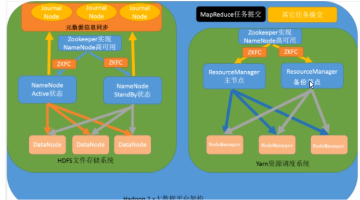

## 安装Hadoop

集群规划

| 服务器            | 192.168.73.100 | 192.168.73.110 | 192.168.73.120 |
| ----------------- | -------------- | -------------- | -------------- |
| 主机名            | node01         | node02         | node03         |
| NameNode          | 是             | 否             | 否             |
| SecondaryNameNode | 是             | 否             | 否             |
| dataNode          | 是             | 是             | 是             |
| ResourceManager   | 是             | 否             | 否             |
| NodeManager       | 是             | 是             | 是             |

### 集群环境搭建

#### 注意事项

**确保vmware已经启动了**

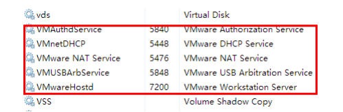

**确认好vmware生成的网关地址**

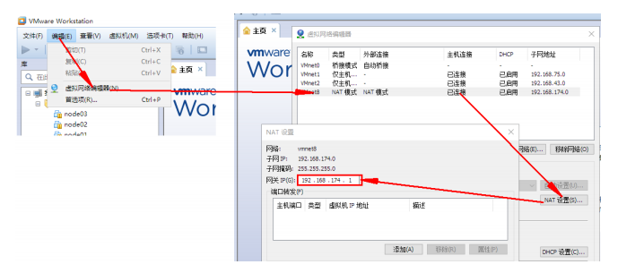

**确认好vmNet8网卡已经配置好了IP地址和DNS**

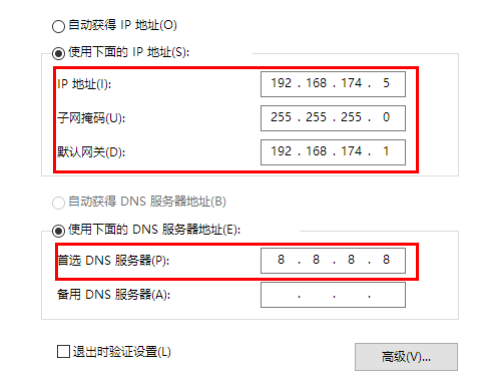

#### 复制虚拟机

> 首先安装好一台虚拟机，在关机情况下右键克隆，并分别命名如下

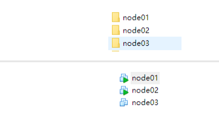

**分别设置三台虚拟机的内存**

- 需要三台虚拟机，并且需要同时运行的时候，内存的总体占用情况为:  每台虚拟机内存 * 3
- 在分配的时候，需要在总内存大小的基础上，减去2G-4G作为系统内存，剩余的除以3，作为每台虚拟机的内存
  - 每台虚拟机的内存 = (总内存 - 4) / 3

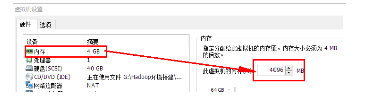


#### 虚拟机修改Mac和IP

**集群规划**

| IP              | 主机名 | 环境配置                               | 安装                                      |
| --------------- | ------ | -------------------------------------- | ----------------------------------------- |
| 192.168.169.100 | node01 | 关防火墙和selinux, host 映射, 时钟同步 | JDK, NameNode, ResourceManager, Zookeeper |
| 192.168.169.110 | node02 | 关防火墙和selinux, host 映射, 时钟同步 | JDK, NameNode, ResourceManager, Zookeeper |
| 192.168.169.120 | node03 | 关防火墙和selinux, host 映射, 时钟同步 | JDK, NameNode, ResourceManager, Zookeeper |

**设置ip和Mac地址**

每台虚拟机更改mac地址：

```shell
vim /etc/udev/rules.d/70-persistent-net.rules
```

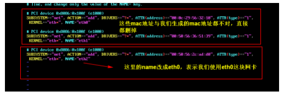

每台虚拟机更改IP地址

```shell
vim /etc/sysconfig/network-scripts/ifcfg-eth0
```

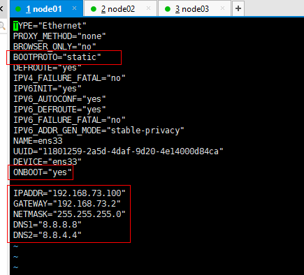

每台虚拟机修改对应主机名

```shell
vi /etc/sysconfig/network
#主机名
HOSTNAME=node01
```

每台虚拟机，设置ip和域名映射

```shell
vim /etc/hosts
```

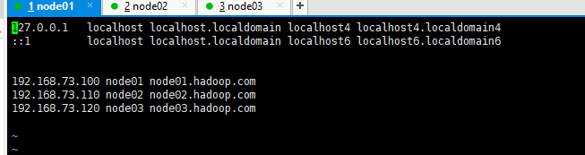


**重启linux**

关机重启linux系统即可进行联网了

==第二台和第三台重复以上步骤==

#### 虚拟机关闭防火墙和SELinux

**关闭防火墙**

三台机器执行以下命令（root用户来执行）

```shell
# 查看防火墙状态
systemctl status firewalld
service  iptables status
# 永久关闭防火墙
systemctl disable firewalld
chkconfig iptables off
```

**三台机器关闭selinux**

- 什么是SELinux
  - SELinux是Linux的一种安全子系统
  - Linux中的权限管理是针对于文件的, 而不是针对进程的, 也就是说, 如果root启动了某 个进程, 则这个进程可以操作任何一个文件
  - SELinux在Linux的文件权限之外, 增加了对进程的限制, 进程只能在进程允许的范围内 操作资源
- 为什么要关闭SELinux
  - 如果开启了SELinux, 需要做非常复杂的配置, 才能正常使用系统, 在学习阶段, 在非生 产环境, 一般不使用SELinux
- SELinux的工作模式
  - enforcing 强制模式
  - permissive 宽容模式
  - disable 关闭

```shell
# 修改selinux的配置文件
vi /etc/selinux/config
```

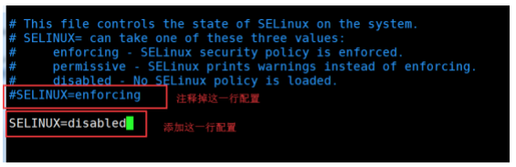

#### 虚拟机免密登录


免密SSH登录的原理

- 需要先在B节点配置A节点的公钥
- A节点请求B节点要求登录
- B节点使用A节点的公钥，加密一段随机文本
- A节点使用私钥解密，并发回给B节点
- B节点 验证文本是否正确

==步骤==

1. 在三台机器执行以下命令，生成公钥与私钥

```shell
ssh-keygen -t rsa
```

执行该命令之后，按下三个回车即可

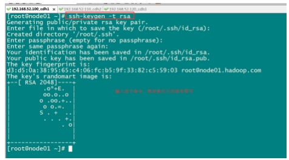

2. 进入到/root/.ssh/  拷贝公钥到同一台机器 (也可以手动复制)

三台机器将拷贝公钥到第一台机器

三台机器执行命令：

ssh-copy-id node01

3. 复制第一台机器的认证到其他机器

将第一台机器的公钥拷贝到其他机器上 

在第一台机器上面执行以下命令

```shell
scp /root/.ssh/authorized_keys node02:/root/.ssh
scp /root/.ssh/authorized_keys node03:/root/.ssh
```

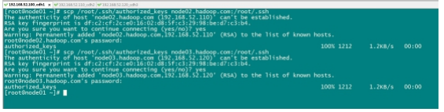

#### 三台机器时钟同步

为什么需要时间同步

- 因为很多分布式系统是有状态的, 比如说存储一个数据, A节点 记录的时间是 1, B节点 记录 的时间是 2, 就会出问题

通过网络，所有主机和时钟同步服务器保持同步

```shell
## 安装
yum install -y ntp
## 启动定时任务
crontab -e
```

随后在输入界面键入

```shell
*/1 * * * * /usr/sbin/ntpdate ntp4.aliyun.com;
```

------

#### 软件安装

==jdk安装==

**查看自带jdk并卸载**

```shell
rpm -qa | grep java
rpm -e java-1.6.0-openjdk-1.6.0.41-1.13.13.1.el6_8.x86_64 tzdata-java2016j-1.el6.noarch java-1.7.0-openjdk-1.7.0.131-2.6.9.0.el6_8.x86_64 --
nodeps
```

**创建安装目录**

```shell
mkdir -p /export/softwares  #软件包存放目录
mkdir -p /export/servers    #安装目录
```

**上传并解压**

```shell
#上传jdk到/export/softwares路径下去，并解压
tar -zxvf jdk-8u141-linux-x64.tar.gz -C ../servers/
```

**配置环境变量**

```shell
vim /etc/profile
```

添加如下内容

```shell
export JAVA_HOME=/export/servers/jdk1.8.0_141
export PATH=:$JAVA_HOME/bin:$PATH
```

修改完成之后记得 source /etc/profile生效

```shell
source /etc/profile
```

==mysql安装==

第一步：在线安装mysql相关的软件包

```shell
yum install mysql mysql-server mysql-devel
```

第二步：启动mysql的服务

```shell
/etc/init.d/mysqld start
```

第三步：通过mysql安装自带脚本进行设置

```shell
/usr/bin/mysql_secure_installation
```

第四步：进入mysql的客户端然后进行授权

```shell
grant all privileges on *.* to 'root'@'%' identified by '123456' with
grant option;
flush privileges;
```


### 集群搭建


## HDFS

### 概述

> Hadoop Distributed File System，分布式文件系统

在现代的企业环境中，单机容量往往无法存储大量的数据，需要跨机器存储。统一管理分布在集群上的文件系统称为==分布式文件系统==

HDFS:适于存储大型数据（比如TB和PB），其就是使用HDFS作为存储系统，HDFS使用多台计算机存储文件，并且提供统一的访问接口，像是访问一个普通文件系统一样使用分布式文件系统。

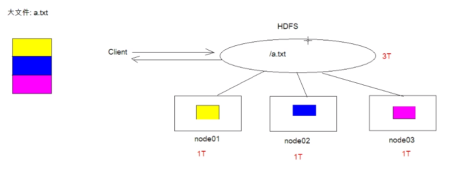

****

### 应用场景

**适合的场景**

- 存储非常大的文件，TB级别的，需要高吞吐量，对延时没有要求
- 采用流式的数据访问方式：即一次写入，多次读取，数据集经常从数据源生成或拷贝一次，然后在其上做很多分析工作
- 不需要特别贵的机器，可运行于普通廉价的机器，可以节约成本
- 需要高的容错性
- 为数据存储提供可扩展能力

**不适合的应用场景**

- 延时低的数据访问，对延时要求在毫秒级别的应用，不适合采用HDFS。HDFS是为了高吞吐数据传输设计的，因此可能==牺牲延时==
- 大量的小文件，文件的元数据保存在NameNode的内存中，整个文件系统的文件数量会受限于NameNode的内存大小。经验而言，一个文件/目录/文件块一般占有150字节的元数据内存空间。如果100万文件，每个文件占用1个文件块，则需要大约300M的内存。因此十亿级别的文件数量在现有商用机器上难以支持。
- 多方读写，需要任意的文件修改HDFS采用追加（append-only）的方式写入数据，==不支持任意offset的修改==，不支持多个写入器（writer）

### HDFS架构

> HDFS是一个主/从架构  (Master/Slave) 体系结构

HDFS由四部分组成： HDFS Client   NameNode   DataNode 和 Secondary NameNode

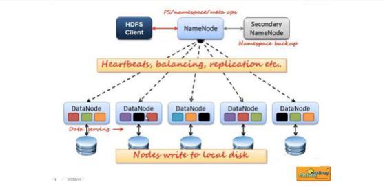


**1. Client: 客户端**

- 文件切分。文件上传 HDFS 的时候，Client 将文件切分成 一个一个的Block，然后进行存 储。 
- 与 NameNode 交互，获取文件的位置信息。 
- 与 DataNode 交互，读取或者写入数据。
-  Client 提供一些命令来管理 和访问HDFS，比如启动或者关闭HDFS。

**2. NameNode: 就是master，它是一个主管，管理者**

- 管理 HDFS 的名称空间 
- 管理数据块（Block）映射信息 
- 配置副本策略 
- 处理客户端读写请求。

**3. DataNode: 就是slave。NameNode下达命令，DataNode执行实际的操作**

- 存储实际的数据块。 
- 执行数据块的读/写操作。

**4. Secondary NameNode：并非 NameNode 的热备。当NameNode 挂掉的时候，它并不 能马上替换 NameNode 并提供服务。**

- 辅助NameNode，分担其工作量。
- 定期合并fsimage和fsedits，并推送给NameNode
- 在紧急情况下，可辅助恢复NameNode

### NameNode和DataNode

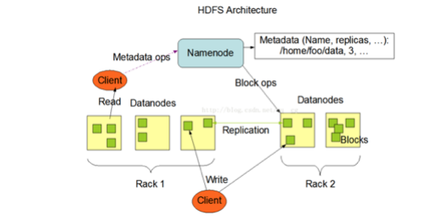

#### NameNode

- NameNode在内存中保存着整个文件系统的名称 空间和文件数据块的地址映射 
- 整个HDFS可存储的文件数受限于NameNode的内存大小

> 1、NameNode元数据信息 文件名，文件目录结构，文件属性(生成时间，副本数，权限)每个 文件的块列表。 以及列表中的块与块所在的DataNode之间的地址映射关系 在内存中加载文件 系统中每个文件和每个数据块的引用关系(文件、block、datanode之间的映射信息) 数据会定 期保存到本地磁盘（fsImage文件和edits文件）
>
>  2、NameNode文件操作 NameNode负责文件元数据的操作 DataNode负责处理文件内容的读写 请求，数据流不经过NameNode，会询问它跟那个DataNode联系
>
>  3、NameNode副本 文件数据块到底存放到哪些DataNode上，是由NameNode决定的，NN根 据全局情况做出放置副本的决定
>
>  4、NameNode心跳机制 全权管理数据块的复制，周期性的接受心跳和块的状态报告信息（包 含该DataNode上所有数据块的列表） 若接受到心跳信息，NameNode认为DataNode工作正 常，如果在10分钟后还接受到不到DN的心跳，那么NameNode认为DataNode已经宕机 ,这时候 NN准备要把DN上的数据块进行重新的复制。 块的状态报告包含了一个DN上所有数据块的列 表，blocks report 每个1小时发送一次.

#### DataNode

提供真实文件数据存储服务

> 1. Data Node以数据块的形式存储文件
> 2. Data Node 响应HDFS客户端读写请求
> 3. Dtaa Node 周期性向NameNode汇报心跳信息
> 4. Data Node 周期性向NameNode汇报数据块信息
> 5. Data Node 周期性向NameNode汇报缓存数据块信息

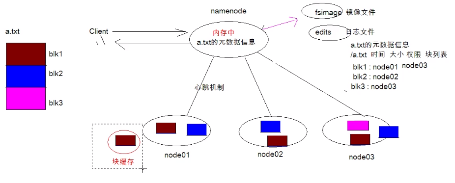

### 副本机制和机架感知

所有的文件都是以 block 块的方式存放在 HDFS 文件系统当中,作用如下

> 1. 一个文件有可能大于集群中任意一个磁盘，引入块机制,可以很好的解决这个问题 
> 2. 使用块作为文件存储的逻辑单位可以简化存储子系统 
> 3. 块非常适合用于数据备份进而提供数据容错能力

#### 副本机制

在 Hadoop1 当中, 文件的 block 块默认大小是 64M, hadoop2 当中, 文件的 block 块大小默认是 128M, block 块的大小可以通过 hdfs-site.xml 当中的配置文件进行指定

==默认是128M，也就是每个块的大小为128M，切分为三个块的话，最大是128*3   最小是128 *2 + 1==

```xml
<property>
    <name>dfs.block.size</name>
    <value>块大小 以字节为单位</value>
</property>
```

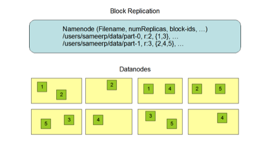

#### 机架感知

HDFS分布式文件系统的内部有一个副本存放策略：以默认的副本数=3为例：

1. 第一个副本块存本机
2. 第二个副本块存跟本机同机架内的其他服务器节点
3. 、第三个副本块存不同机架的一个服务器节点上

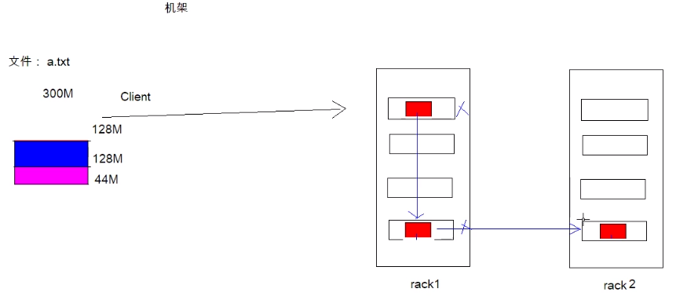

### HDFS命令的使用

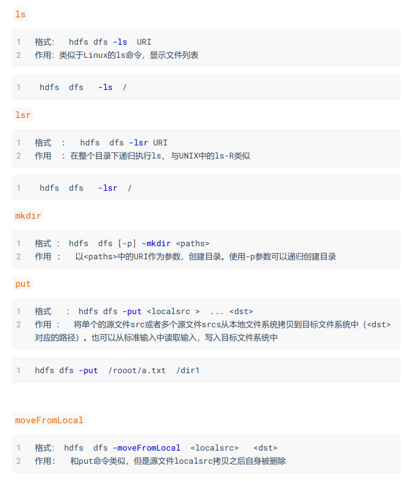

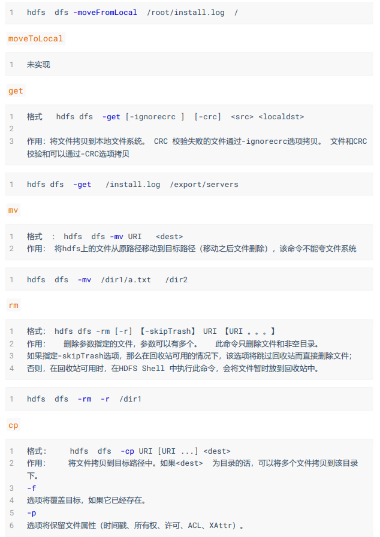

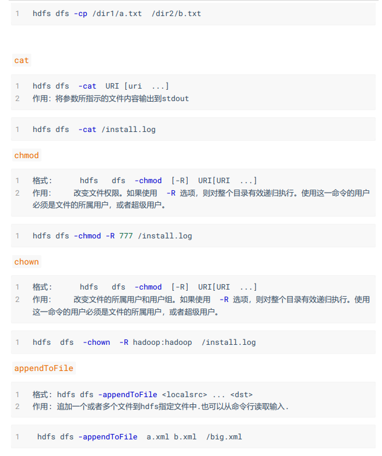

==查看用户和用户组 可以进入/home 目录下 ls 就能看到了==

```shell
# 查看用户
cd /home
ls /
# 添加用户
useradd hadoop
passwd hadoop
```

### HDFS高级命令

#### HDFS文件限额配置

在多人共用HDFS的环境下，配置设置非常重要。特别是在Hadoop处理大量资料的环境，如 果没有配额管理，很容易把所有的空间用完造成别人无法存取。Hdfs的配额设定是针对目录 而不是针对账号，可以 让每个账号仅操作某一个目录，然后对目录设置配置。

 hdfs文件的限额配置允许我们以文件个数，或者文件大小来限制我们在某个目录下上传的文 件数量或者文件内容总量，以便达到我们类似百度网盘网盘等限制每个用户允许上传的最大 的文件的量。

```shell
hdfs dfs -count -q -h /user/root/dir1  #查看配额信息
```

##### 数量限额

```shell
hdfs dfs  -mkdir -p /user/root/dir    #创建hdfs文件夹
hdfs dfsadmin -setQuota 2 dir      # 给该文件夹下面设置最多上传两个文件，发现只能
上传一个文件
```

```shell
hdfs dfsadmin -clrQuota /user/root/dir  # 清除文件数量限制
```

**空间大小限额**

在设置空间配额时，设置的空间至少是block_size * 3大小

```shell
hdfs dfsadmin -setSpaceQuota 4k /user/root/dir   # 限制空间大小4KB
hdfs dfs -put /root/a.txt /user/root/dir 
```

生成任意大小文件的命令:

```shell
dd if=/dev/zero of=1.txt  bs=1M count=2     #生成2M的文件
```

清除空间配额限制

```shell
hdfs dfsadmin -clrSpaceQuota /user/root/dir
```

#### HDFS安全模式

安全模式是hadoop的一种保护机制，用于保证集群中的数据块的安全性。当集群启动的时 候，会首先进入安全模式。当系统处于安全模式时会检查数据块的完整性。

假设我们设置的副本数（即参数dfs.replication）是3，那么在datanode上就应该有3个副本存 在，假设只存在2个副本，那么比例就是2/3=0.666。hdfs默认的副本率0.999。我们的副本率 0.666明显小于0.999，因此系统会自动的复制副本到其他dataNode，使得副本率不小于0.999。 如果系统中有5个副本，超过我们设定的3个副本，那么系统也会删除多于的2个副本。

在安全模式状态下，文件系统只接受读数据请求，而不接受删除、修改等变更请求。在，当 整个系统达到安全标准时，HDFS自动离开安全模式。

安全模式操作命令

```shell
hdfs dfsadmin  -safemode  get #查看安全模式状态
hdfs dfsadmin  -safemode enter #进入安全模式
hdfs dfsadmin  -safemode leave #离开安全模式
```

### HDFS准基测试

实际生产环境当中，hadoop的环境搭建完成之后，第一件事情就是进行压力测试，测试我们 的集群的读取和写入速度，测试我们的网络带宽是否足够等一些基准测试

#### 测试写入速度

向HDFS文件系统中写入数据,10个文件,每个文件10MB,文件存放到/benchmarks/TestDFSIO中

```shell
hadoop jar /export/servers/hadoop-2.7.5/share/hadoop/mapreduce/hadoopmapreduce-client-jobclient-2.7.5.jar TestDFSIO -write -nrFiles 10  -
fileSize 10MB
```

完成之后查看写入速度结果

```shell
hdfs dfs -text /benchmarks/TestDFSIO/io_write/part-00000
```

#### 测试读取速度

测试hdfs的读取文件性能 

在HDFS文件系统中读入10个文件,每个文件10M

```shell
hadoop jar /export/servers/hadoop-2.7.5/share/hadoop/mapreduce/hadoop-mapreduce-client-jobclient-2.7.5.jar  TestDFSIO -read -nrFiles 10 -fileSize 10MB
```

查看读取结果

```shell
hdfs dfs -text /benchmarks/TestDFSIO/io_read/part-00000
```

#### 清楚测试数据

```shell
hadoop jar /export/servers/hadoop-2.7.5/share/hadoop/mapreduce/hadoopmapreduce-client-jobclient-2.7.5.jar   TestDFSIO -clean
```

### HDFS文件写入过程

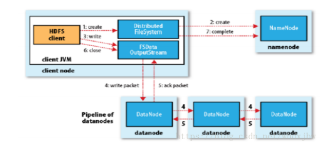

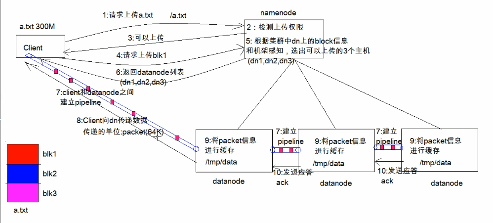


1. Client 发起文件上传请求, 通过 RPC 与 NameNode 建立通讯, NameNode 检查目标文件是 否已存在, 父目录是否存在, 返回是否可以上传

2. Client 请求第一个 block 该传输到哪些 DataNode 服务器上

3. NameNode 根据配置文件中指定的备份数量及机架感知原理进行文件分配, 返回可用的 DataNode 的地址如: A, B, C

   > Hadoop 在设计时考虑到数据的安全与高效, 数据文件默认在 HDFS 上存放三份, 存储 策略为本地一份, 同机架内其它某一节点上一份, 不同机架的某一节点上一份。	

4. Client 请求 3 台 DataNode 中的一台 A 上传数据（本质上是一个 RPC 调用，建立 pipeline ）, A 收到请求会继续调用 B, 然后 B 调用 C, 将整个 pipeline 建立完成, 后逐级返回 client

5. Client 开始往 A 上传第一个 block（先从磁盘读取数据放到一个本地内存缓存）, 以 packet 为单位（默认64K）, A 收到一个 packet 就会传给 B, B 传给 C. A 每传一个 packet 会 放入一个应答队列等待应答

6. 数据被分割成一个个 packet 数据包在 pipeline 上依次传输, 在 pipeline 反方向上, 逐个发 送 ack（命令正确应答）, 最终由 pipeline 中第一个 DataNode 节点 A 将 pipelineack 发送 给 Client

7. 当一个 block 传输完成之后, Client 再次请求 NameNode 上传第二个 block 到服务 1

----

### HDFS文件读取过程

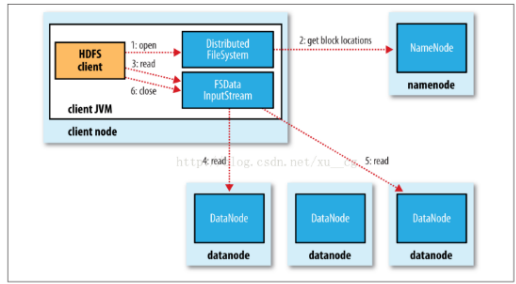


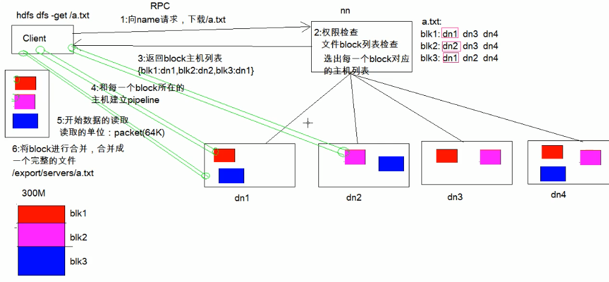

1. Client向NameNode发起RPC请求，来确定请求文件block所在的位置；
2. NameNode会视情况返回文件的部分或者全部block列表，对于每个block，NameNode 都 会返回含有该 block 副本的 DataNode 地址； 这些返回的 DN 地址，会按照集群拓扑结构 得出 DataNode 与客户端的距离，然后进行排序，排序两个规则：网络拓扑结构中距离 Client 近的排靠前；心跳机制中超时汇报的 DN 状态为 STALE，这样的排靠后；
3. Client 选取排序靠前的 DataNode 来读取 block，如果客户端本身就是DataNode,那么将从 本地直接获取数据(短路读取特性)；
4. 底层上本质是建立 Socket Stream（FSDataInputStream），重复的调用父类 DataInputStream 的 read 方法，直到这个块上的数据读取完毕；
5. 当读完列表的 block 后，若文件读取还没有结束，客户端会继续向NameNode 获取下一 批的 block 列表；
6. 读取完一个 block 都会进行 checksum 验证，如果读取 DataNode 时出现错误，客户端会 通知 NameNode，然后再从下一个拥有该 block 副本的DataNode 继续读。
7. read 方法是并行的读取 block 信息，不是一块一块的读取；NameNode 只是返回Client请 求包含块的DataNode地址，并不是返回请求块的数据；
8. 最终读取来所有的 block 会合并成一个完整的最终文件。

**使用url方式访问数据**

```java
@Test
public void demo1()throws  Exception{
    //第一步：注册hdfs 的url
    URL.setURLStreamHandlerFactory(new FsUrlStreamHandlerFactory());
    //获取文件输入流
    InputStream inputStream  = new
URL("hdfs://node01:8020/a.txt").openStream();
    //获取文件输出流
    FileOutputStream outputStream = new FileOutputStream(new
File("D:\\hello.txt"));
    //实现文件的拷贝
    IOUtils.copy(inputStream, outputStream);
    //关闭流
    IOUtils.closeQuietly(inputStream);
    IOUtils.closeQuietly(outputStream);
}
```


### HDFS的元数据辅助管理

当 Hadoop 的集群当中, NameNode的所有元数据信息都保存在了 FsImage 与 Eidts 文件当中, 这两个文件就记录了所有的数据的元数据信息, 元数据信息的保存目录配置在了 hdfssite.xml 当中

```xml
<property>
    <name>dfs.namenode.name.dir</name>    
    <value>
       file:///export/servers/hadoop2.7.5/hadoopDatas/namenodeDatas,    
          file:///export/servers/hadoop2.7.5/hadoopDatas/namenodeDatas2
    </value>
</property>
<property>
     <name>dfs.namenode.edits.dir</name>
     <value>file:///export/servers/hadoop2.7.5/hadoopDatas/nn/edits</value
</property>>
```

#### FsImage 和 Edits 详解

- edits
  - edits 存放了客户端最近一段时间的操作日志
  - 客户端对 HDFS 进行写文件时会首先被记录在 edits 文件中
  - edits 修改时元数据也会更新
- fsimage
  - NameNode 中关于元数据的镜像, 一般称为检查点, fsimage 存放了一份比较完整的 元数据信息
  - 因为 fsimage 是 NameNode 的完整的镜像, 如果每次都加载到内存生成树状拓扑结 构，这是非常耗内存和CPU, 所以一般开始时对 NameNode 的操作都放在 edits 中
  - fsimage 内容包含了 NameNode 管理下的所有 DataNode 文件及文件 block 及 block 所在的 DataNode 的元数据信息
  - 随着 edits 内容增大, 就需要在一定时间点和 fsimage 合并

#### fsimage 中的文件信息查看

使用命令 hdfs oiv

```shell
cd /export/servers/hadoop2.7.5/hadoopDatas/namenodeDatas
hdfs oiv -i fsimage_0000000000000000864 -p XML -o hello.xml
```

#### edits 中的文件信息查看

使用命令 hdfs oev

```shell
cd /export/servers/hadoop2.7.5/hadoopDatas/namenodeDatas
hdfs oev -i edits_0000000000000000865-0000000000000000866 -p XML -o
myedit.xml 
```

**SecondaryNameNode 如何辅助管理 fsimage 与 edits 文件?**

- SecondaryNameNode 定期合并 fsimage 和 edits, 把 edits 控制在一个范围内

- 配置 SecondaryNameNode

  - SecondaryNameNode 在 conf/masters 中指定

  - 在 masters 指定的机器上, 修改 hdfs-site.xml

  - ```xml
    <property>
      <name>dfs.http.address</name>
      <value>host:50070</value>
    </property>
    ```

  - 修改 core-site.xml , 这一步不做配置保持默认也可以

  - ```xml
    <!-- 多久记录一次 HDFS 镜像, 默认 1小时 -->
    <property>
      <name>fs.checkpoint.period</name>
      <value>3600</value>
    </property>
    <!-- 一次记录多大, 默认 64M -->
    <property>
      <name>fs.checkpoint.size</name>
      <value>67108864</value>
    </property>
    
    ```

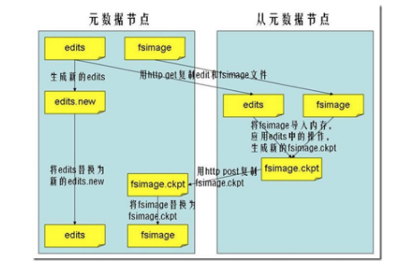

1. SecondaryNameNode 通知 NameNode 切换 editlog
2.  SecondaryNameNode 从 NameNode 中获得 fsimage 和 editlog(通过http方式)
3. SecondaryNameNode 将 fsimage 载入内存, 然后开始合并 editlog, 合并之后成为新的 fsimage
4. SecondaryNameNode 将新的 fsimage 发回给 NameNode
5. NameNode 用新的 fsimage 替换旧的 fsimage

**特点**

- 完成合并的是 SecondaryNameNode, 会请求 NameNode 停止使用 edits, 暂时将新写操作放 入一个新的文件中 edits.new
- SecondaryNameNode 从 NameNode 中通过 Http GET 获得 edits, 因为要和 fsimage 合并, 所 以也是通过 Http Get 的方式把 fsimage 加载到内存, 然后逐一执行具体对文件系统的操作, 与 fsimage 合并, 生成新的 fsimage, 然后通过 Http POST 的方式把 fsimage 发送给 NameNode. NameNode 从 SecondaryNameNode 获得了 fsimage 后会把原有的 fsimage 替 换为新的 fsimage, 把 edits.new 变成 edits. 同时会更新 fstime
- Hadoop 进入安全模式时需要管理员使用 dfsadmin 的 save namespace 来创建新的检查点
- SecondaryNameNode 在合并 edits 和 fsimage 时需要消耗的内存和 NameNode 差不多, 所 以一般把 NameNode 和 SecondaryNameNode 放在不同的机器上

------

## MapReduce

MapReduce思想核心是分而治之，适用于大量复杂的任务处理场景（大规模数据处理场景）

- Map负责分，把复杂的任务分解为若干 简单的任务 来并行处理。可以进行拆分的前提是这些小任务可以并行计算，彼此间几乎没有依赖关系
- Reduce负责合，即对map阶段的结果进行全局汇总
- MapReduce运行在yarn集群
  - ResouceManager
  - NodeManager

这两个阶段合起来正是MapReduce思想的体现

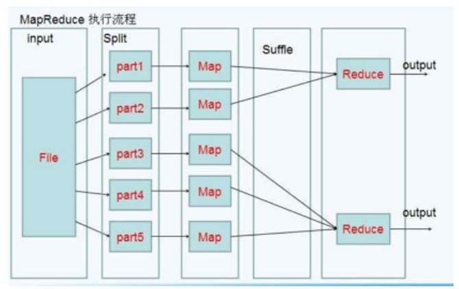

### MapReduce设计构思

> 核心功能是将用户编写的业务逻辑代码和自带默认组件整合成一个完整的分布式计算运算程序，并发运行在hadoop集群上

为程序员提供了一个清晰的操作接口描述。MapReduce中定义了如下的Map和Reduce两个抽象的编程接口，由用户去编程实现，Map和Reduce，MapReduce处理的数据类型是<key,value> 键值对

- Map: (k1, v1)      ->   [(k2 , v2)]
- Reduce: (k2 , [v2])   ->   [(k3 , v3)]

一个完整的mapreduce程序在分布式运行时有三类实例进程

1. MRAppMaster 负责整个程序的过程调度及状态协调
2. MapTask 负责map阶段的整个数据处理流程
3. ReduceTask 负责reduce阶段的整个数据处理流程

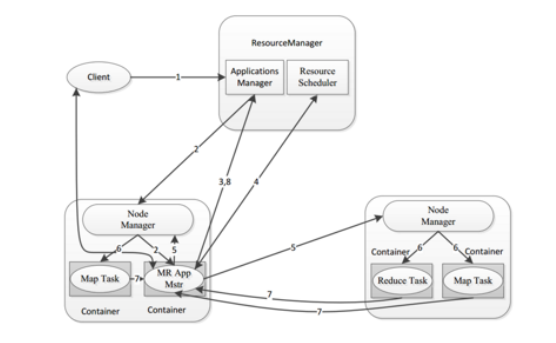

> 一个简单的MapReduce程序只需要指定map() , reduce() ,input 和 output , 剩下的事由框架完成

### MapReduce编程规范

> MapReduce 的开发一共有八个步骤, 其中 Map 阶段分为 2 个步骤，Shule 阶段 4 个步 骤，Reduce 阶段分为 2 个步骤

**Map 阶段 2 个步骤**

1. 设置 InputFormat 类, 将数据切分为 Key-Value(K1和V1) 对, 输入到第二步
2. 自定义 Map 逻辑, 将第一步的结果转换成另外的 Key-Value（K2和V2） 对, 输出结果

**Shule 阶段 4 个步骤**

3. 对输出的 Key-Value 对进行分区
4. 对不同分区的数据按照相同的 Key 排序
5.  (可选) 对分组过的数据初步规约, 降低数据的网络拷贝
6. 对数据进行分组, 相同 Key 的 Value 放入一个集合中

**Reduce阶段2个步骤**

7. 对多个 Map 任务的结果进行排序以及合并, 编写 Reduce 函数实现自己的逻辑, 对输入的 Key-Value 进行处理, 转为新的 Key-Value（K3和V3）输出
8. 设置 OutputFormat 处理并保存 Reduce 输出的 Key-Value 数据

### MapReduce 排序和序列化

- 序列化(Serialization) 是把结构化对象转化为字节流
- 反序列化 (Deserialization) 是序列化的逆过程. 把字节流转为结构化对象. 当要在进程间传 递对象或持久化对象的时候, 就需要序列化对象成字节流, 反之当要将接收到或从磁盘读取 的字节流转换为对象, 就要进行反序列化
- Java 的序列化 (Serializable) 是一个重量级序列化框架, 一个对象被序列化后, 会附带很多额 外的信息 (各种校验信息, header, 继承体系等）, 不便于在网络中高效传输. 所以, Hadoop 自己开发了一套序列化机制(Writable), 精简高效. 不用像 Java 对象类一样传输多层的父子 关系, 需要哪个属性就传输哪个属性值, 大大的减少网络传输的开销
- Writable 是 Hadoop 的序列化格式, Hadoop 定义了这样一个 Writable 接口. 一个类要支持可 序列化只需实现这个接口即可
- 另外 Writable 有一个子接口是 WritableComparable, WritableComparable 是既可实现序列 化, 也可以对key进行比较, 我们这里可以通过自定义 Key 实现 WritableComparable 来实现 我们的排序功能

### 规约Combiner

每一个map都可能产生大量的本地输出，Combiner的作用就是对map端的输出先做一次合并，以减少在map和reduce节点之间的数据传输量，以提高网络IO性能，是MapReduce的一种优化手段之一

- combiner是MR程序中Mapper和Reducer之外的一种组件
- combiner组件的父类就是reducer
- combiner和reducer的区别在于运行的位置
  - combiner是在每一个maptask所在的节点运行
  - reducer是接受全局的mapper的输出结果
- combiner 的意义就是对每一个maptask的输出进行局部汇总，以减少网络传输量

**实现步骤**

1. 自定义一个combiner继承Reducer，重写reduce方法
2. 在job中设置job.setCombinerClass(CustomerCombiner.class)

---

### MapReduce的运行机制

#### MapTask工作机制

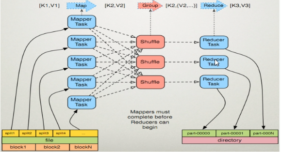

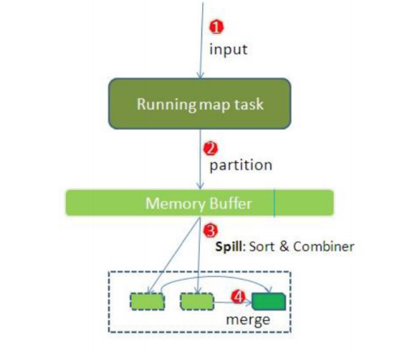

整个Map阶段流程大体如上图所示。

inputFile通过split被逻辑切分为多个split文件，通过Record按行读取内容给map（用户自己实现）进行处理，数据被map处理结束之后交给OutputCollector收集器，对其结果key进行分区（默认使用hash分区），然后写入buffer，每个map task都有一个内存缓冲区，存储着map的输出结果，当缓冲区快满的时候需要将缓冲区的数据以一个临时文件的方式存放到磁盘，当整个map task结束后再对磁盘中这个map task产生的所有临时文件做合并，生成最终的正是输出文件，然后等待reduce task来拉数据

**详细步骤**

1. 读取数据组件，InputFormat会通过getSplits方法对输入目录中文件进行逻辑切片规划得到block，有多少block就对应启动多少MapTask

2. 将输入文件切分为block之后，由Record对象 (默认是LineRecordReader) 进 行读取, 以 \n 作为分隔符, 读取一行数据, 返回  . Key 表示每行首字符偏 移值, Value 表示这一行文本内容

3. 读取 block 返回  , 进入用户自己继承的 Mapper 类中，执行用户重写 的 map 函数, RecordReader 读取一行这里调用一次

4. Mapper 逻辑结束之后, 将 Mapper 的每条结果通过 context.write 进行collect数据收 集. 在 collect 中, 会先对其进行分区处理，默认使用 HashPartitioner

   - > MapReduce 提供 Partitioner 接口, 它的作用就是根据 Key 或 Value 及 Reducer 的数量来决定当前的这对输出数据最终应该交由哪个 Reduce task 处理, 默认对 Key Hash 后再以 Reducer 数量取模. 默认的取模方式只是为 了平均 Reducer 的处理能力, 如果用户自己对 Partitioner 有需求, 可以订制并设置 到 Job 上

5. 接下来, 会将数据写入内存, 内存中这片区域叫做环形缓冲区, 缓冲区的作用是批量收集 Mapper 结果, 减少磁盘 IO 的影响. 我们的 Key/Value 对以及 Partition 的结果都会被写入 缓冲区. 当然, 写入之前，Key 与 Value 值都会被序列化成字节数组

   - > 环形缓冲区其实是一个数组, 数组中存放着 Key, Value 的序列化数据和 Key, Value 的元数据信息, 包括 Partition, Key 的起始位置, Value 的起始位置以及 Value 的长度. 环形结构是一个抽象概

   - > 缓冲区是有大小限制, 默认是 100MB. 当 Mapper 的输出结果很多时, 就可能会撑 爆内存, 所以需要在一定条件下将缓冲区中的数据临时写入磁盘, 然后重新利用 这块缓冲区. 这个从内存往磁盘写数据的过程被称为 Spill, 中文可译为溢写. 这个 溢写是由单独线程来完成, 不影响往缓冲区写 Mapper 结果的线程. 溢写线程启动 时不应该阻止 Mapper 的结果输出, 所以整个缓冲区有个溢写的比例 spill.percent . 这个比例默认是 0.8, 也就是当缓冲区的数据已经达到阈值 buffer size * spill percent = 100MB * 0.8 = 80MB , 溢写线程启动, 锁定这 80MB 的内存, 执行溢写过程. Mapper 的输出结果还可以往剩下的 20MB 内存中写, 互不影

6.  当溢写线程启动后, 需要对这 80MB 空间内的 Key 做排序 (Sort). 排序是 MapReduce 模型 默认的行为, 这里的排序也是对序列化的字节做的排

   - > 如果 Job 设置过 Combiner, 那么现在就是使用 Combiner 的时候了. 将有相同 Key 的 Key/Value 对的 Value 加起来, 减少溢写到磁盘的数据量. Combiner 会优化 MapReduce 的中间结果, 所以它在整个模型中会多次使

   - > 那哪些场景才能使用 Combiner 呢? 从这里分析, Combiner 的输出是 Reducer 的 输入, Combiner 绝不能改变最终的计算结果. Combiner 只应该用于那种 Reduce 的输入 Key/Value 与输出 Key/Value 类型完全一致, 且不影响最终结果的场景. 比 如累加, 最大值等. Combiner 的使用一定得慎重, 如果用好, 它对 Job 执行效率有 帮助, 反之会影响 Reducer 的最终结果

7. 合并溢写文件, 每次溢写会在磁盘上生成一个临时文件 (写之前判断是否有 Combiner), 如 果 Mapper 的输出结果真的很大, 有多次这样的溢写发生, 磁盘上相应的就会有多个临时文 件存在. 当整个数据处理结束之后开始对磁盘中的临时文件进行 Merge 合并, 因为最终的 文件只有一个, 写入磁盘, 并且为这个文件提供了一个索引文件, 以记录每个reduce对应数 据的偏移量

#### ReduceTask工作机制

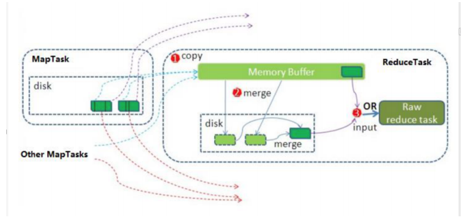


Reduce 大致分为 copy、sort、reduce 三个阶段，重点在前两个阶段。copy 阶段包含一个 eventFetcher 来获取已完成的 map 列表，由 Fetcher 线程去 copy 数据，在此过程中会启动两 个 merge 线程，分别为 inMemoryMerger 和 onDiskMerger，分别将内存中的数据 merge 到磁 盘和将磁盘中的数据进行 merge。待数据 copy 完成之后，copy 阶段就完成了，开始进行 sort阶段，sort 阶段主要是执行 finalMerge 操作，纯粹的 sort 阶段，完成之后就是 reduce 阶段， 调用用户定义的 reduce 函数进行处理

**详细步骤**

1. Copy阶段： 简单的拉取数据 Reduce进程启动一些数据copy线程(Fetcher),通过HTTP方式请求maptask获取属于自己的文件。
2. Merge阶段：。这里的merge如map端的merge动作，只是数组中存放的是不同map端 copy来的数值。Copy过来的数据会先放入内存缓冲区中，这里的缓冲区大小要比map端 的更为灵活。merge有三种形式：内存到内存；内存到磁盘；磁盘到磁盘。默认情况下第 一种形式不启用。当内存中的数据量到达一定阈值，就启动内存到磁盘的merge。与map 端类似，这也是溢写的过程，这个过程中如果你设置有Combiner，也是会启用的，然后 在磁盘中生成了众多的溢写文件。第二种merge方式一直在运行，直到没有map端的数据 时才结束，然后启动第三种磁盘到磁盘的merge方式生成最终的文件。
3. 合并排序：把分散的数据合并成一个大的数据后，还会再对合并后的数据排序。
4. 对排序后的键值对调用reduce方法： 键相等的键值对调用一次reduce方法，每次调用会 产生零个或者多个键值对，最后把这些输出的键值对写入到HDFS文件中。


### Shuffle过程

map阶段处理的数据如何传递给reduce阶段，是Mapreduce框架中最关键的一个流程，这个流程叫做shuffle ： 洗牌，发牌（核心机制：数据分区，排序，分组，规约，合并等过程）

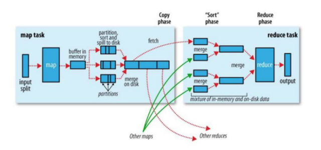

shule 是 Mapreduce 的核心，它分布在 Mapreduce 的 map 阶段和 reduce 阶段。一般把从 Map 产生输出开始到 Reduce 取得数据作为输入之前的过程称作 shule。

1.  Collect阶段 ：将 MapTask 的结果输出到默认大小为 100M 的环形缓冲区，保存的是 key/value，Partition 分区信息等。
2. Spill阶段 ：当内存中的数据量达到一定的阀值的时候，就会将数据写入本地磁盘， 在将数据写入磁盘之前需要对数据进行一次排序的操作，如果配置了 combiner，还会将 有相同分区号和 key 的数据进行排序。
3. Merge阶段 ：把所有溢出的临时文件进行一次合并操作，以确保一个 MapTask 最终只 产生一个中间数据文件。
4. Copy阶段 ：ReduceTask 启动 Fetcher 线程到已经完成 MapTask 的节点上复制一份属于 自己的数据，这些数据默认会保存在内存的缓冲区中，当内存的缓冲区达到一定的阀值 的时候，就会将数据写到磁盘之上。
5. Merge阶段 ：在 ReduceTask 远程复制数据的同时，会在后台开启两个线程对内存到本 地的数据文件进行合并操作。
6. Sort阶段 ：在对数据进行合并的同时，会进行排序操作，由于 MapTask 阶段已经对数 据进行了局部的排序，ReduceTask 只需保证 Copy 的数据的最终整体有效性即可。 Shule 中的缓冲区大小会影响到 mapreduce 程序的执行效率，原则上说，缓冲区越大， 磁盘io的次数越少，执行速度就越快 缓冲区的大小可以通过参数调整, 参数：mapreduce.task.io.sort.mb 默认100M


-------

## YARN

yarn是hadoop集群中的资源管理系统模块，为各类计算框架提供资源的管理和调度，主要用于管理集群当中的资源（主要是服务器的各种硬件资源，包括CPU，内存，磁盘，网络IO等）以及调度运行在yarn上面的各种任务。

主要就是为了：==调度资源，管理任务==

- 一级调度管理：
  - 计算资源管理（CPU，内存，网络IO，磁盘）
- 二级调度管理
  - 任务内部的计算模型管理（AppMaster的任务精细化管理）

### 主要组件介绍与作用

YARN总体上是Master/Slaver结构，主要由ResourceManager，NodeManager，ApplicationMaster和Container等几个组件构成。

- **ResourceManager(RM)**: 负责处理客户端请求，对各NodeManager上的资源进行统一管理和调度。给ApplicationMaster分配空闲的Container运行并监控其运行状态。主要由：调度器/应用程管理器
  - 调度器（Scheduleer）：资源分配，根据集群情况为程序分配封装在Container中的资源
  - 应用程序管理器（Applications Manager）：管理整个系统中所有应用程序，程序提交，调度器协商资源以启动ApplicaionMaster，监控ApplicationMaster运行状态并在失败时重新启动等。跟踪分给的Container的进度，状态也是其职责
- NodeManager（NM）：每个节点上的资源和任务管理器，会定时的向ResourceManager汇报本节点上的资源使用情况和各个Container的运行情况；同时会接收并处理来自ApplicationMaster的Container启动/停止等请求。
- ApplicationMaster（AM）： 负责应用程序监控，跟踪应用执行状态，重启失败任务等。负责向ResourceManager协调资源，并且与NodeManager协同工作完成Task的执行和监控。
- Container：封装了某个节点上的多维度资源，内存，CPU，磁盘，网络等。

### yarn的调度器

**第一种调度器：FIFO Scheduler（队列调度）**

把任务按提交的顺序排成一个队列，这是一个先进先出队列，在进行资源分配的时候，先给 队列中最头上的任务进行分配资源，待最头上任务需求满足后再给下一个分配，以此类推。

FIFO Scheduler是最简单也是最容易理解的调度器，也不需要任何配置，但它并不适用于共享 集群。大的任务可能会占用所有集群资源，这就导致其它任务被阻塞。

**第二种调度器：Capacity Scheduler(容量调度器，apache版本默认使用的调度器)**

Capacity调度器允许多个组织共享整个集群，每个组织可以获得集群的一部分计算能力。通过为每个组织分配专门的队列，然后再为每个队列分配一定的集群资源。这个整个集群就可以通过设置多个队列的方式给多个组织提供服务了。除此之外，队列内部又可以垂直划分，这个一个组织内部的多个成员就可以共享这个队列资源了，在一个队列内部，资源的调度是采用的是先进先出(FIFO)策略。

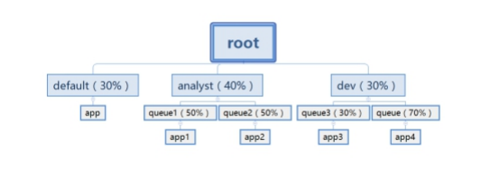

**第三种调度器：Fair Scheduler（公平调度器，CDH版本的hadoop默认使用的调度器)**

Fair调度器的设计目标是为所有的应用分配公平的资源（对公平的定义可以通过参数来设 置）。公平调度在也可以在多个队列间工作。举个例子，假设有两个用户A和B，他们分别拥 有一个队列。当A启动一个job而B没有任务时，A会获得全部集群资源；当B启动一个job后，A 的job会继续运行，不过一会儿之后两个任务会各自获得一半的集群资源。如果此时B再启动 第二个job并且其它job还在运行，则它将会和B的第一个job共享B这个队列的资源，也就是B的 两个job会用于四分之一的集群资源，而A的job仍然用于集群一半的资源，结果就是资源最终 在两个用户之间平等的共享


-----

## Hive

> Hive（数据仓库）：为了构建面向分析的集成化数据环境，为企业提供决策支持（Decision Support）
>
> 数据仓库是存储数据的，企业的各种数据往里面存，主要是为了分析有效数据，后续会基于它产出分析挖掘的数据，或者数据应用需要的数据，如企业的分析报告和各类报表等。
>
> ==面向分析的存储系统==

### 主要特征

数据仓库是面向主题(Subject_Oriented),集成的(Integrated),非易失的(NonVolatile)和时变的(Time-Variant) 数据集合，用以支持管理决策。

**面向主题**

通过一个个主题域将多个业务系统的数据加载到一起，为了各个主题（如：用户，订单，商品等）进行分析而建，操作类型数据库是为了支持各种业务而建立。

**继承性**

数据仓库会将不同源数据库中的数据汇总到一起，数据仓库中的综合数据不能从原有的数据库系统直接得到。因此在数据进入数据仓库之前，必然要经过统一与整合，这一步是数据仓库建设中最关键，最复杂的一步（ETL），要统一源数据中所有矛盾之处，如字段的同名异义，异名同义，单位不统一，字长不一致，等等。

**非易失性**

操作型数据库主要服务于日常的业务操作，使得数据库需要不断的对数据实时更新，以便迅速获得当前最新数据，不至于影响正常的业务运作。

但在数据仓库中，不需要实时更新，可能隔一段时间才需要把新的数据导入到仓库（主要用于分析）。数据仓库中的数据一般仅执行查询操作，很少会有删除和更新，但是需要定期的加载和更新

**时变性**

数据仓库包含各种粒度的历史数据。数据仓库中的数据可能与某个特定日期、星期、月份、 季度或者年份有关。数据仓库的目的是通过分析企业过去一段时间业务的经营状况，挖掘其 中隐藏的模式。虽然数据仓库的用户不能修改数据，但并不是说数据仓库的数据是永远不变 的。分析的结果只能反映过去的情况，当业务变化后，挖掘出的模式会失去时效性。因此数 据仓库的数据需要定时更新，以适应决策的需要。

### 数据库和数据仓库的区别

> 数据库与数据仓库的区别实际讲的是 OLTP 与 OLAP 的区别。
>
> - 操作型处理，叫联机事务处理 OLTP（On-Line Transaction Processing，），也可以称面向交易 的处理系统，它是针对具体业务在数据库联机的日常操作，通常对少数记录进行查询、修 改。用户较为关心操作的响应时间、数据的安全性、完整性和并发支持的用户数等问题。传 统的数据库系统作为数据管理的主要手段，主要用于操作型处理。
> - 分析型处理，叫联机分析处理 OLAP（On-Line Analytical Processing）一般针对某些主题的历 史数据进行分析，支持 管理决策。

首先要明白，数据仓库的出现，并不是要取代数据库。

- 数据库是面向事务的设计，数据仓库是面向主题设计的。
- 数据库一般存储业务数据，数据仓库存储的一般是历史数据。
- 数据库设计是尽量避免冗余，一般针对某一业务应用进行设计，比如一张简单的User表， 记录用户名、密码等简单数据即可，符合业务应用，但是不符合分析。数据仓库在设计 是有意引入冗余，依照分析需求，分析维度、分析指标进行设计。
- 数据库是为捕获数据而设计，数据仓库是为分析数据而设计。

==数据仓库，是在数据库已经大量存在的情况下，为了进一步挖掘数据资源、为了决策需要而 产生的，它决不是所谓的“大型数据库”。==

### 数据仓库的分层架构

> 按照流入流出的过程，数据仓库架构可分为三层--源数据，数据仓库，数据应用

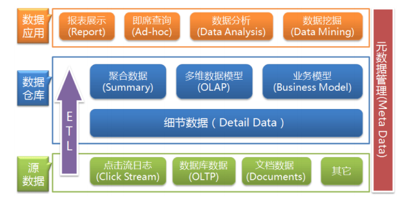

数据仓库的数据来源于不同的源数据，并提供多样的数据应用，数据自下而上流入数据仓库 后向上层开放应用，而数据仓库只是中间集成化数据管理的一个平台。

- **源数据层（ODS）：** 此层数据无任何更改，直接沿用外围系统数据结构和数据，不对外开 放；为临时存储层，是接口数据的临时存储区域，为后一步的数据处理做准备。
- **数据仓库层（DW）：**也称为细节层，DW层的数据应该是一致的、准确的、干净的数据， 即对源系统数据进行了清洗（去除了杂质）后的数据。
- **数据应用层（DA或APP）：** 前端应用直接读取的数据源；根据报表、专题分析需求而计算 生成的数据。

数据仓库从各数据源获取数据及在数据仓库内的数据转换和流动都可以认为是ETL（抽取 Extra, 转化Transfer, 装载Load）的过程，ETL是数据仓库的流水线，也可以认为是数据仓库的 血液，它维系着数据仓库中数据的新陈代谢，而数据仓库日常的管理和维护工作的大部分精 力就是保持ETL的正常和稳定。

**为什么要对数据仓库分层?**

用空间换时间，通过大量的预处理来提升应用系统的用户体验（效率），因此数据仓库会存 在大量冗余的数据；不分层的话，如果源业务系统的业务规则发生变化将会影响整个数据清 洗过程，工作量巨大。

通过数据分层管理可以简化数据清洗的过程，因为把原来一步的工作分到了多个步骤去完 成，相当于把一个复杂的工作拆成了多个简单的工作，把一个大的黑盒变成了一个白盒，每 一层的处理逻辑都相对简单和容易理解，这样我们比较容易保证每一个步骤的正确性，当数 据发生错误的时候，往往我们只需要局部调整某个步骤即可。

### 数据仓库的元数据管理

> **元数据：** 主要记录仓库中模型的定义，各层级之间的映射关系，监控数据仓库的数据状态及ETL的任务运行状态。一般都会通过元数据资料库来统一存储和管理元数据，其主要目的是使数据仓库的设计，部署，操作和管理能达成协同和一致

元数据是数据仓库管理系统的重要组成部分，元数据管理是企业级数据仓库中的关键组件，直接影响着数据仓库的构建，使用和维护。

- 构建数据仓库的主要步骤之一是ETL。这时元数据将发挥重要的作用，它定义了源数据系 统到数据仓库的映射、数据转换的规则、数据仓库的逻辑结构、数据更新的规则、数据 导入历史记录以及装载周期等相关内容。数据抽取和转换的专家以及数据仓库管理员正 是通过元数据高效地构建数据仓库。
- 用户在使用数据仓库时，通过元数据访问数据，明确数据项的含义以及定制报表。
- 数据仓库的规模及其复杂性离不开正确的元数据管理，包括增加或移除外部数据源，改 变数据清洗方法，控制出错的查询以及安排备份等。

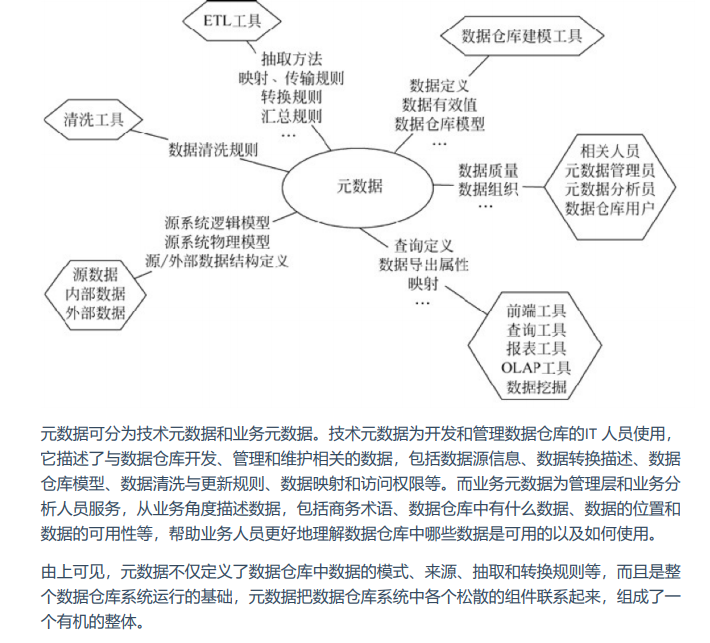


### 	beeline工具连接hive

**一, 修改hadoop的hdfs-site.xml 文件**

在该文件中添加以下内容，开启HDFS的REST接口功能

```xml
<property>
    <name>dfs.webhdfs.enabled</name>
    <value>true</value>
</property>
```

**二，修改hadoop的core-site.xml文件**

在文件中添加以下内容，设置代理用户：

```xml
<property>
    <name>hadoop.proxyuser.root.hosts</name>
    <value>*</value>
</property>
<property>
    <name>hadoop.proxyuser.root.groups</name>
    <value>*</value>
</property>
```

**三，重启hadoop集群**

```shell
scp hdfs-site.xml node02:$PWD
scp hdfs-site.xml node03:$PWD

scp core-site.xml node02:$PWD
scp core-site.xml node03:$PWD

sbin/stop-dfs.sh
sbin/stop-yarn.sh

sbin/start-dfs.sh
sbin/start-yarn.sh
```

**四，启动hiveserver2服务**

前台启动

```shell
cd /export/servers/apache-hive-2.1.1-bin/
bin/hive --service hiveserver2
```

后台启动

```shell
nohup bin/hive --service hiveserver2 > /dev/null 2>&1 &
```

**五，使用beeline连接hiveserver2**

```shell
bin/beeline
beeline> !connect jdbc:hive2://node03:10000
```

输入用户名和密码，用户名必须为root，密码任意

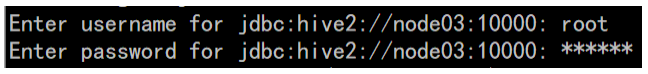


