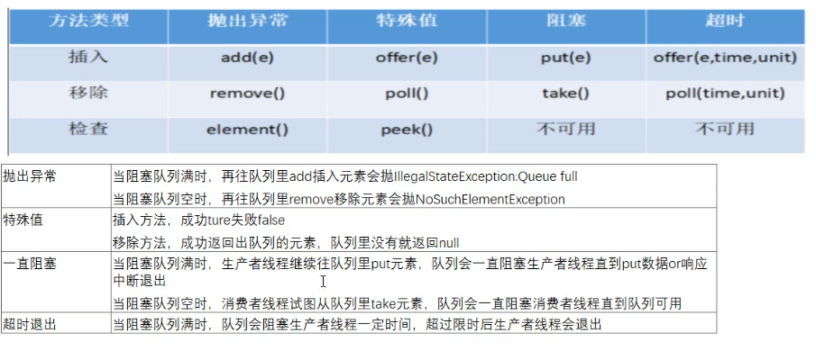

# JUC

> 先看一个小demo

```java
package juc;

class AirConditioner
{
    private int number = 0;

    public synchronized void increment() throws InterruptedException {
        // 1. 判断
        // 这里必须使用while。
        while (number != 0){
            this.wait();
        }
        // 2. 干活
        number ++ ;
        System.out.println(Thread.currentThread().getName()+"\t"+number);
        // 通知
        this.notifyAll();
    }

    public synchronized void decrement() throws InterruptedException {

        // 1. 判断
        while (number == 0){
            this.wait();
        }
        // 2. 干活
        number -- ;
        System.out.println(Thread.currentThread().getName()+"\t"+number);
        // 通知
        this.notifyAll();
    }

}

/**
 * 题目： 现在两个线程，可以操作初始值为零的一个变量
 * 实现一个线程对该变量+1，一个线程对该变量减1
 * 实现交替，来10轮，变量初始值为零
 *
 * 1. 高聚合前提下，线程操作资源类
 * 2. 判断/干活/通知
 * 3. 多线程交互中，必须要防止多线程的虚假唤醒，也即（）
 */
public class ThreadWaitNotifyDemo {
    public static void main(String[] args) {

        AirConditioner airConditioner = new AirConditioner();

        new Thread(() ->{
            for (int i = 1; i <= 10; i++) {
                try {
                    airConditioner.increment();
                } catch (InterruptedException e) {
                    e.printStackTrace();
                }
            }
        },"A").start();

        new Thread(() ->{
            for (int i = 1; i <= 10; i++) {
                try {
                    airConditioner.decrement();
                } catch (InterruptedException e) {
                    e.printStackTrace();
                }
            }
        },"B").start();

        new Thread(() ->{
            for (int i = 1; i <= 10; i++) {
                try {
                    airConditioner.increment();
                } catch (InterruptedException e) {
                    e.printStackTrace();
                }
            }
        },"C").start();

        new Thread(() ->{
            for (int i = 1; i <= 10; i++) {
                try {
                    airConditioner.decrement();
                } catch (InterruptedException e) {
                    e.printStackTrace();
                }
            }
        },"D").start();


    }
}
```

值得注意的是线程的increament 和 decrement必须使用while判断，不能使用if，因为如果当一个线程A阻塞在条件里面的时候，这时候，如果有其他线程唤醒，并把条件的值改变了，那么A线程使用了if，是不会再拉回去判断的，直接跳到下面的步骤，而当你使用while的时候，线程是会被重新拉回条件判断的地方，再次进行判断。

==以上是使用synchronized的，接下来使用lock锁加condition==

```java
package juc;

import java.util.concurrent.locks.Condition;
import java.util.concurrent.locks.Lock;
import java.util.concurrent.locks.ReentrantLock;

class AirConditioner1
{
    private int number = 0;
    private Lock lock = new ReentrantLock();
    private Condition condition = lock.newCondition();

    public void increment() throws InterruptedException{
        lock.lock();
        try {
            // 1.判断
            while (number != 0){
                condition.await();
            }
            //2. 干活
            number ++ ;
            System.out.println(Thread.currentThread().getName() + "\t" + number);
            //3. 通知
            condition.signalAll();
        }catch (Exception e){
            e.printStackTrace();
        }finally {
            lock.unlock();
        }
    }

    public void decrement() throws InterruptedException{
        lock.lock();
        try {
            // 1.判断
            while (number == 0){
                condition.await();
            }
            //2. 干活
            number -- ;
            System.out.println(Thread.currentThread().getName() + "\t" + number);
            //3. 通知
            condition.signalAll();
        }catch (Exception e){
            e.printStackTrace();
        }finally {
            lock.unlock();
        }
    }

}

public class ThreadLockNotifyDemo {

    public static void main(String[] args) {

        AirConditioner1 airConditioner1 = new AirConditioner1();

        new Thread(() ->{
            for (int i = 1; i <= 10; i++) {
                try {
                    airConditioner1.increment();
                } catch (InterruptedException e) {
                    e.printStackTrace();
                }
            }
        },"A").start();


        new Thread(() ->{
            for (int i = 1; i <= 10; i++) {
                try {
                    airConditioner1.decrement();
                } catch (InterruptedException e) {
                    e.printStackTrace();
                }
            }
        },"B").start();

        new Thread(() ->{
            for (int i = 1; i <= 10; i++) {
                try {
                    airConditioner1.increment();
                } catch (InterruptedException e) {
                    e.printStackTrace();
                }
            }
        },"C").start();


        new Thread(() ->{
            for (int i = 1; i <= 10; i++) {
                try {
                    airConditioner1.decrement();
                } catch (InterruptedException e) {
                    e.printStackTrace();
                }
            }
        },"D").start();
    }
}
```

- sychonized  ---- >     lock
- wait()            ----->     await()
- notifyAll()    ------>    signalAll()

利用以上的几点  lock.newCondition()  可以 实现精准控制线程

```java
package juc;

import java.util.concurrent.locks.Condition;
import java.util.concurrent.locks.Lock;
import java.util.concurrent.locks.ReentrantLock;

/**
 * 多线程之间调度： 实现A --> B --> C
 *  三个线程启动，要求如下：
 *
 *  AA 打印5次，BB打印10次，CC打印15次
 *  接着
 *  AA 打印5次，BB打印10次，CC打印15次
 *  。。。来十轮
 */

class ShareResource{

    private int number = 1;   // A: 1    B: 2   C: 3
    private Lock lock = new ReentrantLock();
    private Condition condition1 = lock.newCondition();
    private Condition condition2 = lock.newCondition();
    private Condition condition3 = lock.newCondition();

    public void print5(){
        lock.lock();
        try{
            //1. 判断
            while (number != 1){
                condition1.await();
            }
            //2. 干活
            for (int i = 1; i <= 5; i++) {
                System.out.println(Thread.currentThread().getName() + "\t" +i);
            }
            //3. 通知
            number = 2;
            condition2.signal();

        }catch (Exception e){
            e.printStackTrace();
        }finally {
            lock.unlock();
        }
    }

    public void print10(){
        lock.lock();
        try{
            //1. 判断
            while (number != 2){
                condition2.await();
            }
            //2. 干活
            for (int i = 1; i <= 10; i++) {
                System.out.println(Thread.currentThread().getName() + "\t" +i);
            }
            //3. 通知
            number = 3;
            condition3.signal();

        }catch (Exception e){
            e.printStackTrace();
        }finally {
            lock.unlock();
        }
    }

    public void print15(){
        lock.lock();
        try{
            //1. 判断
            while (number != 3){
                condition3.await();
            }
            //2. 干活
            for (int i = 1; i <= 15; i++) {
                System.out.println(Thread.currentThread().getName() + "\t" +i);
            }
            //3. 通知
            number = 1;
            condition1.signal();

        }catch (Exception e){
            e.printStackTrace();
        }finally {
            lock.unlock();
        }
    }

}


public class ThreadOrderAccess {

    public static void main(String[] args) {
        ShareResource shareResource = new ShareResource();

        new Thread(() ->{
            for (int i = 1; i <= 10; i++) {
                shareResource.print5();
            }
        },"A").start();

        new Thread(() ->{
            for (int i = 1; i <= 10; i++) {
                shareResource.print10();
            }
        },"B").start();


        new Thread(() ->{
            for (int i = 1; i <= 15; i++) {
                shareResource.print15();
            }
        },"C").start();
    }
}
```

**8锁的解释**

```java
package juc;

import java.util.concurrent.TimeUnit;

class Phone{

    public  synchronized void sendEmail() throws Exception{
        TimeUnit.SECONDS.sleep(4);
        System.out.println("--------sendEmail------------");
    }

    public static synchronized void sendSMS() throws Exception{
        System.out.println("--------sendSMS--------------");
    }

    public void hello(){
        System.out.println("--------hello-------------");
    }

}

/**
 * 题目： 多线程8锁
 * 1. 标准访问，请问先打印邮件还是短信？                   邮件   短信
 * 2. 邮件方法暂停4秒钟，请问先打印邮件还是短信               邮件    短信		 (同一个类里面的sychronized只能有一个线程访问，同一时刻)
 * 3. 新增一个普通方法hello() 请问先打印邮件还是Hello         hello    邮件    （hello 没有加sychronized）
 * 4. 两部手机，请问先打印邮件还是短信							不同的类，所以不影响   短信   邮件
 * 5. 两个静态同步方法，同一部手机，请问先打印邮件还是短信？			    邮件    短信   --->  和之前一样
 * 6. 两个静态同步方法，两部手机，请问先打印邮件还是短信？			静态同步方法后，两个手机内存中对应的都是同一个对象  邮件   短信 （锁的是手机模板）
 * 7. 1个普通同步方法，1个静态同步方法，1部手机，请问先打印邮件还是先打印短信？	       短信     邮件  （一个锁的是模板 一个锁的是实体对象）
 * 8. 1个普通同步方法，1个静态同步方法，2部手机，请问先打印邮件还是短信？				 短信     邮件  （同理，只是换了不同的对象）
 */
public class Lock8 {

    public static void main(String[] args) throws InterruptedException {
        Phone phone = new Phone();
        Phone phone1 = new Phone();

        new Thread(() ->{
            try{
                phone.sendEmail();
            }catch (Exception e){
                e.printStackTrace();
            }
        },"A").start();

        Thread.sleep(100);

        new Thread(() ->{
            try{
                phone1.sendSMS();
//                phone.hello();
            }catch (Exception e){
                e.printStackTrace();
            }
        },"B").start();

    }
}
```

**笔记：**

> - 一个对象里面如果有多个sychronized方法，某一时刻内，只要一个线程去调用其中一个sychnorized方法了，其他的线程都只能等待，换句话说，某一时刻内，只能有唯一一个线程去访问这些sychronized方法，锁的当前对象this,被锁定后，其他的线程都不能进入到当前对象的其他的sychronized方法
>- 加个普通方法后发现和同步锁无关，换成两个对象后，不是同一把锁了，情况立刻变化
> - 都换成静态同步方法后，情况又变化所有的非静态同步方法用的都是同一把锁的实例对象本身
>- sychronized实现同步的基础：Java中的每一个对象都可以作为锁，具体表现为以下三种
>   - 对于普通同步方法，锁是当前实例对象
>   - 对于静态同步方法，锁的是当前类的Class对象
>   - 对于同步方法块，锁是Synchronized括号里配置的对象
> - 当一个线程试图访问同步代码块时，它首先必须得到锁，退出或抛出异常时必须释放锁
> - 也就是说如果一个实例对象的普通同步方法获取锁后，该实例对象的其他普通同步方法必须等待获取锁的方法释放后才能获取锁
>- 可是别的实例对象的非静态同步方法 因为跟该实例对象的非静态同步方法用的是不同的锁，所以必须等待该实例对象已获取锁的非静态同步方法释放就可以获取他们自己的锁。
> - 所有的静态同步方法用的也是同一把锁---类对象本身，这两把锁是两个不同的对象，所以静态同步方法与非静态同步方法之间是不会有竞态条件的。
> - 但是一旦一个静态同步方法获取锁后，其他的静态同步方法都必须等待该方法释放锁后才能获取锁，而不管是同一个实例对象的静态方法之间，还是不同的实例对象的静态同步方法之间，只要他们同一类的实例对象
> 

**Callable的一些使用**

```java
package juc;

import java.util.concurrent.Callable;
import java.util.concurrent.FutureTask;
import java.util.concurrent.TimeUnit;

class MyThread implements Callable<Integer>{
    @Override
    public Integer call() throws Exception {
        System.out.println("come in here *************");
        TimeUnit.SECONDS.sleep(2);
        System.out.println(Thread.currentThread().getName());
        return 1024;
    }
}

public class CallableDemo {
    public static void main(String[] args) throws Exception {

        FutureTask futureTask = new FutureTask(new MyThread());
        // 只会调用一次接口，经过一次计算之后，第二次调用的时候直接服用第一次的结果。   A和B都 有可能第一个进去
        new Thread(futureTask,"A").start();
        new Thread(futureTask,"B").start();

        System.out.println(Thread.currentThread().getName()+"**************计算完成");

        System.out.println(futureTask.get());

    }
}
```


## 四大JUC辅助类

**CountDownLatch**

```java
package juc.四大辅助类;

import java.util.concurrent.CountDownLatch;
import java.util.concurrent.TimeUnit;

/**
 * 院子操作
 */
public class CountDownLatchDemo {

    public static void main(String[] args) throws Exception {
        CountDownLatch countDownLatch = new CountDownLatch(6);

        for (int i = 1; i <= 6; i++) {
            new Thread(()->{
                countDownLatch.countDown();
                System.out.println(Thread.currentThread().getName() + "\t离开教室");
            },String.valueOf(i)).start();
        }

        // 等待
        countDownLatch.await();
        System.out.println(Thread.currentThread().getName() + "\t 关门走人");

    }
}
```

**CyclicBarrier**

```java
package juc.四大辅助类;

import java.util.concurrent.BrokenBarrierException;
import java.util.concurrent.CyclicBarrier;

/**
 * 屏障
 */
public class CyclicBarrierDemo {

    public static void main(String[] args) {
        CyclicBarrier cyclicBarrier = new CyclicBarrier(6,() ->{
            System.out.println("----------召唤神龙-----------------");
        });

        for (int i = 1; i <= 7; i++) {
            final int temp = i;
            new Thread(() ->{
                System.out.println(Thread.currentThread().getName()+"\t收集到第:"+temp+"颗龙珠");
                try {
                    cyclicBarrier.await();
                } catch (InterruptedException e) {
                    e.printStackTrace();
                } catch (BrokenBarrierException e) {
                    e.printStackTrace();
                }
            },String.valueOf(i)).start();
        }
    }
}
```

**Semphore**

```java
package juc.四大辅助类;

import java.util.concurrent.Semaphore;
import java.util.concurrent.TimeUnit;

/**
 * 信号灯
 */
public class SemphoreDemo {
    public static void main(String[] args) {
        // 模拟资源类，有3个空车位
        Semaphore semaphore = new Semaphore(3);

        for (int i = 1; i <= 6; i++) {

            new Thread(() ->{
                try {
                    semaphore.acquire();
                    System.out.println(Thread.currentThread().getName()+ "\t抢占到了车位");
                    TimeUnit.SECONDS.sleep(3);
                    System.out.println(Thread.currentThread().getName()+"\t离开了车位");
                } catch (InterruptedException e) {
                    e.printStackTrace();
                }finally {
                    semaphore.release();
                }
            },String.valueOf(i)).start();
        }
    }
}
```

## 读写锁

> 读锁: 防止读的时候其他线程写，允许读的时候其他线程读
>
> 写锁：防止其他线程读和写

```java
package juc;

import java.util.HashMap;
import java.util.Map;
import java.util.concurrent.TimeUnit;
import java.util.concurrent.locks.ReadWriteLock;
import java.util.concurrent.locks.ReentrantReadWriteLock;

class MyCache{
    private volatile Map<String,Object> map = new HashMap<>();
    private ReadWriteLock readWriteLock = new ReentrantReadWriteLock();


    public void put(String key,Object value) throws InterruptedException {
        // 加写锁
        readWriteLock.writeLock().lock();

        System.out.println(Thread.currentThread().getName()+"\t ---写入数据:"+key);
        // 暂停一会
        TimeUnit.MILLISECONDS.sleep(300);
        map.put(key,value);
        System.out.println(Thread.currentThread().getName()+"\t ---写入完成~");

        readWriteLock.writeLock().unlock();
    }

    public void get(String key) throws InterruptedException {
        // 加读锁
        readWriteLock.readLock().lock();

        System.out.println(Thread.currentThread().getName() + "\t 读取数据");
        TimeUnit.MILLISECONDS.sleep(300);
        Object result = map.get(key);
        System.out.println(Thread.currentThread().getName() + "\t 读取完成"+result);

        readWriteLock.readLock().unlock();
    }

}

/**
 * 多个线程同时去读一个资源类没有任何问题，所以为了满足并发量，读取共享资源应该可以同时进行
 * 但是
 * 如果有线程想去写共享资源，就不应该再有其他线程可以对该资源进行读或写
 * 总结：
 *      - 读-读 能共享
 *        读-写 不能共享
 *        写-写 不能共享
 */

public class ReadWriteLockDemo {
    public static void main(String[] args) {

        MyCache myCache = new MyCache();

        for (int i = 1; i <= 5; i++) {
            final int tempInt = i;
            new Thread(() ->{
                try {
                    myCache.put(tempInt+"" , tempInt + "");
                } catch (InterruptedException e) {
                    e.printStackTrace();
                }
            },String.valueOf(i)).start();
        }

        for (int i = 1; i <= 5; i++) {
            final int tempInt = i;
            new Thread(() ->{
                try {
                    myCache.get(tempInt+"" );
                } catch (InterruptedException e) {
                    e.printStackTrace();
                }
            },String.valueOf(i)).start();
        }
    }
}
```

一个线程拥有了对象A的写锁，在释放写锁前其他线程无法获得A的读锁、写锁，因此其他线程此时无法读写；
一个线程拥有了对象A的读锁，在释放前其他线程可以获得A的读锁但无法获得A的写锁，因此其他线程此时可以读不可以写。
不加读锁的话其他线程是可以读，但也可以写，这时就可能导致数据不一致了

## 阻塞队列

- **ArrayBlockingQueue**: 由数组结构组成的有界阻塞队列
- **LinkedBlockQueue**: 由链表结构组成的有界队列（但大小默认值为Integer.MAX_VALUE） 阻塞队列
- **PropityBlockingQueue**: 支持优先级排序的无界队列
- **DelayQueue**： 使用优先级队列实现的延迟无界阻塞队列
- **SynchronousQueue**： 不存储元素的阻塞队列，也即单个元素的队列
- **LinkedTranferQueue**: 由链表组成的无界阻塞队列
- **LinkedBlockingDeque**: 由链表组成的双向阻塞队列




