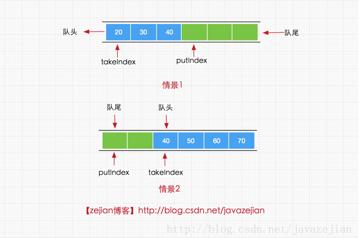

# JUC

> 先看一个小demo

```java
package juc;

class AirConditioner
{
    private int number = 0;

    public synchronized void increment() throws InterruptedException {
        // 1. 判断
        // 这里必须使用while。
        while (number != 0){
            this.wait();
        }
        // 2. 干活
        number ++ ;
        System.out.println(Thread.currentThread().getName()+"\t"+number);
        // 通知
        this.notifyAll();
    }

    public synchronized void decrement() throws InterruptedException {

        // 1. 判断
        while (number == 0){
            this.wait();
        }
        // 2. 干活
        number -- ;
        System.out.println(Thread.currentThread().getName()+"\t"+number);
        // 通知
        this.notifyAll();
    }

}

/**
 * 题目： 现在两个线程，可以操作初始值为零的一个变量
 * 实现一个线程对该变量+1，一个线程对该变量减1
 * 实现交替，来10轮，变量初始值为零
 *
 * 1. 高聚合前提下，线程操作资源类
 * 2. 判断/干活/通知
 * 3. 多线程交互中，必须要防止多线程的虚假唤醒，也即（）
 */
public class ThreadWaitNotifyDemo {
    public static void main(String[] args) {

        AirConditioner airConditioner = new AirConditioner();

        new Thread(() ->{
            for (int i = 1; i <= 10; i++) {
                try {
                    airConditioner.increment();
                } catch (InterruptedException e) {
                    e.printStackTrace();
                }
            }
        },"A").start();

        new Thread(() ->{
            for (int i = 1; i <= 10; i++) {
                try {
                    airConditioner.decrement();
                } catch (InterruptedException e) {
                    e.printStackTrace();
                }
            }
        },"B").start();

        new Thread(() ->{
            for (int i = 1; i <= 10; i++) {
                try {
                    airConditioner.increment();
                } catch (InterruptedException e) {
                    e.printStackTrace();
                }
            }
        },"C").start();

        new Thread(() ->{
            for (int i = 1; i <= 10; i++) {
                try {
                    airConditioner.decrement();
                } catch (InterruptedException e) {
                    e.printStackTrace();
                }
            }
        },"D").start();


    }
}
```

值得注意的是线程的increament 和 decrement必须使用while判断，不能使用if，因为如果当一个线程A阻塞在条件里面的时候，这时候，如果有其他线程唤醒，并把条件的值改变了，那么A线程使用了if，是不会再拉回去判断的，直接跳到下面的步骤，而当你使用while的时候，线程是会被重新拉回条件判断的地方，再次进行判断。

==以上是使用synchronized的，接下来使用lock锁加condition==

```java
package juc;

import java.util.concurrent.locks.Condition;
import java.util.concurrent.locks.Lock;
import java.util.concurrent.locks.ReentrantLock;

class AirConditioner1
{
    private int number = 0;
    private Lock lock = new ReentrantLock();
    private Condition condition = lock.newCondition();

    public void increment() throws InterruptedException{
        lock.lock();
        try {
            // 1.判断
            while (number != 0){
                condition.await();
            }
            //2. 干活
            number ++ ;
            System.out.println(Thread.currentThread().getName() + "\t" + number);
            //3. 通知
            condition.signalAll();
        }catch (Exception e){
            e.printStackTrace();
        }finally {
            lock.unlock();
        }
    }

    public void decrement() throws InterruptedException{
        lock.lock();
        try {
            // 1.判断
            while (number == 0){
                condition.await();
            }
            //2. 干活
            number -- ;
            System.out.println(Thread.currentThread().getName() + "\t" + number);
            //3. 通知
            condition.signalAll();
        }catch (Exception e){
            e.printStackTrace();
        }finally {
            lock.unlock();
        }
    }

}

public class ThreadLockNotifyDemo {

    public static void main(String[] args) {

        AirConditioner1 airConditioner1 = new AirConditioner1();

        new Thread(() ->{
            for (int i = 1; i <= 10; i++) {
                try {
                    airConditioner1.increment();
                } catch (InterruptedException e) {
                    e.printStackTrace();
                }
            }
        },"A").start();


        new Thread(() ->{
            for (int i = 1; i <= 10; i++) {
                try {
                    airConditioner1.decrement();
                } catch (InterruptedException e) {
                    e.printStackTrace();
                }
            }
        },"B").start();

        new Thread(() ->{
            for (int i = 1; i <= 10; i++) {
                try {
                    airConditioner1.increment();
                } catch (InterruptedException e) {
                    e.printStackTrace();
                }
            }
        },"C").start();


        new Thread(() ->{
            for (int i = 1; i <= 10; i++) {
                try {
                    airConditioner1.decrement();
                } catch (InterruptedException e) {
                    e.printStackTrace();
                }
            }
        },"D").start();
    }
}
```

- sychonized  ---- >     lock
- wait()            ----->     await()
- notifyAll()    ------>    signalAll()

利用以上的几点  lock.newCondition()  可以 实现精准控制线程

```java
package juc;

import java.util.concurrent.locks.Condition;
import java.util.concurrent.locks.Lock;
import java.util.concurrent.locks.ReentrantLock;

/**
 * 多线程之间调度： 实现A --> B --> C
 *  三个线程启动，要求如下：
 *
 *  AA 打印5次，BB打印10次，CC打印15次
 *  接着
 *  AA 打印5次，BB打印10次，CC打印15次
 *  。。。来十轮
 */

class ShareResource{

    private int number = 1;   // A: 1    B: 2   C: 3
    private Lock lock = new ReentrantLock();
    private Condition condition1 = lock.newCondition();
    private Condition condition2 = lock.newCondition();
    private Condition condition3 = lock.newCondition();

    public void print5(){
        lock.lock();
        try{
            //1. 判断
            while (number != 1){
                condition1.await();
            }
            //2. 干活
            for (int i = 1; i <= 5; i++) {
                System.out.println(Thread.currentThread().getName() + "\t" +i);
            }
            //3. 通知
            number = 2;
            condition2.signal();

        }catch (Exception e){
            e.printStackTrace();
        }finally {
            lock.unlock();
        }
    }

    public void print10(){
        lock.lock();
        try{
            //1. 判断
            while (number != 2){
                condition2.await();
            }
            //2. 干活
            for (int i = 1; i <= 10; i++) {
                System.out.println(Thread.currentThread().getName() + "\t" +i);
            }
            //3. 通知
            number = 3;
            condition3.signal();

        }catch (Exception e){
            e.printStackTrace();
        }finally {
            lock.unlock();
        }
    }

    public void print15(){
        lock.lock();
        try{
            //1. 判断
            while (number != 3){
                condition3.await();
            }
            //2. 干活
            for (int i = 1; i <= 15; i++) {
                System.out.println(Thread.currentThread().getName() + "\t" +i);
            }
            //3. 通知
            number = 1;
            condition1.signal();

        }catch (Exception e){
            e.printStackTrace();
        }finally {
            lock.unlock();
        }
    }

}


public class ThreadOrderAccess {

    public static void main(String[] args) {
        ShareResource shareResource = new ShareResource();

        new Thread(() ->{
            for (int i = 1; i <= 10; i++) {
                shareResource.print5();
            }
        },"A").start();

        new Thread(() ->{
            for (int i = 1; i <= 10; i++) {
                shareResource.print10();
            }
        },"B").start();


        new Thread(() ->{
            for (int i = 1; i <= 15; i++) {
                shareResource.print15();
            }
        },"C").start();
    }
}
```

**8锁的解释**

```java
package juc;

import java.util.concurrent.TimeUnit;

class Phone{

    public  synchronized void sendEmail() throws Exception{
        TimeUnit.SECONDS.sleep(4);
        System.out.println("--------sendEmail------------");
    }

    public static synchronized void sendSMS() throws Exception{
        System.out.println("--------sendSMS--------------");
    }

    public void hello(){
        System.out.println("--------hello-------------");
    }

}

/**
 * 题目： 多线程8锁
 * 1. 标准访问，请问先打印邮件还是短信？                   邮件   短信
 * 2. 邮件方法暂停4秒钟，请问先打印邮件还是短信               邮件    短信		 (同一个类里面的sychronized只能有一个线程访问，同一时刻)
 * 3. 新增一个普通方法hello() 请问先打印邮件还是Hello         hello    邮件    （hello 没有加sychronized）
 * 4. 两部手机，请问先打印邮件还是短信							不同的类，所以不影响   短信   邮件
 * 5. 两个静态同步方法，同一部手机，请问先打印邮件还是短信？			    邮件    短信   --->  和之前一样
 * 6. 两个静态同步方法，两部手机，请问先打印邮件还是短信？			静态同步方法后，两个手机内存中对应的都是同一个对象  邮件   短信 （锁的是手机模板）
 * 7. 1个普通同步方法，1个静态同步方法，1部手机，请问先打印邮件还是先打印短信？	       短信     邮件  （一个锁的是模板 一个锁的是实体对象）
 * 8. 1个普通同步方法，1个静态同步方法，2部手机，请问先打印邮件还是短信？				 短信     邮件  （同理，只是换了不同的对象）
 */
public class Lock8 {

    public static void main(String[] args) throws InterruptedException {
        Phone phone = new Phone();
        Phone phone1 = new Phone();

        new Thread(() ->{
            try{
                phone.sendEmail();
            }catch (Exception e){
                e.printStackTrace();
            }
        },"A").start();

        Thread.sleep(100);

        new Thread(() ->{
            try{
                phone1.sendSMS();
//                phone.hello();
            }catch (Exception e){
                e.printStackTrace();
            }
        },"B").start();

    }
}
```

**笔记：**

> - 一个对象里面如果有多个sychronized方法，某一时刻内，只要一个线程去调用其中一个sychnorized方法了，其他的线程都只能等待，换句话说，某一时刻内，只能有唯一一个线程去访问这些sychronized方法，锁的当前对象this,被锁定后，其他的线程都不能进入到当前对象的其他的sychronized方法
>- 加个普通方法后发现和同步锁无关，换成两个对象后，不是同一把锁了，情况立刻变化
> - 都换成静态同步方法后，情况又变化所有的非静态同步方法用的都是同一把锁的实例对象本身
>- sychronized实现同步的基础：Java中的每一个对象都可以作为锁，具体表现为以下三种
>   - 对于普通同步方法，锁是当前实例对象
>   - 对于静态同步方法，锁的是当前类的Class对象
>   - 对于同步方法块，锁是Synchronized括号里配置的对象
> - 当一个线程试图访问同步代码块时，它首先必须得到锁，退出或抛出异常时必须释放锁
> - 也就是说如果一个实例对象的普通同步方法获取锁后，该实例对象的其他普通同步方法必须等待获取锁的方法释放后才能获取锁
>- 可是别的实例对象的非静态同步方法 因为跟该实例对象的非静态同步方法用的是不同的锁，所以必须等待该实例对象已获取锁的非静态同步方法释放就可以获取他们自己的锁。
> - 所有的静态同步方法用的也是同一把锁---类对象本身，这两把锁是两个不同的对象，所以静态同步方法与非静态同步方法之间是不会有竞态条件的。
> - 但是一旦一个静态同步方法获取锁后，其他的静态同步方法都必须等待该方法释放锁后才能获取锁，而不管是同一个实例对象的静态方法之间，还是不同的实例对象的静态同步方法之间，只要他们同一类的实例对象
> 

**Callable的一些使用**

```java
package juc;

import java.util.concurrent.Callable;
import java.util.concurrent.FutureTask;
import java.util.concurrent.TimeUnit;

class MyThread implements Callable<Integer>{
    @Override
    public Integer call() throws Exception {
        System.out.println("come in here *************");
        TimeUnit.SECONDS.sleep(2);
        System.out.println(Thread.currentThread().getName());
        return 1024;
    }
}

public class CallableDemo {
    public static void main(String[] args) throws Exception {

        FutureTask futureTask = new FutureTask(new MyThread());
        // 只会调用一次接口，经过一次计算之后，第二次调用的时候直接服用第一次的结果。   A和B都 有可能第一个进去
        new Thread(futureTask,"A").start();
        new Thread(futureTask,"B").start();

        System.out.println(Thread.currentThread().getName()+"**************计算完成");

        System.out.println(futureTask.get());

    }
}
```


## 三大JUC辅助类

**CountDownLatch**

```java
package juc.四大辅助类;

import java.util.concurrent.CountDownLatch;
import java.util.concurrent.TimeUnit;

/**
 * 院子操作
 */
public class CountDownLatchDemo {

    public static void main(String[] args) throws Exception {
        CountDownLatch countDownLatch = new CountDownLatch(6);

        for (int i = 1; i <= 6; i++) {
            new Thread(()->{
                countDownLatch.countDown();
                System.out.println(Thread.currentThread().getName() + "\t离开教室");
            },String.valueOf(i)).start();
        }

        // 等待
        countDownLatch.await();
        System.out.println(Thread.currentThread().getName() + "\t 关门走人");

    }
}
```

**CyclicBarrier**

```java
package juc.四大辅助类;

import java.util.concurrent.BrokenBarrierException;
import java.util.concurrent.CyclicBarrier;

/**
 * 屏障
 */
public class CyclicBarrierDemo {

    public static void main(String[] args) {
        CyclicBarrier cyclicBarrier = new CyclicBarrier(6,() ->{
            System.out.println("----------召唤神龙-----------------");
        });

        for (int i = 1; i <= 7; i++) {
            final int temp = i;
            new Thread(() ->{
                System.out.println(Thread.currentThread().getName()+"\t收集到第:"+temp+"颗龙珠");
                try {
                    cyclicBarrier.await();
                } catch (InterruptedException e) {
                    e.printStackTrace();
                } catch (BrokenBarrierException e) {
                    e.printStackTrace();
                }
            },String.valueOf(i)).start();
        }
    }
}
```

**Semphore**

```java
package juc.四大辅助类;

import java.util.concurrent.Semaphore;
import java.util.concurrent.TimeUnit;

/**
 * 信号灯
 */
public class SemphoreDemo {
    public static void main(String[] args) {
        // 模拟资源类，有3个空车位
        Semaphore semaphore = new Semaphore(3);

        for (int i = 1; i <= 6; i++) {

            new Thread(() ->{
                try {
                    semaphore.acquire();
                    System.out.println(Thread.currentThread().getName()+ "\t抢占到了车位");
                    TimeUnit.SECONDS.sleep(3);
                    System.out.println(Thread.currentThread().getName()+"\t离开了车位");
                } catch (InterruptedException e) {
                    e.printStackTrace();
                }finally {
                    semaphore.release();
                }
            },String.valueOf(i)).start();
        }
    }
}
```

## 读写锁

> 读锁: 防止读的时候其他线程写，允许读的时候其他线程读
>
> 写锁：防止其他线程读和写

```java
package juc;

import java.util.HashMap;
import java.util.Map;
import java.util.concurrent.TimeUnit;
import java.util.concurrent.locks.ReadWriteLock;
import java.util.concurrent.locks.ReentrantReadWriteLock;

class MyCache{
    private volatile Map<String,Object> map = new HashMap<>();
    private ReadWriteLock readWriteLock = new ReentrantReadWriteLock();


    public void put(String key,Object value) throws InterruptedException {
        // 加写锁
        readWriteLock.writeLock().lock();

        System.out.println(Thread.currentThread().getName()+"\t ---写入数据:"+key);
        // 暂停一会
        TimeUnit.MILLISECONDS.sleep(300);
        map.put(key,value);
        System.out.println(Thread.currentThread().getName()+"\t ---写入完成~");

        readWriteLock.writeLock().unlock();
    }

    public void get(String key) throws InterruptedException {
        // 加读锁
        readWriteLock.readLock().lock();

        System.out.println(Thread.currentThread().getName() + "\t 读取数据");
        TimeUnit.MILLISECONDS.sleep(300);
        Object result = map.get(key);
        System.out.println(Thread.currentThread().getName() + "\t 读取完成"+result);

        readWriteLock.readLock().unlock();
    }

}

/**
 * 多个线程同时去读一个资源类没有任何问题，所以为了满足并发量，读取共享资源应该可以同时进行
 * 但是
 * 如果有线程想去写共享资源，就不应该再有其他线程可以对该资源进行读或写
 * 总结：
 *      - 读-读 能共享
 *        读-写 不能共享
 *        写-写 不能共享
 */

public class ReadWriteLockDemo {
    public static void main(String[] args) {

        MyCache myCache = new MyCache();

        for (int i = 1; i <= 5; i++) {
            final int tempInt = i;
            new Thread(() ->{
                try {
                    myCache.put(tempInt+"" , tempInt + "");
                } catch (InterruptedException e) {
                    e.printStackTrace();
                }
            },String.valueOf(i)).start();
        }

        for (int i = 1; i <= 5; i++) {
            final int tempInt = i;
            new Thread(() ->{
                try {
                    myCache.get(tempInt+"" );
                } catch (InterruptedException e) {
                    e.printStackTrace();
                }
            },String.valueOf(i)).start();
        }
    }
}
```

一个线程拥有了对象A的写锁，在释放写锁前其他线程无法获得A的读锁、写锁，因此其他线程此时无法读写；
一个线程拥有了对象A的读锁，在释放前其他线程可以获得A的读锁但无法获得A的写锁，因此其他线程此时可以读不可以写。
不加读锁的话其他线程是可以读，但也可以写，这时就可能导致数据不一致了

------

## 线程池

### Executors

```java
package java.util.concurrent;

import static java.lang.ref.Reference.reachabilityFence;
import java.security.AccessControlContext;
import java.security.AccessControlException;
import java.security.AccessController;
import java.security.PrivilegedAction;
import java.security.PrivilegedActionException;
import java.security.PrivilegedExceptionAction;
import java.util.Collection;
import java.util.List;
import java.util.concurrent.atomic.AtomicInteger;
import sun.security.util.SecurityConstants;

public class Executors {
    // 创建一个定长的线程池，可控制线程最大的并发数，超出的线程会在队列中等待
    public static ExecutorService newFixedThreadPool(int nThreads) {
        return new ThreadPoolExecutor(nThreads, nThreads,
                                      0L, TimeUnit.MILLISECONDS,
                                      new LinkedBlockingQueue<Runnable>());
    }

   // 任务窃取线程，用到了分而治之，递归计算的算法。
    public static ExecutorService newWorkStealingPool(int parallelism) {
        return new ForkJoinPool
            (parallelism,
             ForkJoinPool.defaultForkJoinWorkerThreadFactory,
             null, true);
    }

    public static ExecutorService newWorkStealingPool() {
        return new ForkJoinPool
            (Runtime.getRuntime().availableProcessors(),
             ForkJoinPool.defaultForkJoinWorkerThreadFactory,
             null, true);
    }

    // 创建一个可重用固定个数的线程池，以共享的无界队列方式来运行这些线程。 传入拒绝策略
    public static ExecutorService newFixedThreadPool(int nThreads, ThreadFactory threadFactory) {
        return new ThreadPoolExecutor(nThreads, nThreads,
                                      0L, TimeUnit.MILLISECONDS,
                                      new LinkedBlockingQueue<Runnable>(),
                                      threadFactory);
    }

    // 创建一个单线程化的线程池，它只会用唯一的工作线程来执行任务，保证所有任务按照指定顺序(FIFO.LIFO,优先级)执行。
    public static ExecutorService newSingleThreadExecutor() {
        return new FinalizableDelegatedExecutorService
            (new ThreadPoolExecutor(1, 1,
                                    0L, TimeUnit.MILLISECONDS,
                                    new LinkedBlockingQueue<Runnable>()));
    }

   // 创建单线程化的线程池，并传入拒绝策略
    public static ExecutorService newSingleThreadExecutor(ThreadFactory threadFactory) {
        return new FinalizableDelegatedExecutorService
            (new ThreadPoolExecutor(1, 1,
                                    0L, TimeUnit.MILLISECONDS,
                                    new LinkedBlockingQueue<Runnable>(),
                                    threadFactory));
    }

    // 创建缓冲性线程池，没有则创建，60秒内未被使用则会被销毁
    public static ExecutorService newCachedThreadPool() {
        return new ThreadPoolExecutor(0, Integer.MAX_VALUE,
                                      60L, TimeUnit.SECONDS,
                                      new SynchronousQueue<Runnable>());
    }

   // 同上  创建了拒绝策略
    public static ExecutorService newCachedThreadPool(ThreadFactory threadFactory) {
        return new ThreadPoolExecutor(0, Integer.MAX_VALUE,
                                      60L, TimeUnit.SECONDS,
                                      new SynchronousQueue<Runnable>(),
                                      threadFactory);
    }

   // 返回单实例的线程池，如果线程失败而终止，再次调用的时候将替换一个新的线程，保证执行任务。
    public static ScheduledExecutorService newSingleThreadScheduledExecutor() {
        return new DelegatedScheduledExecutorService
            (new ScheduledThreadPoolExecutor(1));
    }

    // 同上指定拒绝策略
    public static ScheduledExecutorService newSingleThreadScheduledExecutor(ThreadFactory threadFactory) {
        return new DelegatedScheduledExecutorService
            (new ScheduledThreadPoolExecutor(1, threadFactory));
    }

    // 创建一个可以定期执行的线程池，并指定保留在池中的线程数
    public static ScheduledExecutorService newScheduledThreadPool(int corePoolSize) {
        return new ScheduledThreadPoolExecutor(corePoolSize);
    }

   // 同上 指定拒绝策略
    public static ScheduledExecutorService newScheduledThreadPool(
            int corePoolSize, ThreadFactory threadFactory) {
        return new ScheduledThreadPoolExecutor(corePoolSize, threadFactory);
    }

    // 配置ExecutorService 使其只暴露出ExecutorService的方法 ，而不能对其进行配置(用于创建不可更改的线程池)
    public static ExecutorService unconfigurableExecutorService(ExecutorService executor) {
        if (executor == null)
            throw new NullPointerException();
        return new DelegatedExecutorService(executor);
    }

   // 同上 并传入拒绝策略
    public static ScheduledExecutorService unconfigurableScheduledExecutorService(ScheduledExecutorService executor) {
        if (executor == null)
            throw new NullPointerException();
        return new DelegatedScheduledExecutorService(executor);
    }

   // 线程构造器吧。给线程命名，或者设置为后台线程/前台进程
    public static ThreadFactory defaultThreadFactory() {
        return new DefaultThreadFactory();
    }

   // 用于返回创建新线程的线程工厂
    public static ThreadFactory privilegedThreadFactory() {
        return new PrivilegedThreadFactory();
    }

    
    public static <T> Callable<T> callable(Runnable task, T result) {
        if (task == null)
            throw new NullPointerException();
        return new RunnableAdapter<T>(task, result);
    }

    public static Callable<Object> callable(Runnable task) {
        if (task == null)
            throw new NullPointerException();
        return new RunnableAdapter<Object>(task, null);
    }

  
    public static Callable<Object> callable(final PrivilegedAction<?> action) {
        if (action == null)
            throw new NullPointerException();
        return new Callable<Object>() {
            public Object call() { return action.run(); }};
    }

   
    public static Callable<Object> callable(final PrivilegedExceptionAction<?> action) {
        if (action == null)
            throw new NullPointerException();
        return new Callable<Object>() {
            public Object call() throws Exception { return action.run(); }};
    }

    public static <T> Callable<T> privilegedCallable(Callable<T> callable) {
        if (callable == null)
            throw new NullPointerException();
        return new PrivilegedCallable<T>(callable);
    }

   
    public static <T> Callable<T> privilegedCallableUsingCurrentClassLoader(Callable<T> callable) {
        if (callable == null)
            throw new NullPointerException();
        return new PrivilegedCallableUsingCurrentClassLoader<T>(callable);
    }

  
    private static final class RunnableAdapter<T> implements Callable<T> {
        private final Runnable task;
        private final T result;
        RunnableAdapter(Runnable task, T result) {
            this.task = task;
            this.result = result;
        }
        public T call() {
            task.run();
            return result;
        }
        public String toString() {
            return super.toString() + "[Wrapped task = " + task + "]";
        }
    }

    private static final class PrivilegedCallable<T> implements Callable<T> {
        final Callable<T> task;
        final AccessControlContext acc;

        PrivilegedCallable(Callable<T> task) {
            this.task = task;
            this.acc = AccessController.getContext();
        }

        public T call() throws Exception {
            try {
                return AccessController.doPrivileged(
                    new PrivilegedExceptionAction<T>() {
                        public T run() throws Exception {
                            return task.call();
                        }
                    }, acc);
            } catch (PrivilegedActionException e) {
                throw e.getException();
            }
        }

        public String toString() {
            return super.toString() + "[Wrapped task = " + task + "]";
        }
    }

    private static final class PrivilegedCallableUsingCurrentClassLoader<T>
            implements Callable<T> {
        final Callable<T> task;
        final AccessControlContext acc;
        final ClassLoader ccl;

        PrivilegedCallableUsingCurrentClassLoader(Callable<T> task) {
            SecurityManager sm = System.getSecurityManager();
            if (sm != null) {
                sm.checkPermission(SecurityConstants.GET_CLASSLOADER_PERMISSION);
                sm.checkPermission(new RuntimePermission("setContextClassLoader"));
            }
            this.task = task;
            this.acc = AccessController.getContext();
            this.ccl = Thread.currentThread().getContextClassLoader();
        }

        public T call() throws Exception {
            try {
                return AccessController.doPrivileged(
                    new PrivilegedExceptionAction<T>() {
                        public T run() throws Exception {
                            Thread t = Thread.currentThread();
                            ClassLoader cl = t.getContextClassLoader();
                            if (ccl == cl) {
                                return task.call();
                            } else {
                                t.setContextClassLoader(ccl);
                                try {
                                    return task.call();
                                } finally {
                                    t.setContextClassLoader(cl);
                                }
                            }
                        }
                    }, acc);
            } catch (PrivilegedActionException e) {
                throw e.getException();
            }
        }

        public String toString() {
            return super.toString() + "[Wrapped task = " + task + "]";
        }
    }

    /**
     * The default thread factory.
     */
    private static class DefaultThreadFactory implements ThreadFactory {
        private static final AtomicInteger poolNumber = new AtomicInteger(1);
        private final ThreadGroup group;
        private final AtomicInteger threadNumber = new AtomicInteger(1);
        private final String namePrefix;

        DefaultThreadFactory() {
            SecurityManager s = System.getSecurityManager();
            group = (s != null) ? s.getThreadGroup() :
                                  Thread.currentThread().getThreadGroup();
            namePrefix = "pool-" +
                          poolNumber.getAndIncrement() +
                         "-thread-";
        }

        public Thread newThread(Runnable r) {
            Thread t = new Thread(group, r,
                                  namePrefix + threadNumber.getAndIncrement(),
                                  0);
            if (t.isDaemon())
                t.setDaemon(false);
            if (t.getPriority() != Thread.NORM_PRIORITY)
                t.setPriority(Thread.NORM_PRIORITY);
            return t;
        }
    }
    /** Cannot instantiate. */
    private Executors() {}
}
```

### 阻塞队列

> 最常用的队列主要有以下两种：
>
> - 先进先出(FIFO): 先插入的队列的元素也最先出队列，类似于排队的功能。从某种程度上来说，这种队列也体现了一种公平性
> - 后进先出(LIFO): 后插入队列的元素最先出队列，这种队列优先处理最近发生的事件

- **ArrayBlockingQueue**: 由数组结构组成的有界阻塞队列
- **LinkedBlockQueue**: 由链表结构组成的有界队列（但大小默认值为Integer.MAX_VALUE） 阻塞队列
- **PropityBlockingQueue**: 支持优先级排序的无界队列
- **DelayQueue**： 使用优先级队列实现的延迟无界阻塞队列
- **SynchronousQueue**： 不存储元素的阻塞队列，也即单个元素的队列
- **LinkedTranferQueue**: 由链表组成的无界阻塞队列
- **LinkedBlockingDeque**: 由链表组成的双向阻塞队列


经典的生产者消费者问题，当生产者生产的速度大于消费者消费的速度的时候，队列满了，就会阻塞其他线程的加入。

**BlockQueue的核心方法**

1. 放入数据
   1. offer(anObject): 表示如果可能的话，将anObject加入到BlockQueue里，即如果BlockQueue可以容纳，则返回true，否则false
   2. offer(E o, long timeout, TimeUnit unit)：可以设定等待的时间，如果在指定的时间内，还不能往队列中加入BlockingQueue，则返回失败。
   3. put(anObject):把anObject加到BlockingQueue里,如果BlockQueue没有空间,则调用此方法的线程被阻断直到BlockingQueue里面有空间再继续.
2. 获取数据
   1. poll(time):取走BlockingQueue里排在首位的对象,若不能立即取出,则可以等time参数规定的时间,取不到时返回null;
   2. poll(long timeout, TimeUnit unit)：从BlockingQueue取出一个队首的对象，如果在指定时间内，队列一旦有数据可取，则立即返回队列中的数据。否则知道时间 , 超时还没有数据可取，返回失败。
   3. take():取走BlockingQueue里排在首位的对象,若BlockingQueue为空,阻断进入等待状态直到BlockingQueue有新的数据被加入; 
   4. drainTo():一次性从BlockingQueue获取所有可用的数据对象（还可以指定获取数据的个数），通过该方法，可以提升获取数据效率；不需要多次分批加锁或释放锁。

**ArrayBlockingQueue的基本使用**

> ArrayBlockingQueue 的内部是通过一个可重入锁ReentrantLock和两个Condition条件对象来实现阻塞

```java
public class ArrayBlockingQueue<E> extends AbstractQueue<E>
        implements BlockingQueue<E>, java.io.Serializable {

    /** 存储数据的数组 */
    final Object[] items;

    /**获取数据的索引，主要用于take，poll，peek，remove方法 */
    int takeIndex;

    /**添加数据的索引，主要用于 put, offer, or add 方法*/
    int putIndex;

    /** 队列元素的个数 */
    int count;


    /** 控制并非访问的锁 */
    final ReentrantLock lock;

    /**notEmpty条件对象，用于通知take方法队列已有元素，可执行获取操作 */
    private final Condition notEmpty;

    /**notFull条件对象，用于通知put方法队列未满，可执行添加操作 */
    private final Condition notFull;

    /**
       迭代器
     */
    transient Itrs itrs = null;

}
```

这样来看ArrayBlockingQueue是使用数组对象来存储数据的，


添加到阻塞队列的操作

```java
//add方法实现，间接调用了offer(e)
public boolean add(E e) {
        if (offer(e))
            return true;
        else
            throw new IllegalStateException("Queue full");
    }

//offer方法
public boolean offer(E e) {
     checkNotNull(e);//检查元素是否为null
     final ReentrantLock lock = this.lock;
     lock.lock();//加锁
     try {
         if (count == items.length)//判断队列是否满
             return false;
         else {
             enqueue(e);//添加元素到队列
             return true;
         }
     } finally {
         lock.unlock();
     }
 }

//入队操作
private void enqueue(E x) {
    //获取当前数组
    final Object[] items = this.items;
    //通过putIndex索引对数组进行赋值
    items[putIndex] = x;
    //索引自增，如果已是最后一个位置，重新设置 putIndex = 0;
    if (++putIndex == items.length)
        putIndex = 0;
    count++;//队列中元素数量加1
    //唤醒调用take()方法的线程，执行元素获取操作。
    notEmpty.signal();
}
```



**调用put方法**

> 添加线程的执行存在以下两种情况，一是，队列已满，那么新到来的put线程将添加到notFull的条件队列中，二是移除线程执行操作，移除成功同时唤醒put线程。


**LinkedBlockingQueue**

> linkedBlockingQueue是一个由链表实现的有界阻塞队列，但大小默认值为Integer.MAX_VALUE，所以我们在使用LinkedBlocking时建议手动传值，为其提供我们所需的大小，避免队列过大造成机器负载获取内存爆满的情况。

```java
//默认大小为Integer.MAX_VALUE
public LinkedBlockingQueue() {
       this(Integer.MAX_VALUE);
}

//创建指定大小为capacity的阻塞队列
public LinkedBlockingQueue(int capacity) {
     if (capacity <= 0) throw new IllegalArgumentException();
     this.capacity = capacity;
     last = head = new Node<E>(null);
 }

//创建大小默认值为Integer.MAX_VALUE的阻塞队列并添加c中的元素到阻塞队列
public LinkedBlockingQueue(Collection<? extends E> c) {
     this(Integer.MAX_VALUE);
     final ReentrantLock putLock = this.putLock;
     putLock.lock(); // Never contended, but necessary for visibility
     try {
         int n = 0;
         for (E e : c) {
             if (e == null)
                 throw new NullPointerException();
             if (n == capacity)
                 throw new IllegalStateException("Queue full");
             enqueue(new Node<E>(e));
             ++n;
         }
         count.set(n);
     } finally {
         putLock.unlock();
     }
 }
```

接下来我们来看看LinkedBlockingQueue的内部成员变量

```java
public class LinkedBlockingQueue<E> extends AbstractQueue<E>
        implements BlockingQueue<E>, java.io.Serializable {

    /**
     * 节点类，用于存储数据
     */
    static class Node<E> {
        E item;

        /**
         * One of:
         * - the real successor Node
         * - this Node, meaning the successor is head.next
         * - null, meaning there is no successor (this is the last node)
         */
        Node<E> next;

        Node(E x) { item = x; }
    }

    /** 阻塞队列的大小，默认为Integer.MAX_VALUE */
    private final int capacity;

    /** 当前阻塞队列中的元素个数 */
    private final AtomicInteger count = new AtomicInteger();

    /**
     * 阻塞队列的头结点
     */
    transient Node<E> head;

    /**
     * 阻塞队列的尾节点
     */
    private transient Node<E> last;

    /** 获取并移除元素时使用的锁，如take, poll, etc */
    private final ReentrantLock takeLock = new ReentrantLock();

    /** notEmpty条件对象，当队列没有数据时用于挂起执行删除的线程 */
    private final Condition notEmpty = takeLock.newCondition();

    /** 添加元素时使用的锁如 put, offer, etc */
    private final ReentrantLock putLock = new ReentrantLock();

    /** notFull条件对象，当队列数据已满时用于挂起执行添加的线程 */
    private final Condition notFull = putLock.newCondition();

}
```

由于LinkedBlockingQueue的默认情况下其容量大小是Integer.MAX_VALUE,如果存在添加速度大于删除速度的时候，可能会造成内存溢出(OOM)

**对比一下以上两个队列的区别:**

-  队列大小有所不同，ArrayBlockingQueue是有界的初始化必须指定大小，而LinkedBlockingQueue可以是有界的也可以是无界的，无界情况容易造成溢出
-  数据存储容器不同，ArrayBlockingQueue采用的是数组存储容器，而LinkedBlockingQueue采用的是链表
-  由于ArrayBlockingQueue采用的是数组的存储容器，因此在插入或删除元素时不会产生销毁任何额外的对象实例，而LinkedBlockingQueue则会产生一个额外的Node对象。可能对于GC存在较大影响
-  实现队列添加或移除的锁不一样，ArrayBlockingQueue实现的队列中的锁是没有分离的，即添加操作和移除操作使用同一个ReentLock锁，而LinkedBlockingQueue是没有分离的，添加采用putLock，移除采用takeLock。这样能大大提高吞吐量，提高并发性能。


参考链接： https://www.cnblogs.com/xuwc/p/8661098.html


### 线程理解

> - 用户级线程(ULT)   ----->    交给自己管理 APP 管理
>   - 用户程序实现，不依赖操作系统核心，应用提供创建，同步，调度和管理的函数来控制用户线程。==不需要用户态/内核态切换，速度快。==内核对ULT无感知，线程阻塞则进程（包括它的所有线程）阻塞。
>
>  对于内核来说就像是单线程一样。这样子的话，上述的线程表就需要维护在对应的进程之间了，而且进程间无法共享数据，所以线程表只是各自进程的线程
>
> 
>
> - 内核线程(KLT)
>   - 系统内核管理线程（KLT），内核保护线程的状态和上下文信息，线程阻塞不会引起进程阻塞。在多处理器系统上，多线程在多处理器上并行运行。线程的创建，调度和管理由内核完成，效率比ULT慢，比进程操作快。
>
>  内核需要维护一个所有线程的线程表。（线程表保存了寄存器，状态和其他信息。）

> JVM使用的是KLT模型


线程是稀缺资源，它的创建与销毁是一个相对偏重且耗资源的操作，而Java线程依赖于内核线程，创建线程需要进行==操作系统切换==，为了避免资源过度的消耗需要设法重用线程执行多个任务。线程池就是一个线程缓存，负责对线程进行统一分配，调用和监控。

> 什么时候使用线程池？

- 单个任务处理时间比较短
- 需要处理的任务数量很大

> 线程池优势

- 重用存在的线程，减少线程创建，消亡的开销，提高性能
- 提高响应速度。当任务到达时，任务可以不需要等到线程创建就能立即执行。
- 提高线程的可管理性，可统一分配，调优和监控

**线程池池化过程**


### 线程池状态

> 线程池主要有五种状态：
>
> - Running
>   - 能接受新任务以及处理已添加的任务
> - Shutdown
>   - 不接受新任务，可以处理已经添加的任务
> - Stop
>   - 不接受新任务，不处理已经添加的任务，并且中断正在处理的任务
> - Tidying
>   - 所有的任务已经终止，ctl记录的“任务数量”为0，ctl负责记录线程池的运行状态与活动线程数量
> - Terminated
>   - 线程池彻底终止，则线程池转变为terminated


- 当调用shutdown的时候。队列中存在的任务还是会执行完的、
- 当调用shutdownNow，则会把队列中抛弃了，去执行停止线程的工作

```java
 	private final AtomicInteger ctl = new AtomicInteger(ctlOf(RUNNING, 0));
    private static final int COUNT_BITS = Integer.SIZE - 3;          // = 29

	// 高3位记录线程池生命状态
	// 低29位记录当前工作线程数
	
    private static final int COUNT_MASK = (1 << COUNT_BITS) - 1;

    // runState is stored in the high-order bits
    private static final int RUNNING    = -1 << COUNT_BITS;				// 111
    private static final int SHUTDOWN   =  0 << COUNT_BITS;				// 000
    private static final int STOP       =  1 << COUNT_BITS;				// 001
    private static final int TIDYING    =  2 << COUNT_BITS;				// 010
    private static final int TERMINATED =  3 << COUNT_BITS;				// 011

    // Packing and unpacking ctl
    private static int runStateOf(int c)     { return c & ~COUNT_MASK; }
    private static int workerCountOf(int c)  { return c & COUNT_MASK; }
    private static int ctlOf(int rs, int wc) { return rs | wc; }
```

锁的标志位:


### 线程池的设置

**CPU密集型**

> CPU密集型也是指计算密集型，大部分时间用来做计算逻辑判断等CPU动作的程序称为CPU密集型任务。计算量比较消耗资源。这种计算密集型任务，虽然可以用多任务完成，但是任务越多花在任务切换的时间就越多，CPU执行效率就越低，所以，要高效的利用CPU，计算密集型任务同时进行的数量应当等于CPU的核心数。

特点：

- CPU使用效率较高(也就是经常计算一些复杂的运算，逻辑处理等情况) 非常多的情况下使用
- 针对单台机器，最大线程数一般只需要设置为CPU核心数的线程个数就可以了
- 这一类型多出现在开发中的一些业务复杂计算和逻辑处理过程中

```java
package pool;

import java.util.concurrent.Executors;
import java.util.concurrent.LinkedBlockingDeque;
import java.util.concurrent.ThreadPoolExecutor;
import java.util.concurrent.TimeUnit;

public class Demo02 {
    public static void main(String[] args) {
        //自定义线程池！ 工作中只会使用 ThreadPoolExecutor

        /**
         * 最大线程该如何定义（线程池的最大的大小如何设置！）
         * 1、CPU  密集型，几核，就是几，可以保持CPU的效率最高！
         */

        //获取电脑CPU核数
        System.out.println(Runtime.getRuntime().availableProcessors());    //8核

        ThreadPoolExecutor threadPool = new ThreadPoolExecutor(
                2,                                  　　　　　　//核心线程池大小
                Runtime.getRuntime().availableProcessors(),   //最大核心线程池大小（CPU密集型，根据CPU核数设置）
                3,                                　　　　　　　//超时了没有人调用就会释放
                TimeUnit.SECONDS,                             //超时单位
                new LinkedBlockingDeque<>(3),                 //阻塞队列
                Executors.defaultThreadFactory(),             //线程工厂，创建线程的，一般不用动
                new ThreadPoolExecutor.AbortPolicy());        //银行满了，还有人进来，不处理这个人的，抛出异常

        try {
            //最大承载数，Deque + Max    (队列线程数+最大线程数)
            //超出 抛出 RejectedExecutionException 异常
            for (int i = 1; i <= 9; i++) {
                //使用了线程池之后，使用线程池来创建线程
                threadPool.execute(()->{
                    System.out.println(Thread.currentThread().getName()+" ok");
                });
            }
        } catch (Exception e) {
            e.printStackTrace();
        } finally {
            //线程池用完，程序结束，关闭线程池
            threadPool.shutdown();      //（为确保关闭，将关闭方法放入到finally中）
        }
    }
}
```

**IO密集型**

> IO密集型任务指任务需要执行大量的IO操作，涉及到网络，磁盘IO操作，对CPU消耗较少，其消耗的主要资源为IO

我们所接触到的IO，大致可以分成两种：磁盘IO和网络IO

- ==磁盘IO==，大多都是一些针对磁盘的读写操作，最常见的就是文件的读写，加入你的数据库，Redis也是在本地的话，那么这个也是数据磁盘IO
- ==网络IO==，比如http，远程读redis等


​	IO操作的特点就是需要等待，我们请求一些数据，由对方将数据写入缓冲区，这段时间中，需要读取数据的线程根本无事可做，因此可以把CPU时间片让出         	去，直到缓冲区写满，既然这样，IO密集型任务就有很大的优化空间了

​	CPU效率低，程序中会存在大量的I/O操作占用时间，导致线程空余时间很多，==所以通常就需要开CPU核心数两倍的线程==，当线程进行I/O操作CPU空闲时，线程等待时间所占比例越高，就需要越多线程，启用其他线程继续使用CPU，以此提高CPU的使用率；线程CPU时间所占比例越高，需要越少的线程，这一类型在开发中主要出现在一些计算业务频繁的逻辑中。

```java
package pool;

import java.util.concurrent.Executors;
import java.util.concurrent.LinkedBlockingDeque;
import java.util.concurrent.ThreadPoolExecutor;
import java.util.concurrent.TimeUnit;

public class Demo02 {
    public static void main(String[] args) {
        //自定义线程池！ 工作中只会使用 ThreadPoolExecutor

        /**
         * 最大线程该如何定义（线程池的最大的大小如何设置！）
         * 2、IO   密集型  >判断你程序中十分耗IO的线程
         *      程序    15个大型任务   io十分占用资源！  （最大线程数设置为30）
         *      设置最大线程数为十分耗io资源线程个数的2倍
         */

        //获取电脑CPU核数
        System.out.println(Runtime.getRuntime().availableProcessors());   //8核

        ThreadPoolExecutor threadPool = new ThreadPoolExecutor(
                2,                               //核心线程池大小
                16,       　　　　　　　　　　　　　　//若一个IO密集型程序有15个大型任务且其io十分占用资源！（最大线程数设置为 2*CPU 数目）
                3,                                //超时了没有人调用就会释放
                TimeUnit.SECONDS,                 //超时单位
                new LinkedBlockingDeque<>(3),     //阻塞队列
                Executors.defaultThreadFactory(),               //线程工厂，创建线程的，一般不用动
                new ThreadPoolExecutor.DiscardOldestPolicy());  //队列满了，尝试和最早的竞争，也不会抛出异常

        try {
            //最大承载数，Deque + Max    (队列线程数+最大线程数)
            //超出 抛出 RejectedExecutionException 异常
            for (int i = 1; i <= 9; i++) {
                //使用了线程池之后，使用线程池来创建线程
                threadPool.execute(()->{
                    System.out.println(Thread.currentThread().getName()+" ok");
                });
            }
        } catch (Exception e) {
            e.printStackTrace();
        } finally {
            //线程池用完，程序结束，关闭线程池
            threadPool.shutdown();      //（为确保关闭，将关闭方法放入到finally中）
        }
    }
}
```

**总体分析：**

1. 高并发，任务执行时间短的业务，线程池数量可以设置为CPU核数+1，减少线程上下文的切换
2. 并发不高，任务执行时间长的业务这就需要区分开了：
   1. ==业务集中在IO操作上，也就是IO密集型的任务==，因为IO操作并不占用CPU，所以不要让所有的CPU闲下来，可以适当加大线程池中的线程数目，让CPU处理更多的业务
   2. ==业务时间长集中在计算操作上，也就是计算密集型任务==，这个就没办法了，线程数尽量设置得少一点，减少线程上下文的切换
3. 并发高，业务执行时间长，解决这种类型任务的关键不在于线程而在于整体架构的设计，看看这些业务里面某些数据能否做缓存是第一步，我们的项目使用时redis作为缓存。增加服务器是第二步（一般政府项目的首先，因为不用对项目技术做大改动，求一个稳，但前提是资金充足）。

- ==一个计算为主的程序（CPU密集型程序）==，在多线程跑的时候，可以充分利用起所有的CPU核心数，比如8个核心的CPU，开8个线程的时候，可以同时跑8个线程的运算任务，此时是最大效率。但是如果线程远远超出CPU核心数量，反而会使得任务效率下降，因为频繁的的切换线程也是要消耗时间的。因此对于CPU密集型的任务来说，线程数等于CPU数是最好的了
- ==如果是一个磁盘或网络为主的程序（IO密集型程序）==，一个线程处在IO等待的时候，另一个线程还可以在CPU里面跑，有时候CPU闲着没事干，所有的线程都在等着IO,这时候他们就是同时的了，而单线程的话此时还是在一个个等待。我们都知道IO的速度比起CPU来是很慢的。此时线程数等于CPI核心数的两倍是最佳的。

==线程池的默认拒绝策略是： new ThreadPoolExecutor.AbortPolicy();==


