# JVM

> - 请你谈谈你对JVM的理解？java8的虚拟机有什么更新？
> - 什么是OOM？什么是StackOverflowError？有哪些方法分析？
> - JVM常用的参数调优你知道哪些？
> - 谈谈JVM中，对类加载器你的认识？

**遇到的问题**

> - 运行着的线上系统突然卡死，系统无法访问，甚至直接OOM！
> - 想解决线上的JVM GC问题，但却无从下手
> - 新项目上线，对各种JVM参数设置一脸茫然，直接默认吧，然后就GG
> - 每次面试前都要背一遍JVM的一些原理，但是还是理解不了，一被问到调优JVM，解决GC，OOM等问题 一脸懵

**为什么要学习JVM**

> - 面试的需要(BATJ  TMD  PKQ等面试都爱问)
> - 中高级程序原必备技能
>   - 项目管理，调优的需要
> - 追求极客的精神
>   - 比如：垃圾回收算法，JIT，底层原理

**JVM所处的位置**

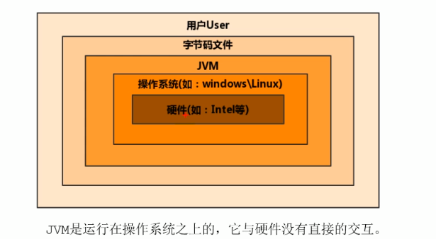

**Java代码的执行流程**


JIT编译器是负责将坚持执行的代码编译，提高运行效率的。

**JVM的声明周期**

- 虚拟机的启动

Java虚拟机的启动是通过引导类加载器(bootstartp class loader) 创建一个初始类(inital class)来完成的，这个类是由虚拟机的具体实现指定的。

- 虚拟机的执行
  - 一个运行中的Java虚拟机有着一个清晰的任务；执行Java程序
  - 程序开始执行时他才开始运行，程序结束时他就停止
  - ==执行一个所谓的Java程序的时候，真真正正在执行的是一个叫做Java虚拟机的进程。==（程序在执行中的话使用jps是可以看到正在执行的线程的）

**虚拟机的退出**

- 程序的正常执行结束
- 程序在执行过程中遇到了异常或错误而异常终止
- 由于操作系统出现错误而导致Java虚拟机进程终止
- 某线程调用Runtime类（单例，饿汉式）或System类的exit方法 或 Runtime类的halt方法，并且Java安全管理器允许这次exit或halt操作

## JVM的发展历程

###  Sun Classic VM

- 早在1996年Java1.0版本的时候，Sun公司发布了一款名为sun classic VM的Java虚拟机，它同时也是世界上第一款商用Java虚拟机，JDK1.4时完全被淘汰。
- 这款虚拟机内部只提供解释器。现在还有及时编译器，因此效率比较低，而及时编译器会把热点代码缓存起来，那么以后使用热点代码的时候，效率就比较高。
- 如果使用JIT编译器，就需要进行外挂。但是一旦使用了JIT编译器，JIT就会接管虚拟机的执行系统。解释器就不再工作。解释器和编译器不能配合工作。
- 现在hotspot内置了此虚拟机。

###  Exact VM

为了解决上一个虚拟机问题，jdk1.2时，sun提供了此虚拟机。 Exact Memory Management：准确式内存管理

- 也可以叫Non-Conservative/Accurate Memory Management
- 虚拟机可以知道内存中某个位置的数据具体是什么类型。|

具备现代高性能虚拟机的维形

- 热点探测（寻找出热点代码进行缓存）
- 编译器与解释器混合工作模式

只在solaris平台短暂使用，其他平台上还是classic vm，英雄气短，终被Hotspot虚拟机替换

###  HotSpot VM

HotSpot历史

- 最初由一家名为“Longview Technologies”的小公司设计
- 1997年，此公司被sun收购；2009年，Sun公司被甲骨文收购。
- JDK1.3时，HotSpot VM成为默认虚拟机

目前Hotspot占有绝对的市场地位，称霸武林。

- 不管是现在仍在广泛使用的JDK6，还是使用比例较多的JDK8中，默认的虚拟机都是HotSpot
- Sun/oracle JDK和openJDK的默认虚拟机
- 因此本课程中默认介绍的虚拟机都是HotSpot，相关机制也主要是指HotSpot的Gc机制。（比如其他两个商用虚机都没有方法区的概念）

从服务器、桌面到移动端、嵌入式都有应用。

名称中的HotSpot指的就是它的热点代码探测技术。

- 通过计数器找到最具编译价值代码，触发即时编译或栈上替换
- 通过编译器与解释器协同工作，在最优化的程序响应时间与最佳执行性能中取得平衡

###  Jockit

专注于服务器端应用

- 它可以不太关注程序启动速度，因此JRockit内部不包含解析器实现，全部代码都靠即时编译器编译后执行。

大量的行业基准测试显示，JRockit JVM是世界上最快的JVM。

- 使用JRockit产品，客户已经体验到了显著的性能提高（一些超过了70%）和硬件成本的减少（达50%）。

优势：全面的Java运行时解决方案组合

- JRockit面向延迟敏感型应用的解决方案JRockit Real Time提供以毫秒或微秒级的JVM响应时间，适合财务、军事指挥、电信网络的需要
- MissionControl服务套件，它是一组以极低的开销来监控、管理和分析生产环境中的应用程序的工具。

2008年，JRockit被oracle收购。

oracle表达了整合两大优秀虚拟机的工作，大致在JDK8中完成。整合的方式是在HotSpot的基础上，移植JRockit的优秀特性。

高斯林：目前就职于谷歌，研究人工智能和水下机器人

###  IBM的J9

全称：IBM Technology for Java Virtual Machine，简称IT4J，内部代号：J9

市场定位与HotSpot接近，服务器端、桌面应用、嵌入式等多用途VM广泛用于IBM的各种Java产品。

目前，有影响力的三大商用虚拟机之一，也号称是世界上最快的Java虚拟机。

2017年左右，IBM发布了开源J9VM，命名为openJ9，交给EClipse基金会管理，也称为Eclipse OpenJ9

OpenJDK -> 是JDK开源了，包括了虚拟机

###  KVM和CDC / CLDC Hotspot

oracle在Java ME产品线上的两款虚拟机为：CDC/CLDC HotSpot Implementation VM KVM（Kilobyte）是CLDC-HI早期产品目前移动领域地位尴尬，智能机被Angroid和ioS二分天下。

KVM简单、轻量、高度可移植，面向更低端的设备上还维持自己的一片市场

- 智能控制器、传感器
- 老人手机、经济欠发达地区的功能手机

所有的虚拟机的原则：一次编译，到处运行。

###  Azul VM

前面三大“高性能Java虚拟机”使用在通用硬件平台上这里Azu1VW和BEALiquid VM是与特定硬件平台绑定、软硬件配合的专有虚拟机I

- 高性能Java虚拟机中的战斗机。

Azul VM是Azu1Systems公司在HotSpot基础上进行大量改进，运行于Azul Systems公司的专有硬件Vega系统上的ava虚拟机。

每个Azu1VM实例都可以管理至少数十个CPU和数百GB内存的硬件资源，并提供在巨大内存范围内实现可控的GC时间的垃圾收集器、专有硬件优化的线程调度等优秀特性。

2010年，AzulSystems公司开始从硬件转向软件，发布了自己的zing JVM，可以在通用x86平台上提供接近于Vega系统的特性。

###  Liquid VM

高性能Java虚拟机中的战斗机。

BEA公司开发的，直接运行在自家Hypervisor系统上Liquid VM即是现在的JRockit VE（Virtual Edition），

Liquid VM不需要操作系统的支持，或者说它自己本身实现了一个专用操作系统的必要功能，如线程调度、文件系统、网络支持等。

随着JRockit虚拟机终止开发，Liquid vM项目也停止了。

### Apache Marmony

Apache也曾经推出过与JDK1.5和JDK1.6兼容的Java运行平台Apache Harmony。

它是IElf和Inte1联合开发的开源JVM，受到同样开源的openJDK的压制，Sun坚决不让Harmony获得JCP认证，最终于2011年退役，IBM转而参与OpenJDK

虽然目前并没有Apache Harmony被大规模商用的案例，但是它的Java类库代码吸纳进了Android SDK。

### Micorsoft JVM

微软为了在IE3浏览器中支持Java Applets，开发了Microsoft JVM。

只能在window平台下运行。但确是当时Windows下性能最好的Java VM。

1997年，sun以侵犯商标、不正当竞争罪名指控微软成功，赔了sun很多钱。微软windowsXPSP3中抹掉了其VM。现在windows上安装的jdk都是HotSpot。

### Taobao JVM

由AliJVM团队发布。阿里，国内使用Java最强大的公司，覆盖云计算、金融、物流、电商等众多领域，需要解决高并发、高可用、分布式的复合问题。有大量的开源产品。

基于openJDK开发了自己的定制版本AlibabaJDK，简称AJDK。是整个阿里Java体系的基石。

基于openJDK Hotspot VM发布的国内第一个优化、深度定制且开源的高性能服务器版Java虚拟机。

- 创新的GCIH（GCinvisible heap）技术实现了off-heap，即将生命周期较长的Java对象从heap中移到heap之外，并且Gc不能管理GCIH内部的Java对象，以此达到降低GC的回收频率和提升Gc的回收效率的目的。
- GCIH中的对象还能够在多个Java虚拟机进程中实现共享
- 使用crc32指令实现JvM intrinsic降低JNI的调用开销
- PMU hardware的Java profiling tool和诊断协助功能
- 针对大数据场景的ZenGc

taobao vm应用在阿里产品上性能高，硬件严重依赖inte1的cpu，损失了兼容性，但提高了性能

目前已经在淘宝、天猫上线，把oracle官方JvM版本全部替换了。

### Dalvik VM

谷歌开发的，应用于Android系统，并在Android2.2中提供了JIT，发展迅猛。

Dalvik y只能称作虚拟机，而不能称作“Java虚拟机”，它没有遵循 Java虚拟机规范

不能直接执行Java的Class文件

基于寄存器架构，不是jvm的栈架构。

执行的是编译以后的dex（Dalvik Executable）文件。执行效率比较高。

- 它执行的dex（Dalvik Executable）文件可以通过class文件转化而来，使用Java语法编写应用程序，可以直接使用大部分的Java API等。

Android 5.0使用支持提前编译（Ahead of Time Compilation，AoT）的ART VM替换Dalvik VM。

### Graal VM

2018年4月，oracle Labs公开了GraalvM，号称 "Run Programs Faster Anywhere"，勃勃野心。与1995年java的”write once，run anywhere"遥相呼应。

GraalVM在HotSpot VM基础上增强而成的跨语言全栈虚拟机，可以作为“任何语言” 的运行平台使用。语言包括：Java、Scala、Groovy、Kotlin；C、C++、Javascript、Ruby、Python、R等

支持不同语言中混用对方的接口和对象，支持这些语言使用已经编写好的本地库文件

工作原理是将这些语言的源代码或源代码编译后的中间格式，通过解释器转换为能被Graal VM接受的中间表示。Graal VM提供Truffle工具集快速构建面向一种新语言的解释器。在运行时还能进行即时编译优化，获得比原生编译器更优秀的执行效率。

如果说HotSpot有一天真的被取代，Graalvm希望最大。但是Java的软件生态没有丝毫变化。


## 类加载器(ClassLoader)

> 负责加载class文件，class文件在文件开头有特定的文件标识（cafe babe），将class文件字节码内容加载到内存中，并将这些文件内容转换成方法区中的运行时数据结构并且ClassLoader只负责class文件的加载，至于它是否可以运行，则由Execution Engine决定

- 第一步user.class 文件被ClassLoader加载，变成了user   Class  进入了方法区，相当于8锁那边的模板 static静态方法

**加载器**

- 启动类加载器(Bootstarp) C++
- 扩展类加载器(Extension)  Java
- 应用程序类加载器(AppClassLoader)

一些java自带的类，由类加载器 初始化加载，放在jre/lib/rt.jar 包中（根加载器）

扩展包的加载由扩展类加载器加载，也就是lib包下面的jar包

自己定义的方法类 是由应用程序类加载器加载的

Object.getClass().getClassLoader();  -->  获取类加载器

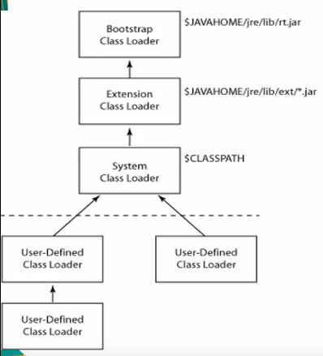

### Bootstarp ClassLoader( 启动类加载器)

- 这个类加载使用C/C++实现，嵌套在JVM内部
- 它用来加载Java的核心库(JAVA_HOME/jre/lib/rt.jar,resouces.jar,sun.boot.path路径下的内容)，用于提供JVM自身需要
- 并不继承自java.lang.ClassLoader,没有父加载器
- 加载扩展类和应用程序类加载器，并指定为他们的父类加载器
- 处于安全考虑, bootstarp启动类加载器只加载包名为java,javax,sun 等开头的类

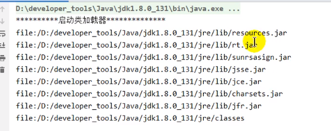


### 扩展类加载器

- Java语言编写，由sun.misc.Launcher$ExtClassLoader实现
- 派生于ClassLoader类
- 父类加载器为启动类加载器
- 从java.ext.dirs 系统属性所指定的目录中加载类库，或从JDK的安装目录的 jre/lib/ext子目录（扩展目录）下加载类库。如果用户创建的JAR放在此目录下，也会自动由扩展类加载器加载。


### 应用程序类加载器 （AppClassLoader）

- java语言编写，由sun.misc.Laucher$AppClassLoder实现
- 派生于Classloader类
- 父类加载器为扩展类加载器
- 它负责加载环境变量classpath或系统属性，java.class.path 指定路径下的类库
- 该类加载是程序中默认的类加载器，一般来说，java应用的类都是由它来完成加载
- 通过ClassLoader#getSystemClassLoader() 方法可以获取到该类加载器

----

### 用户自定义的类加载器

- 在Java的日常应用程序开发中，类的加载几乎是由上述3种类加载器互相配合执行的，在必要时，我们还可以自定义类加载器，来定制类的加载方式。
- 隔离加载类
- 修改类加载的方式
- 扩展加载源
- 防止源码泄露

**实现步骤:**

1. 开发人员可以通过继承抽象类java.lang.ClassLoader类的方式，实现自己的类加载器，以满足一些特殊的要求
2. 在JDK1.2之前，在自定义类加载器时，总会去继承ClassLoder类并重写loadClass() 方法，从而实现自定义的类加载类，但是在JDK1.2之后已不再建议用户去覆盖loadClass() 方法，而是建议把自定义的类加载逻辑写在findClass() 方法中
3. 在编写自定义类加载器时，如果没有太过于复杂的需求，可以直接继承URLClassLoader类，这样就可以避免自己去编写findClass() 方法及其获取字节码流的方式，使用自定义类加载器编写更加简洁。

**获取类加载器**

```java
package jvm.test;
// 获取类加载器
public class ClassLoaderTest1 {
    public static void main(String[] args) throws ClassNotFoundException {
        ClassLoader classLoader = Class.forName("java.lang.String").getClassLoader();
        System.out.println(classLoader);

        ClassLoader contextClassLoader = Thread.currentThread().getContextClassLoader();
        System.out.println(contextClassLoader);

        ClassLoader classLoader1 = ClassLoader.getSystemClassLoader().getParent();
        System.out.println(classLoader1);
    }
}
```


## 类加载过程

> 类加载:
>
> - 通过一个类的全限定名获取定义此类的二进制字节流
> - 将这个字节流所代表的静态存储结构转换为方法区的运行时数据结构
> - 在内存中生成一个代表这个类的java.lang.Class对象，作为方法区这个类的各种数据的访问入口

**类加载子系统**


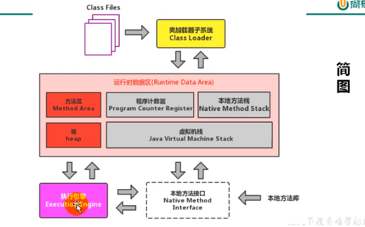

**子系统部分**

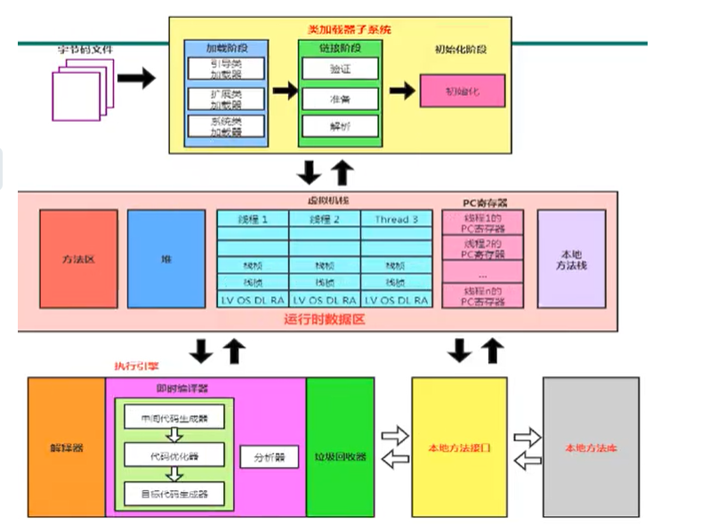

作用：

- 类加载器子系统负责从文件系统或者网络中加载class文件，class文件在文件开头有特定的文件标识
- ClassLoader只负责class文件的加载，至于它是否可运行，则由Execution Engine决定
- 加载的类信息存放于一块称为方法区的内存空间。除了类的信息外，方法区中还会存放运行时常量池信息，可能还包括字符串字面量和数字常量（这部分常亮量信息是Class文件中常量池部分的内存映射）

**类加载过程**

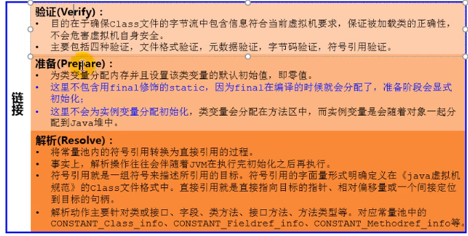

**初始化：**

- 初始化阶段就是执行类构造器方法<clinit>()  的过程
- 此方法不用编译，是javac编译器自动收集类中的所有类变量的赋值动作和静态代码块中的语句合并而来的
- 构造器方法中指令按语句在源文件中出现的顺序执行
- <clinit>() 不同于类的构造器。(关联：构造器是虚拟机视角下<init>())
- 若该类具有父类，JVM会保证子类的<clinit>() 执行之前，父类的<clinit>() 已经执行完成。

```java
package jvm.test;

public class ClassInitTest {

    private static int num = 1;

    static {
        num = 2;
        number = 20;
    }

    private static int number = 10;   // prepre 阶段已经给number 赋默认值0;

    public static void main(String[] args) {
        System.out.println(ClassInitTest.num);      // 2
        System.out.println(ClassInitTest.number);   // 10
    }
}
```


## 双亲委派

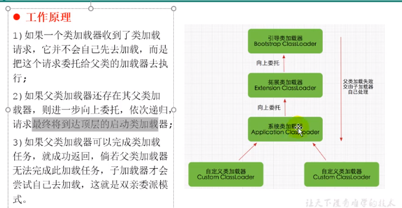


> **作用：** 保证java源代码不受污染，保证源码干净（==沙箱安全==）

当一个类收到类加载请求，他首先不会去加载这个类，而是把这个请求委派给父类去完成，每一个层次加载器都是如此，因此所有的加载请求都应该传达到启动类加载器中，只有当父类加载器反馈自己无法完成这个请求的时候（在它的加载路径下没有找到所需加载的Class），子类加载器才会尝试自己去加载。

采用双亲委派的一个好处是比如 加载位于rt.jar 包中的类java.lang.Object，不管是哪个加载器加载这个类，最终都是委托给顶层的启动类加载器进行加载，这样就保证了使用不同的类加载器最终得到的都是同一个Object对象。

如： 新建一个包 java.lang  ---> 类 String 无法启动main方法

```java
package jvm.java.lang;
public class String {
    // 运行不了！！！
    public static void main(String[] args) {
        System.out.println("hello world!");
    }
}
```

因为类在加载的时候 默认去bootstarp类加载器 最顶层上面找，发现有这个类的时候 不会加载 当前自己的类，保证了源代码不会被污染。

==如果想自己定义类加载器  直接继承ClassLoader 就行了==

类方法内部 可以编写只有声明的类，不需要实现，但是这个方法只作为声明，不被java调用，只能由C语言或者其他语言调用，加了Native的意思是java已经无法调用了，只能交由其他语言调用，只是声明了接口、（加了Navtive的方法都走 本地方法栈）	


## 理解执行引擎

**翻译机**

> 包括了解释器和JIT

- 解释器： 需要进行逐行解释，  类似于走路，虽然没停，但是比较慢
- JIT：  提供方法区的CodeCache缓冲，类似于公交车，需要等待一段时间后，才能快速行驶


## 类的主动使用与被动使用

> 每个类或者接口只有在首次主动使用时才初始化他们

### 主动使用七种情况

- 创建类的实例
- 访问某个类或接口的静态变量，或者对该静态变量赋值
- 调用类的静态方法
- 反射(比如： Class.forName("java.lang.String"))
- 初始化一个类的子类
- Java虚拟机启动时被标明为启动类的类
- JDK7 开始提供的动态语言支持：
  - java.lang.invoke.MethodHandle 实例的解析结果
  - REF_getStatic, REF_putStatic, REF_invokeStatic 句柄对应的类没有初始化，则初始化
- 除了以上七种情况，其他使用Java类的方式都被看作是对类的被动使用，都不会导致类的初始化


## 程序计数器（PC寄存器）

> PC寄存器是用来存储指向下一条指令的地址，也即将要执行的指令代码。由执行引擎读取下一条指令。

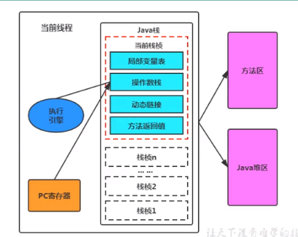

**介绍**

-  是一块很小的内存空间，几乎可以不计，也是运行速度最快的存储区域
- 每个线程都有自己的程序计数器，是线程私有的，生命周期与线程的生命周期保持一致
- 任何时间一个线程都只有一个方法在执行，也就是所谓的当前方法。程序计数器会存储当前线程正在执行的Java方法的JVM指令地址：或者，如果是在执行native方法，则是未指定的值
- 是程序控制流的指示器，分支，循环，跳转，异常处理，线程恢复等基础功能都需要依赖这个程序计数器来完成
- 字节码解释器工作就是通过改变这个计数器的值来选取下一条需要执行的字节码指令
- 它是唯一一个在Java 虚拟机规范中没有规定任何OutofMemoryError情况的区域。 （即没有GC也没有OOM）

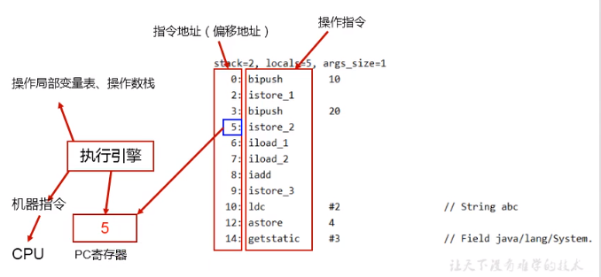

> 使用PC寄存器存储字节码指令地址有什么用呢？

因为CPU在不停的切换线程，这个时候切换回来我们需要知道，从哪继续开始。


> 为什么使用PC寄存器来记录当前的执行地址呢？

JVM字节码解释器就需要通过改变PC寄存器的值来明确下一个该执行什么样的字节码指令。


> PC寄存器为什么是线程私有的呢？

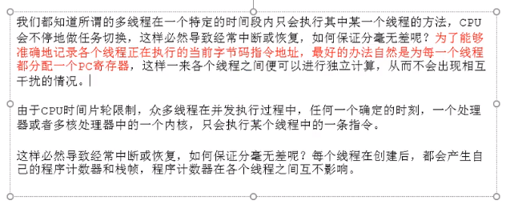


## 虚拟机栈

**目录结构:**

> - 虚拟机栈的概述
> - 栈从存储单位
> - 局部变量表
> - 操作数栈
> - 代码追踪
> - 栈顶缓存技术
> - 动态链接
> - 方法的调用：解析与分派
> - 方法返回地址
> - 一些附加信息
> - 栈的相关面试题

### 概述

==栈是运行的单位，而堆是存储的单位==

栈解决程序的运行问题，即程序如何执行，或者说如何处理数据。

堆解决的是数据存储的问题，即数据怎么存放，放在哪

> Java虚拟机栈是什么?

每个线程在创建时都会创建一个虚拟机栈，其内部保存一个个的栈贞，对应着一次次的java调用方法。  （是线程私有的）

- 生命周期：   生命周期与线程一致
- 作用： 主管Java程序的运行，它保存方法的局部变量，部分结果，并参与方法的调用和返回。


**栈的优点：**

- 栈是一种快速有效的分配存储方式，访问速度仅次于程序计数器
- JVM直接对Java栈的操作只有两个：
  - 每个方法执行，伴随着进栈（入栈，压栈）
  - 执行结束后的出栈工作
- 对于栈来说不存在垃圾回收问题
  - GC ； OOM

**开发中遇到的异常有哪些？**

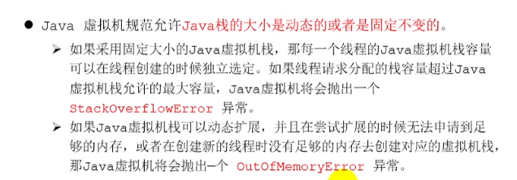

**栈存储什么？**

- 每个线程都有自己的栈，栈中的数据都是以栈贞的格式存在
- 在这个线程上执行的每个方法都各自对应一个栈贞（Stack Frame）
- 栈贞是一个内存区块，是一个数据集，维系着方法执行过程中的各种数据信息

### 栈帧的内部结构

**每个栈帧存储着：**

- ==局部变量表==
- ==操作数栈==
- 动态链接 （或指向运行时常量池的方法引用）
- 方法返回地址  （或方法正常退出或者异常的定义）
- 一些附加信息

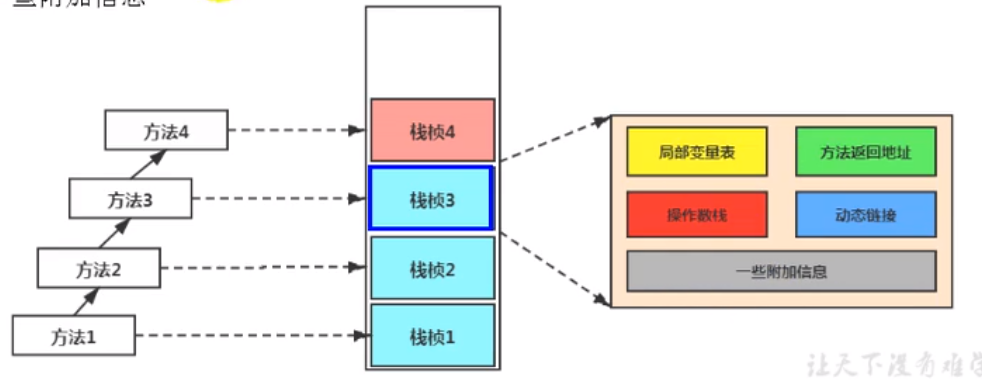

-------

**局部变量表：**

> 被称为局部变量数组或本地变量表
>
> - 主要存储方法参数和定义在方法体内的局部变量  类型(基本数据类型，对象引用，returnAddress)
> - 存放着预编译期可知的各种基本数据类型（8种），引用类型，returnAddress类型
> - 32位以内的类型只占用一个slot，64位的类型（long/double）只占用两个slot

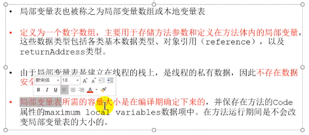


https://gitee.com/moxi159753/LearningNotes/tree/master/JVM/1_


