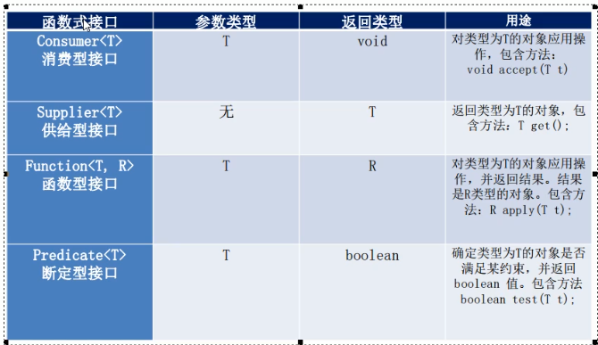

# Java8 新特性

> Lambda是一个匿名函数，可以理解为一段==可以传递的代码==

首先简单介绍一下lambda的表达式

我们在写一个compareto的方法是这样写, 以及改用lambda表达式之后

```java
 // 第一种写法
        Comparator<Integer> com = new Comparator<Integer>() {
            @Override
            public int compare(Integer o1, Integer o2) {
                return Integer.compare(o1,o2);
            }
        };
        TreeSet<Integer> ts =  new TreeSet<>(com);

        // 第二种写法
        Comparator<Integer> com1 = (x,y) -> Integer.compare(x,y);
        TreeSet<Integer> ts1 = new TreeSet<>(com1);
```

自己构建函数式接口表达式

```java
// 有以下接口
// lambda之后的过滤
    public static List<Employee> filterEmployee(List<Employee> list,MyPredicate<Employee>mp){
        List<Employee> emps = new ArrayList<>();
        for (Employee employee : list) {
            if (mp.test(employee)){
                emps.add(employee);
            }
        }
        return emps;
    }
// 其中Mypredicate只实现了一个test接口，返回值为boolean
// 可以使用以下lambda表达式，来传入该接口方法
List<Employee> list3 = filterEmployee(employees, (e) -> e.getSlary() <= 5000);
list3.forEach(System.out::println);
```

> jdk提供了几大核心函数式接口，这样就不需要我们自己去编写函数式接口了
>
> - 消费型接口，供给型接口，函数型接口，断言型接口

```java
/**
 * Java8 内置了四大核心函数式接口
 * Consumer<T>: 消费型接口
 *         void accept(T t)
 *
 * Supplier<T>: 供给型接口
 *          T get();
 * Function<T,R>: 函数型接口
 *          R apply(T t);
 * Predicate<T>: 断言型接口
 *          boolean test(T t);
 */
public class Lambda {
    public static void main(String[] args) {
        // Consumer<T>  消费型接口
        happy(10000,(m) -> System.out.println("哈哈:"+m));

        System.out.println("=========================供给型接口============================");
        // 供给型接口
        getNumList(10,()-> (int)(Math.random()*100)).forEach(System.out::println);

        System.out.println("=====================函数型接口==========================");
        // 函数型接口
        System.out.println(strHandler("\t\t\t\t 我在多益", (str) -> str.trim()));

        System.out.println("===================断言型接口=================");
        // 断言型接口
        List<String> list = Arrays.asList("Hello","duoyi","chenbin","www","wok");
        filterStr(list,(s -> s.length()>3)).forEach(System.out::println);

    }

    // 将满足条件的字符串，放入到集合中
    public static List<String> filterStr(List<String> list, Predicate<String> pre){
        ArrayList<String> strList = new ArrayList<>();
        for (String str : list) {
            if (pre.test(str)){
                strList.add(str);
            }
        }
        return strList;
    }

    // 用户处理字符串
    public static String strHandler(String str, Function<String,String> fun){
        return fun.apply(str);
    }

    public static List<Integer> getNumList(int num, Supplier<Integer> sup){
        List<Integer> list = new ArrayList<>();
        for (int i = 0; i < num; i++) {
            Integer n = sup.get();
            list.add(n);
        }
        return list;
    }
    public static void happy(double money, Consumer<Double> con){
        con.accept(money);
    }
}
```

其中这几大函数式接口又涉及到lambda的集中语法格式

```java
/**
 * -> 标识符将lambda表达式分为两部分
 * 左侧： Lambda 表达式的参数列表
 * 右侧： Lambda 表达式中所需执行的功能，即Lambda 体
 *
 * 语法格式一： 无参数，无返回值
 *          () -> System.out.println("Hello Lambda!")
 * 语法格式二：有一个参数，并且无返回值
 *
 * 语法格式三： 有一个参数，小括号可以省略不写
 *
 * 语法格式四： 有两个以上的参数，有返回值，并且Lambda 体中有多条语句
 *
 * 语法格式五： 若Lambda体中只有一条语句， return 和 大括号都可以省略不写
 *
 * 语法格式六： Lambda可以通过推断出 参数的类型
 *          左右遇一括号省
 *          左侧推断类型省
 *
 *  Lambda 表达式需要函数式接口的支持
 *  函数式接口： 接口中只有一个抽象方法的接口，称为函数式接口、可以使用注解@FunctionalInterface 修饰
 *                  可以检查是否是函数式接口
 *
 */
public class Lambda {
    public static void main(String[] args) {
        int num = 0;    //默认加上final
        // 无参函数式接口
        Runnable r = new Runnable() {
            @Override
            public void run() {
                // 这里的num局部变量默认加上了final
                System.out.println("Hello World!"+num);
            }
        };
        r.run();
        System.out.println("------------------------------------------------");
        Runnable r1 = () -> System.out.println("Hello Lambda!"+num);
        r1.run();

        System.out.println("=================有一个参数，但是无返回值===================");
        Consumer<String> con = (x) -> System.out.println(x);
        Consumer<String> con1 = x -> System.out.println(x);
        con.accept("我在多益！");

        System.out.println("=================有多个参数===============================");
        Comparator<Integer> com = (x,y) ->{
            System.out.println("函数式接口");
            return Integer.compare(x,y);
        };

        Comparator<Integer> com1 = (x,y) -> Integer.compare(x,y);

        List<Employee> employees = Arrays.asList(
                new Employee("张三",18,99.99),
                new Employee("李四",20,55.99),
                new Employee("王五",12,66.99),
                new Employee("赵六",21,77.99),
                new Employee("田七",23,88.99)
        );

        System.out.println("=================排序==========================");
        Collections.sort(employees,(e1,e2) ->{
            if (e1.getAge() < e2.getAge()){
                return e1.getName().compareTo(e2.getName());
            }else {
                return Integer.compare(e1.getAge(),e2.getAge());
            }
        });

        employees.forEach(employee -> {
            System.out.println(employee);
        });

        String st = strHandler(" 这 是 啥 呀!", (str) -> {
            return str.trim() + "hello World!";
        });
        System.out.println(st);
    }
    //需求：用于处理字符串的方法
    public static String strHandler(String str,MyFunction mf){
        return mf.getValue(str);
    }
}
```

  流式处理的过滤操作，包括排序，取值，匹配元素，最大值，最小值，平均值，汇总，

```java
package lambda.stream;

import lambda.filter.Employee;

import java.util.*;
import java.util.stream.Collectors;

public class TestStreamAPI2 {
    private static List<Employee> employees = Arrays.asList(
            new Employee("张三",18,99.99, Employee.Status.BUSY),
            new Employee("李四",20,55.99, Employee.Status.FREE),
            new Employee("王五",12,66.99, Employee.Status.BUSY),
            new Employee("赵六",21,77.99, Employee.Status.VOCATION),
            new Employee("田七",23,88.99, Employee.Status.BUSY)
    );
    public static void main(String[] args) {
        /**
         *  查找与匹配
         *  allMatch -- 检查是否匹配所有元素
         *  anyMatch -- 检查是否至少匹配一个元素
         *  noneMatch -- 检查是否没有匹配所有元素
         *  findFirst -- 返回第一个元素
         *  count -- 返回流中元素的总个数
         *  max -- 返回流中最大值
         *  min -- 返回流中最小值
         */

        // allMatch
        System.out.println(employees.stream().allMatch((e) -> e.getStatus().equals(Employee.Status.BUSY)));
        // anyMatch
        System.out.println(employees.stream().anyMatch((e) -> e.getStatus().equals(Employee.Status.BUSY)));
        // noneMatch
        System.out.println(employees.stream().noneMatch((e) -> e.getStatus().equals(Employee.Status.BUSY)));
        // findFirst
        Optional<Employee> op = employees.stream().sorted((e1, e2) -> Double.compare(e1.getSlary(), e2.getSlary())).findFirst();
        System.out.println(op.get());
        // findAny
        Optional<Employee> op2 = employees.parallelStream().filter((e) -> e.getStatus().equals(Employee.Status.FREE)).findAny();
        System.out.println(op2.get());
        // count
        System.out.println(employees.stream().count());
        // max
        Optional<Employee> op3 = employees.stream().max((e1, e2) -> Double.compare(e1.getSlary(), e2.getSlary()));
        System.out.println(op3.get());
        // min
        Optional<Double> op4 = employees.stream().map(Employee::getSlary).min(Double::compareTo);
        System.out.println(op4.get());

        /**
         * 规约
         * reduce(T identity,BinaryOperator) / reduce(BinaryOperator)  - 可以将流中元素反复结合起来，得到一个值
         */
        List<Integer> list = Arrays.asList(1,2,3,4,5,6,7,8,9);
        Integer sum = list.stream()
                .reduce(0,(x,y) -> x+y);
        System.out.println(sum);

        Optional<Double> op5 = employees.stream().map(Employee::getSlary).reduce(Double::sum);
        System.out.println(op5.get());

        // 收集 collection 将流转换为其他形式。接收一个Collection接口的实现，用于给Stream中元素汇总的方法
        employees.stream().map(Employee::getName).collect(Collectors.toList()).forEach(System.out::println);
        employees.stream().map(Employee::getName).collect(Collectors.toSet()).forEach(System.out::println);
        employees.stream().map(Employee::getName).collect(Collectors.toCollection(HashSet::new)).forEach(System.out::println);
        // 总数
        System.out.println(employees.stream().collect(Collectors.counting()));
        // 平均值
        System.out.println(employees.stream().collect(Collectors.averagingDouble(Employee::getSlary)));
        // 总和
        System.out.println(employees.stream().collect(Collectors.summingDouble(Employee::getSlary)));
        // 最大值
        Optional<Employee> op6 = employees.stream().collect(Collectors.maxBy((e1, e2) -> Double.compare(e1.getSlary(), e2.getSlary())));
        System.out.println(op6.get());
        // 最小值
        System.out.println(employees.stream().map(Employee::getSlary).collect(Collectors.minBy(Double::compare)).get());
        /**
         * 分组
         */
        Map<Employee.Status, List<Employee>> map = employees.stream().collect(Collectors.groupingBy(Employee::getStatus));
        map.forEach((k,v) ->{
            System.out.println("key:"+k+",value:"+v);
        });
        // 多级分组
        Map<Employee.Status, Map<String, List<Employee>>> map1 = employees.stream().collect(Collectors.groupingBy(Employee::getStatus, Collectors.groupingBy((e) -> {
            if (((Employee) e).getAge() <= 35) {
                return "青年";
            } else if (((Employee) e).getAge() <= 50) {
                return "中年";
            } else {
                return "老年";
            }
        })));
        System.out.println(map1);

        // 分区
        Map<Boolean, List<Employee>> map3 = employees.stream().collect(Collectors.partitioningBy((e) -> e.getSlary() > 8000));
        System.out.println(map3);

        // 获取多种值
        DoubleSummaryStatistics dss = employees.stream().collect(Collectors.summarizingDouble(Employee::getSlary));
        System.out.println(dss.getSum());
        System.out.println(dss.getAverage());
        System.out.println(dss.getMax());

        // 收集
        String str = employees.stream().map(Employee::getName).collect(Collectors.joining(",","!!!","~~~"));
        System.out.println(str);

    }
}
```

一些用流式处理的题，还没写完

```java
package lambda.stream;

import lambda.filter.Employee;

import java.util.Arrays;
import java.util.List;

public class ti {

    private static List<Employee> employees = Arrays.asList(
            new Employee("张三",18,99.99, Employee.Status.BUSY),
            new Employee("李四",20,55.99, Employee.Status.FREE),
            new Employee("王五",12,66.99, Employee.Status.BUSY),
            new Employee("赵六",21,77.99, Employee.Status.VOCATION),
            new Employee("田七",23,88.99, Employee.Status.BUSY)
    );

    public static void main(String[] args) {

        /**
         * 1. 给定一个数字列表，返回列表中的所有数字的平方
         */
        Integer[] nums = new Integer[]{1,2,3,4,5};
        Arrays.stream(nums).map((x) -> x*x).forEach(System.out::println);

        /**
         * 2. 怎么用map和reduce 计算有多少个Employee呢
         */
        System.out.println(employees.stream().map((e) -> 1).reduce(Integer::sum).get());

        /**
         * 3.
         */

    }
}
```


# 注解的使用

> 注解可以用于创建文档，跟踪代码的依赖性，执行基本编译时检查。
>
> 注解是以==@注解名== 存在的，

根据注解参数的个数，可以将注解分为以下几类：（注解知识作为标识存在，不会直接影响到语义）

- 标记注解
- 单值注解
- 完整注解

**常用注解**

在日常编程中，我们遇到的注解有@Override,@SuppressWarning 等，@Override表示为重写父类的方法，@SuppressWarnings表示忽略警告信息

```java
package com.ares.Temp;

/**
 * @author Ares
 */
public class T {
    @SuppressWarnings("unused")
    public static void test(){
        int i;
        System.out.println("This is a test.");
    }
    
    @Override
    public String toString(){
        return "Test Class";
    }
}
```

**元注解**

> 元注解是可以注解在注解上的注解(基本注解)
>
> - @Retention,@Documented,@Target,@Inherited,@Repeatable这5个   ==两个类型一样的注解不能同时注解==

- **@Retention【重点】**

Retention 意思是保留期的意识，当@Retention应用到一个注解上的时候，解释说明了这个注解的存活时间取值如下

| **值**                  | **描述**                                                    |
| ----------------------- | ----------------------------------------------------------- |
| RetentionPolicy.SOURCE  | 注解只是在源代码阶段保留，在编译器进行编译时将会被丢弃忽视  |
| RetentionPolicy.CLASS   | 只被保留在编译进行的时候，并不会加载到JVM中                 |
| RetentionPolicy.RUNTIME | 可以保留到程序运行时，它会被加载到JVM中，所以可以获取到他们 |

> RetentionPolicy是一个枚举类

 代码演示:

```java
@Retention(RetentionPolicy.RUNTIME)//定义一个运行期有效的注解
public @interface MyAnnotation {
}
```

- **@Target【重点】**

目标的意思，@Target指定注解运用的地方

- ElementType.ANNOTATION_TYPE: 可以给注解进行注释
- ElementType.CONSTRUCTOR：可以给构造方法注解
- **ElementType.FIELD：** 可以给属性进行注解
- ElementType.LOCAL_VARIABLE：可以给局部变量进行注解
- **ElementType.METHOD：** 可以给方法进行注解不能用在构造方法上
- ElementType.PACKAGE：可以给包进行注解
- ElementType.PARAMETER：可以给方法内的参数进行注解
- **ElementType.TYPE；** 可以给一个类型进行注解，比如类，接口，枚举

代码实例：

```java
// 改注解可以在 类 接口 枚举 方法 成员变量
 @Target({ElementType.TYPE,ElementType.FIELD,ElementType.METHOD})
```

```java
@MyAnnotation
public class Student {
    @MyAnnotation
    int age;
    @MyAnnotation
    public void test() {
    }
}
```

- **@Inherited**

表示该注解能被子类使用（继承）

> 注解MyAnnotation被@Inherited修饰，如果有个类A使用了@MyAnnotation注解，又有一个子类b继承了A，在b中也能使用@MyAnnotation注解

- **@Documented**

这个注解和文档有关，它能将注解中的元素包含到Javadoc中

- **@Repeatable**

在需要对同一个注解多次使用在一个类，接口，方法，属性等上面的时候，需要用@Repeatable

**注解中的属性**

> 注解的属性也叫成员变量，**注解中只有成员变量，无成员方法**
>
> 注解的成员变量在注解的定义以无参数的方法的形式来声明。其方法名定义了该成员变量的名字，其返回值定义了该成员变量的类型。

```java
@Target({ElementType.TYPE,ElementType.FIELD,ElementType.METHOD})
public @interface MyAnnotation {
    //注解中只有成员变量，无成员方法
    int id() default 0;
    String username() default " ";
}
```

> 这里的default给该变量id和username设置了默认值

在Student类中用了该注解的方法可以给该注解中的变量赋值，如果注解没有设置默认值，则在该注解的时候必须给该注解赋值

```java
public class Student {
    @MyAnnotation(id = 12, username ="小飞龙" )
    int age;
    @MyAnnotation
    public void test01() {
    }
    @MyAnnotation(id = 55)
    public void test02() {
    }
}
```

当注解中只有一个变量的时候（也就是只有一个无参方法的时候），可以这样写

注解中的代码:

```java
public @interface MyAnnotation {
    //注解中只有成员变量，无成员方法
    String value() default " ";
}
```

Student中的代码

```java
public class Student {
    @MyAnnotation("张三")
    public void test01() {
    }
  //  @MyAnnotation(value = "李四")等价    @MyAnnotation("张三")
  @MyAnnotation(value = "李四")
    public void test02() {
    }
}
```

**自定义注解**





