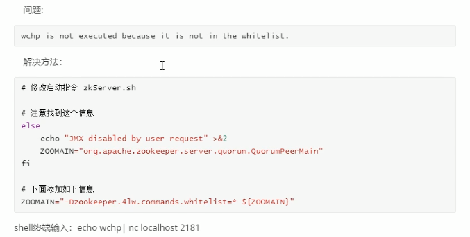

# Zookeeper

## 基本原理

> zookeeper是一个分布式服务框架，主要用来解决数据管理问题，如: 统一命名服务，状态同步服务，集群管理，分布式应用配置项的管理。
>
> 现成的使用实现共识，组管理，领导者选举和状态协议。

==zookeeper = 文件系统 + 监听通知机制==

### **设计目标**

zookeeper的数据保留在内存中，这意味着zookeeper可以实现高吞吐量和低延迟数。（zookeeper实施对高性能，高可用性，严格有序访问加以重视）


- **zookeeper is replicated：** 组成zookeeper的服务器彼此了解。维护内存中的状态图像，以及持久存储中的事务日志和快照。只要大多数服务器可用，zookeeper服务器将可用。客户端连接到单个zookeeper服务器。客户端维护着一个TCP连接，通过它发送请求，获取响应，获取监视事件并发送心跳。如果与服务器的TCP连接断开，则客户端将连接到其他服务器。
- **zookeeper is ordered：** zookeeper用一个反应所有zookeeper事务顺序的数字标记每个更新。后续操作可以使用该命令来实现更高级的抽象，例如同步原语。
- **zookeeper is fast:** 在读取为主的负载均衡中，特别快。可在数千台计算机上运行，并且在读取比写入更为常见的情况下，其性能最佳，比率约10:1

### 数据模型与分层空间

ZooKeeper提供的名称空间与标准文件系统的名称空间非常相似。名称是由斜杠（/）分隔的一系列路径元素。ZooKeeper命名空间中的每个节点都由路径标识。

zookeeper的层次命名空间


### 节点和短暂节点

zookeeper命名空间中的每个节点都可以具有与其关联的数据以及子节点。就像拥有一个文件系统一样，该文件系统也允许文件成为目录。（zookeeper目的：协调数据，状态信息，配置，位置信息等，因此每个节点上的数据通常很小，在1字节到千字节范围内）

znode的数据每次更改时，版本号都会增加。例如当客户端检索数据时，也会接受到数据的版本。

zookeeper有四种节点：

- 顺序临时
- 顺序永久
- 非顺序临时
- 非顺序永久

临时节点的意义：只要创建znode，当处于活动状态的时候，znode也存在，回话结束，将删除znode。可以用来维护，并通知该程序是否挂掉，选举新的master。（类似于redis的哨兵）

### 有条件的监听

> 类似于手表的概念:   一个监听器只能捕获一次事件

可以设置手表触发一次消失，或者永久存在，当触发手表监视后，客户端会收到一个数据包，说明znode已更改。如果客户端和其中一个zookeeper服务器之间的连接断开，则客户端将收到本地通知。 （当设置临时，触发一次就消失，设置永久时，触发不会被删除，并且会以递归的方式触发已注册的znode以及所有znode的更改）

- **一次性触发:** 数据修改之后，一个监视时间将发送给客户端、例如客户端执行getData("/znode1",true)，然后/znode1 的数据被更改或删除，则客户端将获得/znode1的监视事件。如果/znode1再次更改，则除非客户端进行了另一次读取以设置新的监视，否则不会发送任何监视事件。
- **发送给客户端**： 这意味着事件正在传递给客户端，但是可能未成功到达更改操作的返回码到达发起更改的客户端之前，该事件尚未到达。手表被异步发送给观察者。Zookeeper提供了订购保证：客户端将永远不会看到它为其设置了手表的更改，直到它第一次看到手表为止。网络延迟/其他因素可能导致不同的客户端在不同的时间看到监视并从更新中返回代码。关键是不同客户端看到的所有内容将具有一定的顺序。
- **设置手表的配置：**  指节点可以更改的不同方式。可以将zookeeper视为维护两个手表列表：数据手表和儿童手表。getData() 和 exist() 设置数据监视。getChildren()  设置儿童手表。或者，可以考虑根据数据返回的数据类型设置手表。getData() 和 exist() 返回有关节点数据信息。而getChildren() 返回子级列表。因此，setData() 将触发数据监视是否设置了znode、成功的create() 将触发正在创建的znode的数据监视，并触发父znode的子监视。成功的delete() 将同时触发要删除的znode数据监视和子监视（因为不能再有子监视） 以及父node的子监视。

```shell
get /hadoop watch     # 此条命令会监听这个node一次，当/hadoop发生变化的时候，会监听到
```

**监听器stat path[watch] **  （节点状态发生改变的时候，向客户端发出通知）

> 使用stat path[watch] 注册的监听器能够在节点状态发生改变的时候，向客户端发出通知

```shell
stat /hadoop watch
set /hadoop  112233
[zk: localhost:2181(CONNECTED) 63] 
WATCHER::
WatchedEvent state:SyncConnected type:NodeDataChanged path:/hadoop
```

**ls/ls2 捕获子节点的监听**  （监听该节点下所有子节点的增加和删除操作）

```shell
ls /hadoop watch
ls2 /hadoop watch
```

**watcher的特性**

| 特性           | 说明                                                         |
| -------------- | ------------------------------------------------------------ |
| 一次性         | watcher是一次性的，一旦触发就会移除，再次使用时需要重新注册  |
| 客户端顺序回调 | watcher回调的顺序串行化执行的，只有回调后客户端才能看到最新的数据状态，一个watcher回调逻辑不应该太多，以免影响别的watcher执行 |
| 轻量级         | watchevent是最小的通信单元，结构上只包含通知状态，事件类型和节点路径，并不会告诉数据节点变化前后的具体内容 |
| 时效性         | watcher只有在当前session彻底失效时才会失效，若在session有效期内快速重连成功，则watcher依然存在，仍可接收通知 |

**客户端与服务端的连接状态**

- keeperState： 通知状态
- SyncConnected： 客户端与服务器正常连接时
- Disconnected： 客户端与服务端断开连接时
- Expired： 会话session失效
- AuthFailed：身份认证失败时


### ACL权限控制  

> zookeeper的access control list 访问控制列表可以做到这一点。
>
> acl权限控制，使用scheme: Id: permission 来标识，主要包含3个方面:
>
> - 权限模式(scheme)： 授权的策略
> - 权限对象(id): 授权的对象
> - 权限(permission): 授予的权限
>
> -------
>
> 1. zookeeper的权限控制是基于每个znode节点的，需要对每个节点设置权限
> 2. 每个znode支持设置多种权限控制方案和多个权限
> 3. 子节点不会继承父节点的权限，客户端无权访问某节点，但可能可以访问它的子节点

```shell
setAcl /test2 ip:127.0.0.1:crwda          # 将节点权限设置为ip:127.0.0.1 可以对节点进行增删改查
```

**权限模式**

> 采用何种方式授权

| 方案   | 描述                                                  |
| ------ | ----------------------------------------------------- |
| world  | 只有一个用户：anyone，代表登录zookeeper所有人（默认） |
| ip     | 对客户端使用IP地址认证                                |
| auth   | 使用已添加认证的用户认证                              |
| digest | 使用用户名  密码 进行认证                             |

**授予权限**


**授权的相关命令**

| 命令    | 使用方式              | 描述         |
| ------- | --------------------- | ------------ |
| getAcl  | setAcl<path>          | 读取ACL权限  |
| setAcl  | setAcl<path><acl>     | 设置ACL权限  |
| addauth | addauth<scheme><auth> | 添加认证用户 |

```shell
#用户授权
addauth chenbin:123456
setAcl /node3 auth:chenbin:cdrwa
```

==可以采用多种模式进行授权==


### 简单的API

- create:   创建一个本地树的一个节点
- delete:   删除指定的一个节点
- exists:    查看本地树是否存在该节点
- get data： 查看节点对应的数据
- set data:    设置节点对应的数据
- get children:    检索节点的子节点列表
- sync:    等待数据传播


**文件系统**

zookeeper维护一个类似文件系统的数据结构


每个子目录项如NameService都被称为znode(目录节点)，和文件系统一样，我们能够自由的增加，删除znode，在一个znode下增加，删除子znode，唯一的不同在于znode是可以存储数据的。

有以下四种类型的znode:

> - PERSISTENT - 持久化目录节点  		                                                       	(create /hello world)
>   - 客户端与zookeeper断开连接后，该节点依旧存在
> - PERSISTENT-SEQUENTIAL - 持久化顺序编号目录节点                             (create -s /hello world)
>   - 客户端与zookeeper断开连接后，该节点依旧存在，只是zookeeper给该节点名称进行顺序编号
> - EPHEMERAL - 临时目录节点                                                                        (create -p /hello world)   
>   - 客户端与zookeeper断开连接后，该节点被删除
> - EPHEMERAL_SEQUENTAL - 临时顺序编号目录节点                                  (create -e /hello world)  
>   - 客户端与zookeeper断开连接后，该节点被删除，只是zookeeper给该节点名称进行顺序编号
>
> ==临时节点不允许有子节点，并且使用get命令查看的时候ephemeralOwner = 0x37692f829560001 比较长，没有顺序，永久（ephemeralOwner = 0x0）==

**监听通知机制**

客户端注册监听它关心的目录节点，当目录节点发生变化（数据改变，删除，子目录节点增加/ 删除）时，zookeeper会通知客户端。

**zookeeper能做什么？**

- 应用配置管理
- 同一命名服务
- 状态同步服务
- 集群管理

==分布式配置管理==

> 假设我们的程序是分布式部署在多台机器上，如果我们改变程序的配置文件，需要逐台去修改，非常麻烦。
>
> 现在把这些配置全部放到zookeeper上去，保存在zookeeper的某个目录节点中，然后所有相关应用程序对这个目录节点进行监听，一旦配置信息发生变化，每个应用程序就会收到zookeeper的通知，然后从zookeeper获取新的配置信息应用到系统中。


----


## 单机安装

1. 配置JAVA环境， 检验环境:  java -version
2. 下载并解压zookeeper

```shell
cd /usr/local
wget http://archive.apache.org/dist/zookeeper/zookeeper-3.4.9/zookeeper-3.4.9.tar.gz
tar -zxvf zookeeper-3.4.9.tar.gz
cd zookeeper-3.4.9
```

3. 重命名配置文件zoo_sample.cfg

```shell
cp conf/zoo_sample.cfg conf/zoo.cfg
```

4.  启动zookeeper

```shell
bin/zkServer.sh start
```

5. 检测是否成功启动，用zookeeper客户端连接下服务端

```shell
bin/zkCli.sh
```


------

## 简单的使用

**zookeeper操作命令**

1.  使用ls来查看当前zookeeper中包含的内容


2. 新建一个znode节点，使用 create /zkPro myData


3. 使用get命令查看znode是否包含我们所创建的字符串


> **znode的Stat结构由以下字段组成**
>
> - cZxid: 导致创建此znode的更改zxid
> - mzxid: 上次修改此znode的zxid
> - pzxid：最后一次修改此znode子级的更改zxid
> - ctime： 创建znode的时间
> - mtime： 最后一次修改znode的时间
> - cversion： 此znode的版本号，使用set覆盖之后版本号会+1
> - aclversion： 此znode的ACL更改次数
> - ephemeralOwner： 如果znode是一个临时节点，则此znode的所有的会话ID。如果它不是临时节点，则它将为零
> - dataLength： 此znode的数据字段长度
> - numChildren： 此znode的子级数  


4.  通过set 命令来修改字符串


5.  删除


6.  新建一个节点  (/username chenbin)


6. springboot的使用 （配置pom文件）

```xml
  <!--zookeeper-->
        <dependency>
            <groupId>org.apache.zookeeper</groupId>
            <artifactId>zookeeper</artifactId>
            <version>3.3.6</version>
        </dependency>
```

 添加如下代码

```java
package com.duoyi.demo;

import java.util.concurrent.CountDownLatch;
import org.apache.zookeeper.WatchedEvent;
import org.apache.zookeeper.Watcher;
import org.apache.zookeeper.Watcher.Event.EventType;
import org.apache.zookeeper.Watcher.Event.KeeperState;
import org.apache.zookeeper.ZooKeeper;
import org.apache.zookeeper.data.Stat;

public class ZookeeperProSync implements Watcher {

    private static CountDownLatch connectedSemaphore = new CountDownLatch(1);
    private static ZooKeeper zk = null;
    private static Stat stat = new Stat();

    public static void main(String[] args) throws Exception  {
        // zookeeper配置数据存放路径
        String path = "/username";
        // 连接zookeeper 并注册一个默认的监听器
        zk = new ZooKeeper("49.232.151.218:2181",5000,new ZookeeperProSync());
        // 等待zk连接成功的通知
        connectedSemaphore.await();
        // 获取path目录节点的配置数据，并注册默认的监听器
        System.out.println(new String(zk.getData(path,true,stat)));

        Thread.sleep(Integer.MAX_VALUE);
    }

    @Override
    public void process(WatchedEvent event) {
        // zk连接成功通知事件
        if (KeeperState.SyncConnected == event.getState()){
            if (EventType.None == event.getType() && null == event.getPath()){
                connectedSemaphore.countDown();
            }else if (event.getType() == EventType.NodeDataChanged){
                try{
                    System.out.println("配置已修改，新值为:"+new String(zk.getData(event.getPath(),true,stat)));
                }catch (Exception e){
                    e.printStackTrace();
                }
            }
        }
    }
}
```

**启动之后，会读取到/username的值，并监听修改**


## 集群的搭建

1. **重命名配置文件 并复制多份**

```shell
# 进入到conf目录下, 新建三份配置文件
cp zoo_sample.cfg zoo-1.cfg  
cp zoo_sample.cfg zoo-2.cfg 
cp zoo_sample.cfg zoo-3.cfg 
```

2. **举例其中的一份进行修改**  zoo-1.cfg

```shell
# vim conf/zoo-1.cfg
#数据快照所在路径
dataDir=/dataDir=/usr/local/zookeeper/data/zookeeper1	
服务应用端口
clientPort=2181
# 集群配置
	# server.A = B:C:D
	# A: 是一个数字，表示这个服务器的编号
	# B：是这个服务器的ip地址
	# C：Zookeeper服务器之间的通信端口
	# D：Leader选举的端口

server.1=127.0.0.1:2888:3888		# 这里对应的 1 对应dataDir 路径下的myid 
server.2=127.0.0.1:2889:3889
server.3=127.0.0.1:2890:3890
```

按照以上的步骤 配置三个文件

**配置说明:**

- tickTime: 这个时间是作为zookeeper服务器之间或客户端与服务端之间维持心跳时间间隔，也就是每个tickTime时间就会发送一个心跳
- initLimit: 这个配置是用来配置接受客户端(这里所说的客户端部署用户连接Zookeeper服务器的客户端，而是zookeeper服务器集群中连接到Leader的Follower服务器) 初始化连接时最长能忍受多少个心跳时间间隔数。当已经超过了10个心跳的时间（也就是tickTime）长度之后zookeeper服务器还没有收到客户端返回的信息，那么表明这个客户端连接失败。总的时间长度就是10*2000 = 20秒
- syncLimit： 这个配置项标识Leader 与Follower之间发送消息，请求和响应时间长度，最长不能超过多少个tickTime的时间长度，总的时间长度就是5*2000=10秒
- dataDir： 顾名思义就是zookeeper保存数据的目录，默认情况下，zookeeper将写数据的日志文件也保存在这个目录里
- clientPort： 这个端口就是客户端连接zookeeper服务器的端口，zookeeper会监听这个端口，接受客户端的访问请求。
- server.A = B:C:D:   其中A是一个数字，表示是第几号服务器；B是这个服务器的ip地址；C表示的是这个服务器与集群中的Leader服务器交换信息的端口；D表示的是万一集群中的Leader服务器挂了，需要一个端口来重新进行选举，选出一个新的Leader，而这个端口就是用来执行选举时服务器互相通信的端口。如果伪集群的配置方式，由于B都是一样，所以不同的zookeeper实例通信端口号不能一样，所以要给它们分配不同的端口号

3. **新建dataDir文件目录**

```shell
mkdir data/zookeeper1
vi myid 
1
#-----------------------
mkdir data/zookeeper2
vi myid 

#-----------------------
mkdir data/zookeeper3
vi myid 
3
```

**启动多台服务器**


**查看集群状态**


**一致性协议zab协议（zookeeper Atomic broadcast）原子广播协议。**


zab广播模式工作原理，通过类似两阶段提交协议的方式解决数据一致性问题


以上就算客户端连接的是Follower节点，发起写请求还是会将请求转发给Leader进行写入

1. leader从客户端接收到一个请求
2. leader生成一个新的事务并未这个事务生成一个唯一的ZXID
3. leader将这个事务提议（propose）发送给所有的follows 节点
4. follow节点将收到事务请求加入到历史队列（history queue）中，并发送出ack给leader
5. 当leader收到大多数follower（半数以上的节点）的ack消息，leader会发送commit请求
6. 当follower收到commit请求时，从历史队列中将事务请求commit

### leader选举

**服务器状态**

- looking：寻找状态，当服务器处于该状态时，它会认为集群中没有leader，因此需要进入leader选举状态
- leading： 领导者状态。表明当前服务器角色是leader
- following：跟随者状态。表明当前服务器角色是follower
- observing： 观察者状态，表明当前服务器角色是observer

**服务器启动时期的leader选举**


所以启动第一个，再启动第二个，第二个会成为leader。再启动第三个的时候已经存在leader，会随着变为follower

**服务器运行时期的选举**


**observer角色及其配置**

observer角色的特点：

1. 不参与集群的leader选举
2. 不参与集群中写数据时的ack反馈

为了使用observer，在任何想变成observer角色的配置文件中加入如下配置：

```java
peerType = observer
```

并在所有server的配置文件中，配置成observer模式的server的那行配置加上：observer，例如：

```xml
server.3 = 192.168.0.0:2289:3389:observer
```


------

## 需求分析

客户端有如下四个需求: 

> 1. 它接收如下参数：
>    - Zookeeper服务的地址
>    - 被监控的znode的名称
>    - 可执行命令参数
> 2. 它会取得znode上关联的数据，然后执行命令
> 3. 如果znode变化，客户端重新拉取数据，再次执行命令
> 4. 如果znode消失了，客户端杀掉进行的执行命令

接受用户输入的系统命令，然后监控zookeeper的znode，一旦znode存在，或者发生变化，程序会把znode最新的数据存入文件，然后一个线程执行用户的命令，同时还会起两个线程输出执行结果及日志。

**生活的例子**

警察抓坏人

- 警方安排如下
  - 组长A负责指挥
  - 警察B负责监控嫌疑人，并与组长A联络
  - 警察C，D，E，F埋伏在嫌疑人住所前后左右，准备实施抓捕
- 抓捕过程是这样的
  - 组长A下达命令安排后，B,C 各就各位（对象A 做初始化工作）
  - B开始监控嫌疑人，一旦嫌疑人进入警察布下的埋伏圈，则马上通知组长A（对象B为watcher，嫌疑人为被监听的znode。A注册B的listener，在B的监听回调，在B的监听回调中被触发）
  - 组长A得到通知后，马上命令C，D，E，F 执行抓捕。（C，D，E是被A调用干活的线程）


**Executor：** 程序的入口，负责初始化zookeeper，DataMonitor，把自己注册为DataMonitor的监听者，一旦DataMonitor监听到变化后，会通知它执行业务操作。（例子中的组长A，有几个内部类是前面说的警员C,D,E,F负责干活）=

> StreamWriter  继承Thread，以多线程的形式负责把执行的结果输出。 （相对于例子中的警察C,D,E,F）

- 实现watcher：
  - 监听zookeeper连接的变化，实现process()方法,把事件传递给DataMonitor处理。 
- 实现DataMonitor中定义的接口DataListener：
  - 实现exists()方法，处理znode变化的具体逻辑。
- 实现runnable类：
  - run()方法中阻塞主线程，让程序转为事件驱动。


**DataMonitor:**  负责监控znode，发现znode变化后，通知listener执行业务逻辑，同时再次监控znode。（例子中的警察B，负责监控犯人，并通知A）

> DataMonitorListener:   DataMonitor 一旦监控到znode的变化，立即调用自己持有的listener的exists（通知它的监听者）

- 实现watcher：
  - 监听znode变化。实现process()方法，通过zk.exist()方法再次监听，再次设置自己为zookeeper.exist()的回调（实现不断监听，事件驱动）。同时数据返回后，立即进入下面的回调函数处理
- 实现StatCallback：
  - 这是zookeeper.exist()操作回调对象。实现processResult()方法，调用DataMonitor持有的listener（也就是Excutor）的exists()方法执行逻辑。


**图解**

Executor和DataMonitor的关系如下：


两者通过Executor作为主入口，初始化DataMonitor和ZooKeeper对象后，阻塞主线程。转为事件驱动。即通过DataMonitor监控znode上的事件来驱动程序逻辑。

整个流程如下：


1. Excutor把自己注册为DataMonitor的监听
2. DataMonitor实现watcher接口，并监听znode
3. znode变化时，触发DataMonitor的监听回调
4. 回调中通过ZooKeeper.exist() 再次监听znode
5. 上一步exist的回调方法中，调用监听自己的Executor，执行业务逻辑6
6. Executor启新的线程执行命令
7. Executor启新的线程打印执行命令的输出

------


## javaAPI

**连接zookeeper**

```java
 ZooKeeper zooKeeper = new ZooKeeper("49.232.151.218:2181", 5000, new Watcher())
```

* arg1: 服务器的ip和端口
* arg2: 客户端与服务器之间的会话超时时间，以毫秒为单位
* arg3: 监视器对象

**创建节点**

```java
// 同步方式
create(String path,byte[] data,List<ACL> acl,CreateModel createMode);
// 异步方式
create(String path,byte[] data,List<ACL> acl,CreateModel createMode,
      AsyncCallback.StringCallback callBack,Object ctx);
```

- path: znode 路径
- data： 要存储在znode的数据
- acl：要创建节点的访问控制列表，
- createMode： 节点的类型，这是一个枚举
- callBack： 异步回调接口
- ctx：传递上下文参数

###  创建节点

```java
package com.duoyi.zookeeper;

import org.apache.zookeeper.*;
import org.apache.zookeeper.data.ACL;
import org.apache.zookeeper.data.Id;
import org.checkerframework.checker.units.qual.A;
import org.checkerframework.checker.units.qual.Temperature;
import org.junit.After;
import org.junit.Before;
import org.junit.Test;

import java.util.ArrayList;
import java.util.List;
import java.util.concurrent.CountDownLatch;

public class ZKCreate {

    String IP = "49.232.151.218:2181";
    ZooKeeper zooKeeper;

    @Before
    public void before() throws Exception{
        CountDownLatch countDownLatch = new CountDownLatch(1);

        /**
         * arg1: 服务器的ip和端口
         * arg2: 客户端与服务器之间的会话超时时间，以毫秒为单位
         * arg3: 监视器对象
         */
        zooKeeper = new ZooKeeper(IP, 5000, new Watcher() {
            @Override
            public void process(WatchedEvent watchedEvent) {
                if (watchedEvent.getState() == Event.KeeperState.SyncConnected){
                    System.out.println("连接创建成功~");
                    countDownLatch.countDown();
                }
            }
        });
        // 主线程阻塞等待连接对象的创建成功
        countDownLatch.await();
    }

    @After
    public void after() throws Exception{
        zooKeeper.close();
    }

    @Test
    public void create1() throws Exception{
        // arg1：节点的路径
        // arg2: 节点的数据
        // arg3: 权限列表   world:anyone:cdrwa
        // args4: 节点的类型  持久化节点
        zooKeeper.create("/create/node1","node1".getBytes(), ZooDefs.Ids.OPEN_ACL_UNSAFE, CreateMode.PERSISTENT);
    }

    @Test
    public void create2() throws Exception{
        zooKeeper.create("/create2/node2","node2".getBytes(), ZooDefs.Ids.READ_ACL_UNSAFE,CreateMode.PERSISTENT);
    }

    @Test
    public void create3() throws  Exception{
        // world授权模式
        //权限列表
        List<ACL> acls = new ArrayList<>();
        // 授权模式和授权对象
        Id id = new Id("world","anyone");
        // 权限设置
        acls.add(new ACL(ZooDefs.Perms.READ,id));
        acls.add(new ACL(ZooDefs.Perms.WRITE,id));
        zooKeeper.create("/create/node3","node3".getBytes(),acls,CreateMode.PERSISTENT);
    }

    @Test
    public void create4() throws Exception{
        //ip 授权模式
        // 权限模式
        List<ACL> acls = new ArrayList<>();
        //  授权模式和授权对象
        Id id = new Id("ip","49.232.151.218");
        // 权限设置
        acls.add(new ACL(ZooDefs.Perms.ALL,id));
        zooKeeper.create("/create/node4","node4".getBytes(),acls,CreateMode.PERSISTENT);
    }

    @Test
    public void create5() throws Exception{
        zooKeeper.addAuthInfo("digest","chenbin:123456".getBytes());
        zooKeeper.create("/create/node5","node5".getBytes(), ZooDefs.Ids.CREATOR_ALL_ACL,CreateMode.PERSISTENT);
    }

    @Test
    public void create6() throws Exception{
        //auth授权模式
        // 添加授权用户
        zooKeeper.addAuthInfo("digest","chenbin:123456".getBytes());
        // 权限列表
        List<ACL> acls = new ArrayList<>();
        // 授权模式和授权对象
        Id id = new Id("auth","chenbin");
        // 权限设置
        acls.add(new ACL(ZooDefs.Perms.READ,id));
        zooKeeper.create("/create/node6","node6".getBytes(),acls,CreateMode.PERSISTENT);
    }

    @Test
    public void create7() throws Exception{
        //digest授权模式
        //权限列表
        List<ACL> acls = new ArrayList<>();
        // 授权模式和授权对象
        Id id = new Id("digest","chenbin:12312ghfsdhjf");
        //权限设置
        acls.add(new ACL(ZooDefs.Perms.ALL,id));
        zooKeeper.create("/create/node7","node7".getBytes(),acls,CreateMode.PERSISTENT);
    }


    @Test
    public void create8() throws Exception{
        // 持久化顺序节点, 常见持久化 有序节点
        String result = zooKeeper.create("/create/node8","node8".getBytes(),ZooDefs.Ids.OPEN_ACL_UNSAFE,CreateMode.PERSISTENT_SEQUENTIAL);
        System.out.println(result);
    }


    @Test
    public void create9() throws Exception{
        // 创建临时节点, 随着会话的消失而消失
        String result = zooKeeper.create("/create/node9","node9".getBytes(),ZooDefs.Ids.OPEN_ACL_UNSAFE,CreateMode.EPHEMERAL);
        System.out.println(result);
    }

    @Test
    public void create10() throws Exception{
        // 临时顺序节点
        String result = zooKeeper.create("/create/node10","node10".getBytes(),ZooDefs.Ids.OPEN_ACL_UNSAFE,CreateMode.EPHEMERAL_SEQUENTIAL);
        System.out.println(result);
    }

    @Test
    public void create11() throws Exception{
        // 异步方式创建节点
        zooKeeper.create("/create/node11", "node11".getBytes(), ZooDefs.Ids.OPEN_ACL_UNSAFE, CreateMode.PERSISTENT, new AsyncCallback.StringCallback() {
            @Override
            public void processResult(int rc, String path, Object ctx, String name) {
                //0 代表创建成功
                System.out.println(rc);
                // 节点的路径
                System.out.println(path);
                // 节点的名字
                System.out.println(name);
                // 上下文参数
                System.out.println(ctx);

            }
        },"I am context");
        Thread.sleep(10000);
        System.out.println("结束");
    }
}
```

###  删除节点

```java
package com.duoyi.zookeeper;

import org.apache.zookeeper.AsyncCallback;
import org.apache.zookeeper.WatchedEvent;
import org.apache.zookeeper.Watcher;
import org.apache.zookeeper.ZooKeeper;
import org.junit.After;
import org.junit.Before;
import org.junit.Test;

import java.util.concurrent.CountDownLatch;

public class ZKDelete {


    String IP = "49.232.151.218:2181";
    ZooKeeper zooKeeper;

    @Before
    public void before() throws Exception{
        CountDownLatch countDownLatch = new CountDownLatch(1);

        /**
         * arg1: 服务器的ip和端口
         * arg2: 客户端与服务器之间的会话超时时间，以毫秒为单位
         * arg3: 监视器对象
         */
        zooKeeper = new ZooKeeper(IP, 5000, new Watcher() {
            @Override
            public void process(WatchedEvent watchedEvent) {
                if (watchedEvent.getState() == Event.KeeperState.SyncConnected){
                    System.out.println("连接创建成功~");
                    countDownLatch.countDown();
                }
            }
        });
        // 主线程阻塞等待连接对象的创建成功
        countDownLatch.await();
    }

    @After
    public void after() throws Exception{
        zooKeeper.close();
    }

    @Test
    public void delete1() throws Exception{
        // arg1 删除节点的节点路径
        // args2 数据版本信息，-1代表删除节点时不考虑版本信息
        zooKeeper.delete("/delete/node1",-1);
    }


    @Test
    public void delete2() throws Exception{
        // 异步删除
        zooKeeper.delete("/delete/node1", -1, new AsyncCallback.VoidCallback() {
            @Override
            public void processResult(int rc, String path, Object ctx) {
                //0 代表删除成功
                System.out.println(rc);
                // 节点的路径
                System.out.println(path);
                // 上下文参数对象
                System.out.println(ctx);
            }
        },"I am Context");
        Thread.sleep(10000);
        System.out.println("结束~");
    }

}
```

### 判断节点是否存在

```java
package com.duoyi.zookeeper;

import org.apache.zookeeper.AsyncCallback;
import org.apache.zookeeper.WatchedEvent;
import org.apache.zookeeper.Watcher;
import org.apache.zookeeper.ZooKeeper;
import org.apache.zookeeper.data.Stat;
import org.junit.After;
import org.junit.Before;
import org.junit.Test;

import java.util.concurrent.CountDownLatch;

public class ZKExists {

    String IP = "49.232.151.218:2181";
    ZooKeeper zooKeeper;

    @Before
    public void before() throws Exception{
        CountDownLatch countDownLatch = new CountDownLatch(1);

        /**
         * arg1: 服务器的ip和端口
         * arg2: 客户端与服务器之间的会话超时时间，以毫秒为单位
         * arg3: 监视器对象
         */
        zooKeeper = new ZooKeeper(IP, 5000, new Watcher() {
            @Override
            public void process(WatchedEvent watchedEvent) {
                if (watchedEvent.getState() == Event.KeeperState.SyncConnected){
                    System.out.println("连接创建成功~");
                    countDownLatch.countDown();
                }
            }
        });
        // 主线程阻塞等待连接对象的创建成功
        countDownLatch.await();
    }

    @After
    public void after() throws Exception{
        zooKeeper.close();
    }


    @Test
    public void exist1() throws Exception{
        Stat stat = zooKeeper.exists("/exists1", false);
        System.out.println(stat);
    }


    @Test
    public void exist2() throws Exception{
        // 异步方式
        zooKeeper.exists("/exists1", false, new AsyncCallback.StatCallback() {
            @Override
            public void processResult(int rc, String path, Object ctx, Stat stat) {
                //0 代表执行成功
                System.out.println(rc);
                // 节点的路径
                System.out.println(path);
                // 上下文参数
                System.out.println( ctx);
                // 节点的版本信息
                System.out.println(stat.getVersion());

            }
        },"I am Context");
        Thread.sleep(10000);
        System.out.println("结束");
    }
}
```

### 获取节点

```java
package com.duoyi.zookeeper;

import org.apache.zookeeper.AsyncCallback;
import org.apache.zookeeper.WatchedEvent;
import org.apache.zookeeper.Watcher;
import org.apache.zookeeper.ZooKeeper;
import org.apache.zookeeper.data.Stat;
import org.junit.After;
import org.junit.Before;
import org.junit.Test;

import java.util.concurrent.CountDownLatch;

public class ZKGet {

    String IP = "49.232.151.218:2181";
    ZooKeeper zooKeeper;

    @Before
    public void before() throws Exception{
        CountDownLatch countDownLatch = new CountDownLatch(1);

        /**
         * arg1: 服务器的ip和端口
         * arg2: 客户端与服务器之间的会话超时时间，以毫秒为单位
         * arg3: 监视器对象
         */
        zooKeeper = new ZooKeeper(IP, 5000, new Watcher() {
            @Override
            public void process(WatchedEvent watchedEvent) {
                if (watchedEvent.getState() == Event.KeeperState.SyncConnected){
                    System.out.println("连接创建成功~");
                    countDownLatch.countDown();
                }
            }
        });
        // 主线程阻塞等待连接对象的创建成功
        countDownLatch.await();
    }

    @After
    public void after() throws Exception{
        zooKeeper.close();
    }


    @Test
    public void get1() throws Exception{
        //arg1  节点的路径
        //arg3  读取节点属性的对象
        Stat stat = new Stat();
        byte[] data = zooKeeper.getData("/get/node1", false, stat);
        // 打印数据
        System.out.println(new String(data));
        // 版本信息
        System.out.println(stat.getVersion());
    }


    @Test
    public void get2() throws Exception{
        //异步方式
        zooKeeper.getData("/get/node1", false, new AsyncCallback.DataCallback() {
            @Override
            public void processResult(int rc, String path, Object ctx, byte[] data, Stat stat) {
                //0 代表读取成功
                System.out.println(rc);
                // 节点的路径
                System.out.println(path);
                //  数据
                System.out.println(new String(data));
                // 属性对象
                System.out.println(stat.getVersion());

            }
        },"I am context");
        Thread.sleep(1000);
        System.out.println("结束");
    }
}
```

### 获取子节点

```java
package com.duoyi.zookeeper;

import org.apache.zookeeper.AsyncCallback;
import org.apache.zookeeper.WatchedEvent;
import org.apache.zookeeper.Watcher;
import org.apache.zookeeper.ZooKeeper;
import org.apache.zookeeper.data.Stat;
import org.junit.After;
import org.junit.Before;
import org.junit.Test;

import java.util.List;
import java.util.concurrent.CountDownLatch;

public class ZKGetChildren {

    String IP = "49.232.151.218:2181";
    ZooKeeper zooKeeper;

    @Before
    public void before() throws Exception{
        CountDownLatch countDownLatch = new CountDownLatch(1);

        /**
         * arg1: 服务器的ip和端口
         * arg2: 客户端与服务器之间的会话超时时间，以毫秒为单位
         * arg3: 监视器对象
         */
        zooKeeper = new ZooKeeper(IP, 5000, new Watcher() {
            @Override
            public void process(WatchedEvent watchedEvent) {
                if (watchedEvent.getState() == Event.KeeperState.SyncConnected){
                    System.out.println("连接创建成功~");
                    countDownLatch.countDown();
                }
            }
        });
        // 主线程阻塞等待连接对象的创建成功
        countDownLatch.await();
    }

    @After
    public void after() throws Exception{
        zooKeeper.close();
    }


    @Test
    public void get1() throws Exception{
        // arg1 节点路径
        List<String> children = zooKeeper.getChildren("/get", false);
        for (String str : children) {
            System.out.println(str);
        }
    }


    @Test
    public void get2() throws Exception{
        // 异步用法
        zooKeeper.getChildren("/get", false, new AsyncCallback.ChildrenCallback() {
            @Override
            public void processResult(int rc, String path, Object ctx, List<String> children) {
                //0 代表读取成功
                System.out.println(rc);
                // 节点的路径
                System.out.println(path);
                //  上下文参数对象
                System.out.println( ctx);
                // 子节点信息
                for (String child : children) {
                    System.out.println(child);
                }
            }
        },"I am context");
        Thread.sleep(1000);
        System.out.println("结束");
    }
}
```

###  修改节点

```java
package com.duoyi.zookeeper;

import org.apache.zookeeper.AsyncCallback;
import org.apache.zookeeper.WatchedEvent;
import org.apache.zookeeper.Watcher;
import org.apache.zookeeper.ZooKeeper;
import org.apache.zookeeper.data.Stat;
import org.junit.After;
import org.junit.Before;
import org.junit.Test;

import java.util.concurrent.CountDownLatch;

public class ZKSet {

    String IP = "49.232.151.218:2181";
    ZooKeeper zooKeeper;

    @Before
    public void before() throws Exception{
        CountDownLatch countDownLatch = new CountDownLatch(1);

        /**
         * arg1: 服务器的ip和端口
         * arg2: 客户端与服务器之间的会话超时时间，以毫秒为单位
         * arg3: 监视器对象
         */
        zooKeeper = new ZooKeeper(IP, 5000, new Watcher() {
            @Override
            public void process(WatchedEvent watchedEvent) {
                if (watchedEvent.getState() == Event.KeeperState.SyncConnected){
                    System.out.println("连接创建成功~");
                    countDownLatch.countDown();
                }
            }
        });
        // 主线程阻塞等待连接对象的创建成功
        countDownLatch.await();
    }

    @After
    public void after() throws Exception{
        zooKeeper.close();
    }

    @Test
    public void set1()throws Exception{
        // arg1： 节点的路径
        // arg2：修改的数据
        // arg3: 数据版本号，-1代表版本号不参与更新
        Stat stat = zooKeeper.setData("/set/node1", "node11".getBytes(), -1);
        System.out.println(stat.getAversion());
    }

    @Test
    public void set2()throws Exception{
        zooKeeper.setData("/set/node2", "node2".getBytes(), -1, new AsyncCallback.StatCallback() {
            @Override
            public void processResult(int rc, String path, Object ctx, Stat stat) {
                //0 代表创建成功
                System.out.println(rc);
                // 节点的路径
                System.out.println(path);
                // 上下文参数对象
                System.out.println(ctx);
                // 属性描述对象
                System.out.println(stat.getAversion());
            }
        },"I am Context");
        Thread.sleep(10000);
        System.out.println("结束");
    }
}
```

### 配置中心

​	例子： 将数据库用户名密码放在配置文件中，配置文件信息进行缓存。

设计思路：

1. 连接zookeeper服务器
2. 读取zookeeper的配置信息，注册watcher监听器，存入本地变量
3. 当zookeeper中的配置信息发生变化时，通过watcher的回调方法捕获数据变化事件
4. 重新获取配置信息

> 实时去获取zookeeper里面的配置信息

```java
package com.duoyi.Config;

import com.duoyi.watcher.ZKConnectionWatcher;
import org.apache.zookeeper.WatchedEvent;
import org.apache.zookeeper.Watcher;
import org.apache.zookeeper.ZooKeeper;

import java.util.concurrent.CountDownLatch;

public class MyConfigCenter implements Watcher {

    String IP = "49.232.151.218:2181";
    CountDownLatch countDownLatch = new CountDownLatch(1);
    ZooKeeper zooKeeper;

    //用于本地化存储配置信息
    private String url;
    private String username;
    private String password;

    @Override
    public void process(WatchedEvent watchedEvent) {
        try{
            // 捕获事件状态
            if (watchedEvent.getType() == Event.EventType.None){
                if (watchedEvent.getState() == Event.KeeperState.SyncConnected){
                    System.out.println("连接成功");
                    countDownLatch.countDown();
                }else if (watchedEvent.getState() == Event.KeeperState.Disconnected){
                    System.out.println("连接断开");
                }else if (watchedEvent.getState() == Event.KeeperState.Expired){
                    System.out.println("连接超时！");
                    zooKeeper = new ZooKeeper(IP,6000,new ZKConnectionWatcher());
                }else if (watchedEvent.getState() == Event.KeeperState.AuthFailed){
                    System.out.println("验证失败");
                }
            }else if (watchedEvent.getType() == Event.EventType.NodeDataChanged){
                // 当配置信息发生变化时 从新加载
                initValue();
            }
        }catch (Exception e){
            e.printStackTrace();
        }
    }

    public MyConfigCenter(){
        initValue();
    }


    // 连接zookeeper服务器，读取配置信息
    public void initValue(){
        try{
            // 创建连接对象
            zooKeeper = new ZooKeeper(IP, 5000, this);
            //阻塞线程 等待连接创建
            countDownLatch.await();
            // 读取配置信息
            this.url = new String(zooKeeper.getData("/config/url",true,null));
            this.username = new String(zooKeeper.getData("/config/username",true,null));
            this.password = new String(zooKeeper.getData("/config/password",true,null));
        }catch (Exception e){
            e.printStackTrace();
        }
    }

    public static void main(String[] args) {
        try{
            MyConfigCenter myConfig = new MyConfigCenter();
            for (int i = 1; i <= 10; i++) {
                Thread.sleep(5000);
                System.out.println("url:"+myConfig.getUrl());
                System.out.println("username:"+myConfig.getUsername());
                System.out.println("password:"+myConfig.getPassword());
                System.out.println("====================================");
            }

        }catch (Exception e){
            e.printStackTrace();
        }
    }


    public String getUrl() {
        return url;
    }

    public void setUrl(String url) {
        this.url = url;
    }

    public String getUsername() {
        return username;
    }

    public void setUsername(String username) {
        this.username = username;
    }

    public String getPassword() {
        return password;
    }

    public void setPassword(String password) {
        this.password = password;
    }
}
```

### 唯一ID

> 在过去的单库数据库中，通常指定自动递增的字段来生成唯一id，但是如果分库分表之后就没办法了。此时就可以用zookeeper在分布式环境下生成全局唯一id。

设计思路：

1. 连接zookeeper服务器
2. 指定路径生成临时有序节点
3. 取序列号及为分布式环境下的唯一ID

## 分布式锁

### 为什么要分布式锁

   系统A是一个电商系统，只有一台服务器，系统用户下单的时候需要去订单接口看一下该商品是否有库存，如果有库存才能正常下单。

由于系统有一定的并发，需要将数据暂时缓冲在redis中，用户下单的时候更新数据库

架构如下

1. 第一步


> 这样一来产生一个问题：假如某个时刻，redis里面的商品库存为1。
>
> 此时两个请求进来，其中一个请求执行到上面的步骤3，更新数据库的库存为0，但是第4步还没有执行。
>
> 而另一个请求执行到了第2步，发现库存还是1，就继续执行第3步。==这样就出错了==

2. 第二步

> 解决方案： 用锁把2,3,4步锁住，让他们执行完之后，另一个线程才能进来执行第2步。


3. 一台机器扛不住了要另一台机器


增加机器后 该问题 还是没有解决了。依然会出现超卖的问题。

> 因为是运行在两个不同的JVM里面，他们加的锁只对属于自己的线程有效，对于其他线程是无效的。

**综上**

分布式锁的思路就是：在整个系统提供一个全局，唯一获取锁的“东西”，然后每个系统在需要加锁时，都去问这个“东西”拿到一把锁，这样不同的系统拿到的就可以认为是同一把锁。

这个东西可以是： **Redis**，**Mysql**，**zookeeper**


参考连接：https://zhuanlan.zhihu.com/p/73807097

-----

### zookeeper分布式锁

设计思路：

1. 每个客户端往`/Locks` 下创建临时有序节点 ` /Locks/Lock_`, 创建成功后`/Locks` 下面会有每个客户端对应的节点  `/Lock/lock_0000001`
2. 客户端取得`/Locks` 下面的所有节点，并将节点排序，如果自己排在第一位表示枷锁成功
3. 如果自己不在第一位，则监听自己前一位的锁节点。例如，自己的锁节点`Locks/Lock_000000002` 则监听`Locks/Lock_000000001`
4. 当前一位锁节点 ``Locks/Lock_000000001` 对应的客户端释放了锁，将会触发监听客户端 `Locks/Lock_000000002`   的逻辑
5. 监听客户端重新执行第2步逻辑，判断自己是否获得了锁。 

**分布式锁**

```java
package com.duoyi.Config;

import org.apache.zookeeper.*;
import org.apache.zookeeper.data.Stat;

import java.util.Collections;
import java.util.List;
import java.util.concurrent.CountDownLatch;

/**
 * 分布式锁
 */
public class MyLock {

    String IP = "49.232.151.218:2181";
    CountDownLatch countDownLatch = new CountDownLatch(1);
    ZooKeeper zooKeeper;
    private static final String LOCK_ROOT_PATH = "/Locks";
    private static final String LOCK_NODE_NAME = "Lock_";
    private String lockPath;

    // 打开zookeeper连接
    public MyLock() {
        try {
            zooKeeper = new ZooKeeper(IP, 5000, new Watcher() {
                @Override
                public void process(WatchedEvent watchedEvent) {
                    if (watchedEvent.getType() == Event.EventType.None) {
                        if (watchedEvent.getState() == Event.KeeperState.SyncConnected) {
                            System.out.println("连接成功~");
                            countDownLatch.countDown();
                        }
                    }
                }
            });
            countDownLatch.await();
        } catch (Exception e) {
            e.printStackTrace();
        }
    }

    // 获取锁
    public void acquireLock() throws Exception {
        // 创建锁节点
        createLock();
        // 尝试获取锁
        attemptLock();
    }

    // 创建锁节点
    private void createLock() throws Exception {
        //判断Locks是否存在，不存在则创建
        Stat stat = zooKeeper.exists(LOCK_ROOT_PATH, false);
        if (stat == null) {
            zooKeeper.create(LOCK_ROOT_PATH, new byte[0], ZooDefs.Ids.OPEN_ACL_UNSAFE, CreateMode.PERSISTENT);
        }
        // 创建临时有序节点
        lockPath = zooKeeper.create(LOCK_ROOT_PATH + "/" + LOCK_NODE_NAME, new byte[0], ZooDefs.Ids.OPEN_ACL_UNSAFE, CreateMode.EPHEMERAL_SEQUENTIAL);
        System.out.println("节点创建成功：" + lockPath);
    }

    // 监视器对象，监视上一个节点
    Watcher watcher = new Watcher() {
        @Override
        public void process(WatchedEvent watchedEvent) {
            if (watchedEvent.getType() == Event.EventType.NodeDeleted) {
                synchronized (this) {
                    notifyAll();
                }
            }
        }
    };

    // 尝试获取锁
    private void attemptLock() throws Exception {

        // 获取Locks节点下的所有节点
        List<String> list = zooKeeper.getChildren(LOCK_ROOT_PATH, false);
        // 对子节点进行排序
        Collections.sort(list);
        int index = list.indexOf(lockPath.substring(LOCK_ROOT_PATH.length() + 1));
        if (index == 0) {
            System.out.println("获取锁成功~");
            return;
        } else {
            // 上一个节点的路径
            String path = list.get(index - 1);
            Stat stat = zooKeeper.exists(LOCK_ROOT_PATH + "/" + path, watcher);
            if (stat == null) {
                attemptLock();
            } else {
                synchronized (watcher) {
                    watcher.wait();
                }
            }
            attemptLock();
        }

    }

    //释放锁
    public void releaseLock() throws Exception {
        zooKeeper.delete(this.lockPath, -1);
        zooKeeper.close();
        System.out.println("锁已经释放了~");
    }


    public static void main(String[] args) {
        try {
            MyLock myLock = new MyLock();
            myLock.createLock();
        } catch (Exception e) {
            e.printStackTrace();
        }
    }
}
```

**客户端**

```java
package com.duoyi.Config;

public class TicketSeller {

    private void sell(){
        System.out.println("售票开始");
        int sleepMillis = 5000;
        try{
            Thread.sleep(sleepMillis);
        }catch (Exception e){
            e.printStackTrace();
        }
        System.out.println("售票结束");
    }

    private void sellTicketWithLock() throws Exception{
        // 使sell方法 锁住
        MyLock myLock = new MyLock();
        // 获取锁
        myLock.acquireLock();
        sell();
        // 释放锁
        myLock.releaseLock();
    }

    public static void main(String[] args) throws Exception {
        TicketSeller ticketSeller = new TicketSeller();
        for (int i = 0; i < 10; i++) {
            ticketSeller.sellTicketWithLock();
        }
    }
}
```

## curator

> curator框架在zookeeper原生API接口上进行包装，解决了很多zookeeper客户端非常底层的细节开发。提供zookeeper各种应用场景（比如：分布式锁服务，集群领导选举，共享计数器，缓存机制，分布式队列等）的抽象封装，实现了Fluent风格的API接口，是最好用，最流行的zookeeper的客户端。

原生zookeeperAPI的不足：

- 连接对象异步创建，需要开发人员自行编码等待
- 连接没有自动重连超时机制
- watcher一次注册生效一次
- 不支持递归创建树型节点

curator特点：

- 解决session会话超时重连问题
- watcher反复注册
- 简化开发API
- 遵循Fluent风格的API
- 提供了分布式锁服务，共享计数器，缓存机制等机制

### **创建连接及重连策略**

```java
package com.duoyi.curatorAPI;

import org.apache.curator.RetryPolicy;
import org.apache.curator.framework.CuratorFramework;
import org.apache.curator.framework.CuratorFrameworkFactory;
import org.apache.curator.retry.ExponentialBackoffRetry;
import org.apache.curator.retry.RetryNTimes;
import org.apache.curator.retry.RetryOneTime;
import org.apache.curator.retry.RetryUntilElapsed;

public class CuratorConnection {

    public static void main(String[] args) {

        //3秒后重连
        RetryPolicy retryPolicy = new RetryOneTime(3000);

        // 每3秒重连一次，重连3此
        RetryPolicy retryPolicy1 = new RetryNTimes(3,3000);

        //每3秒重连一次，总等待时间超过10秒后停止重连
        RetryPolicy retryPolicy2 = new RetryUntilElapsed(1000,3000);

        //baseSleepTimeMs * Math.max(1,random.nextInt(1<<(retryCount + 1))
        RetryPolicy retryPolicy3 = new ExponentialBackoffRetry(1000,3);

        // 创建连接对象
        CuratorFramework client = CuratorFrameworkFactory.builder()
                // 地址端口号
                .connectString("49.232.151.218:2181,49.232.151.218:2182,49.232.151.218:2183")
                // 会话超时时间
                .sessionTimeoutMs(5000)
                // 重连机制
                .retryPolicy(retryPolicy3)
                // 命名空间
                .namespace("create")
                // 构建连接对象
                .build();

        // 打开连接
        client.start();
        System.out.println(client.isStarted());
        // 关闭连接
        client.close();
    }
}
```

### **创建create**

```java
package com.duoyi.curatorAPI;

import org.apache.curator.RetryPolicy;
import org.apache.curator.framework.CuratorFramework;
import org.apache.curator.framework.CuratorFrameworkFactory;
import org.apache.curator.framework.api.BackgroundCallback;
import org.apache.curator.framework.api.CuratorEvent;
import org.apache.curator.retry.ExponentialBackoffRetry;
import org.apache.zookeeper.CreateMode;
import org.apache.zookeeper.ZooDefs;
import org.apache.zookeeper.data.ACL;
import org.apache.zookeeper.data.Id;
import org.checkerframework.checker.units.qual.A;
import org.junit.After;
import org.junit.Before;
import org.junit.Test;

import java.util.ArrayList;
import java.util.List;

public class CuratorCreate {

    String IP = "49.232.151.218:2181,49.232.151.218:2182,49.232.151.218:2183";
    CuratorFramework client;

    @Before
    public void before(){
        RetryPolicy retryPolicy = new ExponentialBackoffRetry(1000,3);
        client = CuratorFrameworkFactory.builder()
                .connectString(IP)
                .sessionTimeoutMs(5000)
                .retryPolicy(retryPolicy)
                .namespace("create")
                .build();
        client.start();
    }

    @After
    public void after(){
        client.close();
    }


    @Test
    public void create1() throws Exception{
        // 新增节点
        client.create()
                // 节点的类型
                .withMode(CreateMode.PERSISTENT)
                // 节点的权限列表  world:anyone:cdrwa
                .withACL(ZooDefs.Ids.OPEN_ACL_UNSAFE)
                //arg1: 节点的路径
                //args2: 节点的数据
        .forPath("/node1","node1".getBytes());
        System.out.println("结束");
    }


    @Test
    public void create2() throws Exception{
        // 自定义权限类
        // 创建权限列表
        List<ACL> list = new ArrayList<>();
        // 授权模式和授权对象
        Id id = new Id("ip","49.232.151.218");
        list.add(new ACL(ZooDefs.Perms.ALL,id));
        client.create().withMode(CreateMode.PERSISTENT).withACL(list).forPath("/node2","node2".getBytes());
        System.out.println("结束");
    }


    @Test
    public void create3()throws Exception{
        // 递归创建节点树
        client.create()
                .creatingParentsIfNeeded()   // 递归创建父节点（父节点不存在的话）
                .withMode(CreateMode.PERSISTENT).withACL(ZooDefs.Ids.OPEN_ACL_UNSAFE).forPath("node3/node31","node31".getBytes());
        System.out.println("结束");
    }

    @Test
    public void create4() throws Exception{
        // 异步创建
        client.create().creatingParentsIfNeeded().withMode(CreateMode.PERSISTENT)
                .withACL(ZooDefs.Ids.OPEN_ACL_UNSAFE)
                // 异步创建  回调接口
        .inBackground(new BackgroundCallback() {
            @Override
            public void processResult(CuratorFramework curatorFramework, CuratorEvent curatorEvent) throws Exception {
                System.out.println(curatorEvent.getPath());
                System.out.println(curatorEvent.getType());
            }
        }).forPath("/node4","node4".getBytes());
        Thread.sleep(5000);
        System.out.println("结束");
    }
}
```

### 删除delete

```java
package com.duoyi.curatorAPI;

import org.apache.curator.RetryPolicy;
import org.apache.curator.framework.CuratorFramework;
import org.apache.curator.framework.CuratorFrameworkFactory;
import org.apache.curator.framework.api.BackgroundCallback;
import org.apache.curator.framework.api.CuratorEvent;
import org.apache.curator.retry.ExponentialBackoffRetry;
import org.apache.zookeeper.CreateMode;
import org.apache.zookeeper.ZooDefs;
import org.junit.After;
import org.junit.Before;
import org.junit.Test;

public class CuratorDelete {

    String IP = "49.232.151.218:2181,49.232.151.218:2182,49.232.151.218:2183";
    CuratorFramework client;

    @Before
    public void before(){
        RetryPolicy retryPolicy = new ExponentialBackoffRetry(1000,3);
        client = CuratorFrameworkFactory.builder()
                .connectString(IP)
                .sessionTimeoutMs(5000)
                .retryPolicy(retryPolicy)
                .namespace("create")
                .build();
        client.start();
    }

    @After
    public void after(){
        client.close();
    }


    @Test
    public void delete1() throws Exception{
        // 删除节点
        client.delete().forPath("/node1");
        System.out.println("结束");
    }


    @Test
    public void delete2() throws Exception{
        client.delete()
                // 版本号
                .withVersion(4).forPath("/node1");
        System.out.println("结束");
    }


    @Test
    public void delete3()throws Exception{
        // 删除包含子节点的节点
        client.delete()
                .deletingChildrenIfNeeded()
                .withVersion(-1).forPath("/node1");
        System.out.println("结束");
    }

    @Test
    public void delete4() throws Exception{
        // 异步创建
       client.delete().deletingChildrenIfNeeded()
               .withVersion(-1)
               .inBackground(new BackgroundCallback() {
                   @Override
                   public void processResult(CuratorFramework curatorFramework, CuratorEvent curatorEvent) throws Exception {
                        //节点路径
                       System.out.println(curatorEvent.getPath());
                       //时间类型
                       System.out.println(curatorEvent.getType());
                   }
               }).forPath("/node1");
        Thread.sleep(5000);
        System.out.println("结束");
    }
}
```

### 判断存在Exists

```java
package com.duoyi.curatorAPI;

import org.apache.curator.RetryPolicy;
import org.apache.curator.framework.CuratorFramework;
import org.apache.curator.framework.CuratorFrameworkFactory;
import org.apache.curator.framework.api.BackgroundCallback;
import org.apache.curator.framework.api.CuratorEvent;
import org.apache.curator.retry.ExponentialBackoffRetry;
import org.apache.zookeeper.data.Stat;
import org.junit.After;
import org.junit.Before;
import org.junit.Test;

import java.util.List;

public class CuratorExists {

    String IP = "49.232.151.218:2181,49.232.151.218:2182,49.232.151.218:2183";
    CuratorFramework client;

    @Before
    public void before() {
        RetryPolicy retryPolicy = new ExponentialBackoffRetry(1000, 3);
        client = CuratorFrameworkFactory.builder()
                .connectString(IP)
                .sessionTimeoutMs(5000)
                .retryPolicy(retryPolicy)
                .namespace("get")
                .build();
        client.start();
    }

    @After
    public void after() {
        client.close();
    }


    @Test
    public void exist1() throws Exception {
       // 判断节点是否存在
        Stat stat = client.checkExists()
                // 节点路径
                .forPath("/node3");
        System.out.println(stat);
    }


    @Test
    public void exist2() throws Exception {
        // 异步方式判断节点是否存在
        client.checkExists().inBackground(new BackgroundCallback() {
            @Override
            public void processResult(CuratorFramework curatorFramework, CuratorEvent curatorEvent) throws Exception {
                // 节点路径
                System.out.println(curatorEvent.getPath());
                // 事件类型
                System.out.println(curatorEvent.getType());
                System.out.println(curatorEvent.getStat().getVersion());
            }
        }).forPath("/node2");
        Thread.sleep(5000);
        System.out.println("结束");
    }
}
```

### 获取Get

```java
package com.duoyi.curatorAPI;

import org.apache.curator.RetryPolicy;
import org.apache.curator.framework.CuratorFramework;
import org.apache.curator.framework.CuratorFrameworkFactory;
import org.apache.curator.framework.api.BackgroundCallback;
import org.apache.curator.framework.api.CuratorEvent;
import org.apache.curator.retry.ExponentialBackoffRetry;
import org.apache.zookeeper.data.Stat;
import org.junit.After;
import org.junit.Before;
import org.junit.Test;

public class CuratorGet {

    String IP = "49.232.151.218:2181,49.232.151.218:2182,49.232.151.218:2183";
    CuratorFramework client;

    @Before
    public void before() {
        RetryPolicy retryPolicy = new ExponentialBackoffRetry(1000, 3);
        client = CuratorFrameworkFactory.builder()
                .connectString(IP)
                .sessionTimeoutMs(5000)
                .retryPolicy(retryPolicy)
                .namespace("get")
                .build();
        client.start();
    }

    @After
    public void after() {
        client.close();
    }


    @Test
    public void get1() throws Exception {
        // 读取数据
        byte[] bytes = client.getData().forPath("/node1");
        System.out.println(new String(bytes));
    }


    @Test
    public void get2() throws Exception {
        // 读取节点属性
        Stat stat = new Stat();
        byte[] bytes = client.getData()
                // 读取属性
                .storingStatIn(stat)
                .forPath("/node1");
        System.out.println(new String(bytes));
        System.out.println(stat.getVersion());
    }


    @Test
    public void get3() throws Exception {
       // 异步方式读取
        client.getData().inBackground(new BackgroundCallback() {
            @Override
            public void processResult(CuratorFramework curatorFramework, CuratorEvent curatorEvent) throws Exception {
                //节点路径
                System.out.println(curatorEvent.getPath());
                //事件类型
                System.out.println(curatorEvent.getType());
                // 数据
                System.out.println(new String(curatorEvent.getData()));
            }
        }).forPath("/node1");
        Thread.sleep(5000);
        System.out.println("结束");
    }

    @Test
    public void delete4() throws Exception {
        // 异步创建
        client.delete().deletingChildrenIfNeeded()
                .withVersion(-1)
                .inBackground(new BackgroundCallback() {
                    @Override
                    public void processResult(CuratorFramework curatorFramework, CuratorEvent curatorEvent) throws Exception {
                        //节点路径
                        System.out.println(curatorEvent.getPath());
                        //时间类型
                        System.out.println(curatorEvent.getType());
                    }
                }).forPath("/node1");
        Thread.sleep(5000);
        System.out.println("结束");
    }
}
```

### 获取子节点getChild

```java
package com.duoyi.curatorAPI;

import org.apache.curator.RetryPolicy;
import org.apache.curator.framework.CuratorFramework;
import org.apache.curator.framework.CuratorFrameworkFactory;
import org.apache.curator.framework.api.BackgroundCallback;
import org.apache.curator.framework.api.CuratorEvent;
import org.apache.curator.retry.ExponentialBackoffRetry;
import org.apache.zookeeper.data.Stat;
import org.junit.After;
import org.junit.Before;
import org.junit.Test;

import java.util.List;

public class CuratorGetChild {

    String IP = "49.232.151.218:2181,49.232.151.218:2182,49.232.151.218:2183";
    CuratorFramework client;

    @Before
    public void before() {
        RetryPolicy retryPolicy = new ExponentialBackoffRetry(1000, 3);
        client = CuratorFrameworkFactory.builder()
                .connectString(IP)
                .sessionTimeoutMs(5000)
                .retryPolicy(retryPolicy)
                .namespace("get")
                .build();
        client.start();
    }

    @After
    public void after() {
        client.close();
    }


    @Test
    public void getChild1() throws Exception {
        // 读取子节点数据
        List<String> list = client.getChildren()
                // 节点路径
                .forPath("/get");
        list.forEach(l ->{
            System.out.println(l);
        });
    }


    @Test
    public void getChild2() throws Exception {
        // 异步方式读取子节点数据
        client.getChildren()
                .inBackground(new BackgroundCallback() {
                    @Override
                    public void processResult(CuratorFramework curatorFramework, CuratorEvent curatorEvent) throws Exception {
                        // 节点路径
                        System.out.println(curatorEvent.getPath());
                        // 数据类型
                        System.out.println(curatorEvent.getType());
                        // 读取子节点数据
                        List<String> list = curatorEvent.getChildren();
                        for (String s : list) {
                            System.out.println(s);
                        }
                    }
                }).forPath("/get");
        Thread.sleep(5000);
        System.out.println("结束");
    }
}
```

### 修改set

```java
package com.duoyi.curatorAPI;

import org.apache.curator.RetryPolicy;
import org.apache.curator.framework.CuratorFramework;
import org.apache.curator.framework.CuratorFrameworkFactory;
import org.apache.curator.framework.api.BackgroundCallback;
import org.apache.curator.framework.api.CuratorEvent;
import org.apache.curator.retry.ExponentialBackoffRetry;
import org.apache.zookeeper.CreateMode;
import org.apache.zookeeper.ZooDefs;
import org.apache.zookeeper.data.ACL;
import org.apache.zookeeper.data.Id;
import org.junit.After;
import org.junit.Before;
import org.junit.Test;

import java.util.ArrayList;
import java.util.List;

public class CuratorSet {

    String IP = "49.232.151.218:2181,49.232.151.218:2182,49.232.151.218:2183";
    CuratorFramework client;

    @Before
    public void before(){
        RetryPolicy retryPolicy = new ExponentialBackoffRetry(1000,3);
        client = CuratorFrameworkFactory.builder()
                .connectString(IP)
                .sessionTimeoutMs(5000)
                .retryPolicy(retryPolicy)
                .namespace("create")
                .build();
        client.start();
    }

    @After
    public void after(){
        client.close();
    }


    @Test
    public void set1() throws Exception{
        // 更新节点
        client.setData()
                // arg1 节点的路径
                // arg2 节点的数据
                .forPath("/node1","node11".getBytes());
    }


    @Test
    public void set2() throws Exception{
        client.setData()
                // 指定版本号
                .withVersion(-1).forPath("/node1","node111".getBytes());
    }


    @Test
    public void set3()throws Exception{
       // 异步方式修改节点数据
        client.setData().withVersion(-1).inBackground(new BackgroundCallback() {
            @Override
            public void processResult(CuratorFramework curatorFramework, CuratorEvent curatorEvent) throws Exception {
                // 节点的路径
                System.out.println(curatorEvent.getPath());
                // 事件类型
                System.out.println(curatorEvent.getType());
            }
        }).forPath("/node1","node1".getBytes());
        Thread.sleep(5000);
        System.out.println("结束");
    }

    @Test
    public void create4() throws Exception{
        // 异步创建
        client.create().creatingParentsIfNeeded().withMode(CreateMode.PERSISTENT)
                .withACL(ZooDefs.Ids.OPEN_ACL_UNSAFE)
                // 异步创建  回调接口
        .inBackground(new BackgroundCallback() {
            @Override
            public void processResult(CuratorFramework curatorFramework, CuratorEvent curatorEvent) throws Exception {
                System.out.println(curatorEvent.getPath());
                System.out.println(curatorEvent.getType());
            }
        }).forPath("/node4","node4".getBytes());
        Thread.sleep(5000);
        System.out.println("结束");
    }
}
```

### 监控命令


**==conf命令==**

**查看zookeeper的配置信息**

```xml
echo  conf | nc localhost 2181
```


**==cons命令==**

```shell
echo cons | nc localhost 2181
```


**==crst命令==**

crst：重置当前这台服务器所有连接/ 会话的统计信息

shell终端输入：echo crst | nc localhost 2181

**==dump命令==**

dump：列出未经处理的会话和临时节点

shell终端输入：echo dump | nc localhost 2181


| 属性        | 含义                                                 |
| ----------- | ---------------------------------------------------- |
| session  id | znode path(1对多，处于队列中排队的session和临时节点) |

**==envi命令==**

envi：输出关于服务器的环境配置信息

shell终端输入：echo envi | nc localhost 2181


**==ruok命令==**

ruok：测试服务器是否处于正在运行状态

shell终端输入：

```shell
echo ruok | nc localhost 2181
```

**==stat命令==**

stat：输出服务器的详细信息与srvr相似，但是多了每个链接的会话信息

shell终端输入：

```shell
echo stat | nc locahost 2181
```


**==srst命令==**

srst：重置server状态

```shell
echo srst | nc localhost 2181
```

**==wchs命令==**

wchs: 列出服务器watches的简洁信息

```shell
echo wchs | nc localhost 2181
```


**==wchc==**

wchc: 通过session分组，列出watch的所有节点，它的输出是一个与watch相关的会话的节点列表


**==wchp命令==**

wchp： 通过路径分组，列出所有的watch 的session信息



**==mntr命令==**

mntr: 列出服务器的健康状态


