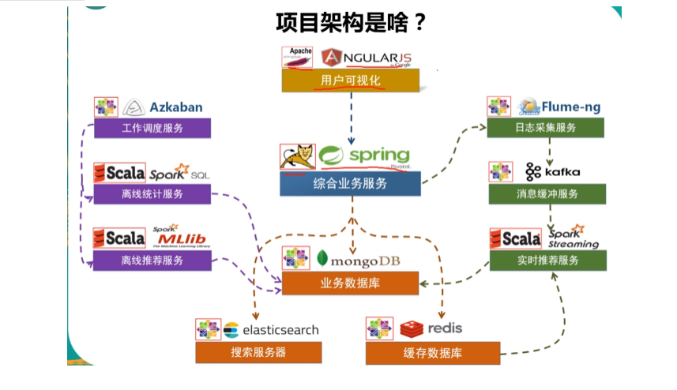

# 电影推荐项目

> 用到的技术栈
>
> - NGULARJS(前端)
> - Spring （综合业务服务）
> - mongoDB (业务数据库)
> - redis （缓存数据库）   存用户最近的评分记录
> - elasticsearch （搜索服务器）
> - Azkaban （工作调度服务）
> - Scala Spark SQL （离线统计服务）
> - Scala MLlib （离线推荐服务）
> - Flume-ng （日志采集服务）
> - kafka （消息缓冲服务）
> - spark streaming （实时推荐）

<<<<<<< HEAD

=======

>>>>>>> 1b6ea9a82c690da662e8b52a4f109f32455451da

**详细版图**


**主要的数据模型**(主要的数据模型 都存在mongoDB上)


**基础环境搭建**


**数据加载服务**


**推荐系统的建设**


**前端系统的构建**


**系统的部署与打包**


## 各大模块

### 实时推荐

>  使用的是缓存队列来实现

### 离线推荐


### 热门推荐


### 评分最多


### 最新电影


## 环境搭建

1. 虚拟机的选择

> 推荐虚拟机CPU > 4core   内存 > 4GB ，推荐的操作系统centos6.9

```shell
# 默认 安装好java
java -version
```

2. MongoDB的安装   （建议将软件都安装到 /home/bigdata/cluster目录下）

```shell
// 通过wegt 下载linux版本的MongoDB
wget http://fastdl.mongodb.org/linux/mongodb-linux-x86_64-rhe162-3.4.3.tgz
// 将mongodb 移动到/home/bigdata/cluster目录下
mv mongodb-linux-x86_64-rhe162-3.4.3.tgz   /home/bigdata/cluster
// 将压缩包解压 
tar -xvf mongodb-linux-x86_64-rhe162-3.4.3.tgz
// 改名
mv  mongodb-linux-x86_64-rhe162-3.4.3  mongodb
// 进入mongodb
cd mongodb
// 创建文件夹
mkdir data
mkdir data/db
mkdir data/logs
// 创建log文件
touch ./data/logs/mongodb.log
// 创建mongodb的配置文件
touch ./data/mongodb.conf
// 编辑配置文件
vim ./data/mongodb.conf


// 添加如下内容
# 端口号
port = 27017
# 数据目录
dbpath = /home/bigdata/cluster/mongodb/data/db
# 日志目录
logpath = /home/bigdata/cluster/mongodb/data/logs/mongodb.log
# 设置后台启动
fork = true
# 日志输出方式
logappend = true
# 开启认证, 先不开启
# auth = true
```

```shell
# 启动mongodb
bin/mongod -config ./data/mongodb/conf
# 停止mongodb
bin/mongod -shutdown -config ./data/mongodb.conf
```


可以下载一个软件 Robo 3T 查看mongodb内容


> 1. mongoDB如果没有可视化客户端，可以使用bin/mongo 直接连接
> 2. MongoDB在关闭的时候，也需要通过 -config 来指定配置文件

----


3. redis的安装

```shell
// 进入目录
cd /home/bigdata/cluster
// 下载redis
wget http://download.redis.io/releases/redis-4.0.2.tar.gz
// 解压redis
tar -xvf redis-4.0.2.tar.gz
# 进入redis目录
sudo yum install gcc
# 编译源代码
make MALLOC = libc
# 编译安装
sudo make install 
# 修改配置文件
# 进入redis
cd redis-4.0.2 

vim redis.conf


# ------修改内容-----------
daemonize yes 
bind 0.0.0.0    # 所有网卡都开启redis服务
logfile "/home/bigdata/cluster/redis/redis.log"
dir "/home/bigdata/cluster/redis"
```

```shell
# 启动redis ，进入bin目录
redis-server ./redis/redis.conf
# 停止redis
redis-cli shutdown
```


4. elasticsearch 搭建

> 下载好elasticsearch放置到 /home/bigdata/cluster 目录下并解压

**配置linux参数**

```shell
# vim /etc/security/limits.conf

# -----配置（在最下面）----------
* soft nofile 65536
* hard nofile 131072
* soft nproc 2048
* hard nproc 4096

# ---------修改第二个配置文件-----------
sudo vim /etc/security/limits.d/90-nproc.conf 
#  -------------配置-------------------
*           soft    nproc      2048
*           soft    nproc      unlimited

# 在文件末尾添加 
sudo vim /etc/sysctl.conf
vm.max_map_count=655360

# 使配置文件生效
sudo sysctl -p

# 进入es目录,新建文件夹
cd elasticsearch 
mkdir data
mkdir logs
vi ./config/elasticsearch.yml

#-----------修改内容--------------------
cluster.name: es-cluster
node.name: es-node
path.data: /home/bigdata/cluster/elasticsearch/data
path.logs: /home/bigdata/cluster/elasticsearch/logs
bootstrap.memory_loc: false
bootstarp.system_call_filter: false
network.host: linux        # 这里可以输入hostname查看
discovery.zen.ping.unicast.hosts: ["linux"]
```

启动

```shell
bin/elasticsearch -d  # 后台启动
# 可以输入jps查看 进程
jps
# 也可以直接在浏览器输入 http://localhost:9200
# 关闭es
jps 查看进程之后
kill 进程id 
```

5. Azkaban(单节点) 环境配置

**安装Git**

```shell
sudo yum install git
# 进入软件路径
cd /home/bigdata/cluster
git clont https://github.com/azkaban/azkaban.git
cd azkaban/
# 切换到3.36.0版本
git checkout -b 3.36.0
```

****

**安装spark**

```shell
# 网上下载spark包，并防止到/home/bigdata/cluster目录下, 并解压
# 改名为 spark 
mv spark-2.1.1-bin-hadoop2.7  spark
# 进入spark
cd spark
# 进入配置文件
cd conf
cp slaves.template slaves
vim slaves
#-------修改的内容--------------
将localhost 改为自己的主机名 使用hostname查看

# 复制一份spark-env.sh.template
cp ./spark-env.sh/template   ./spark-env.sh
vim spark-env.sh
# -----------添加的内容----------------
SPARK_MASTER_HOST=linux        # 添加 spark master 的主机名 hostname
SPARK_MASTER_PORT=7077         # 添加 spark master 的端口号
```

```shell
# 启动spark
sbin/start-all.sh
# 使用jps打印可以看到有 master worker
# 停止spark
sbin/stop-all.sh
```

6. 编译Azkaban

```shell
# 安装编译环境
sudo yum install gcc
sudo yum install -y gcc-c++*
# 执行编译命令
./gradlew clean build
```

下载azkaban-solo-server-3.36.0.tar.gz

并上传到与azkaban目录下

```shell
cd azkaban 
cd azkaban-solo-server/
cd build
#  进入到以上目录，里面有两个文件夹都是新版本的。
# 这时候可以下载azkaban-solo-server-3.36.0.tar.gz 并将之前的删掉，并将azkaban-solo-server-3.36.0.tar.gz 改名为 azkaban
rm -rf azkaban
tar -xvf azkaban-solo-server-3.36.0.tar.gz
mv azkaban-solo-server-3.36.0.tar.gz  azkaban
cd azkaban
```

```shell
# 启动azkaban
bin/azkaban-solo-start.sh
# 启动之后可以登录 http://linux:8081 查看
# 查看登录账号密码
cd  conf
cat azkaban-users.xml
# 账号:azkaban  密码： azkaban

# 关闭azkaban
bin/azkaban-solo-shutdown.sh
```

7. 安装zookeeper

```shell
#  下载zookeeper 并解压到/home/bigdata/cluster 目录下, 并改名
tar -xvf zookeeper-3.4.10.tar.gz
mv zookeeper-3.4.10 zookeeper
cd zookeeper
# 新建数据目录
mkdir data
cd conf
cp zoo_sample.cfg  zoo.cfg
vim zoo.cfg
#----------------修改内容-------------------
dataDir=/home/bigdata/cluster/zookeeper/data
```

```powershell
# 启动zookeeper
bin/zookeeper/bin/ ../conf/zoo.cfg
# 查看启动状态
bin/zkServer.sh status
# 停止zookeeper
bin/zkServer.sh stop
```

8. Flume-ng(单节点) 环境配置

```shell
# 通过wget下载zookeeper安装包
wget http://www.apache.org/dyn/closer.lua/flume/1.8.0/apache-flume-1.8.0-bin.tar.gz
# 将zookeeper解压到安装目录
tar -xvf apache-flume-1.8.0-bin.tar.gz -C ./cluster
# 更改名字
mv apache-flume-1.7.0-bin/ flume
# 然后等待项目部署的时候启动就行了
```

9. Kafka(单节点)  环境配置

```shell
# 通过wet下载
wget http://mirrors.tuna.tsinghua.edu.cn/apache/kafka/0.10.2.1/kafka_2.11-0.10.2.1.tgz
# 将kafka解压到安装目录
tar -xvf kafka_2.11-0.10.2.1.tgz -C ./cluster
mv kafka_2.11-0.10.2.1 kafaka
cd kafka 
# 配置
vim config/server.properties
# ----------------修改内容----------------
host.name=linux    # 使用hostname命令查看
port=9092
zookeeper.connect=linux:2181

# 启动kafka之前要先将zookeeper启动
cd zookeeper
bin/zkServer.sh start
cd ../kafka/
bin/kafka-server-start.sh -daemon ./config/server.properties
# jps查看进程信息
#有了kafka

# 测试kafka是否启动成功
# 创建topic
bin/kafka-topics.sh --create --zookeeper linux:2181 --replication-factor 1 --partitions 1 --topic recommender
# 成功会提示 created topic recommender
# kafka-console-consumer  消息发送者
bin/kafka-console-producer.sh --bootstarp-server linux:9092 --topic recommender
# 在新的窗口打开  消息接受者
bin/kafka-console-consumer.sh --bootstarp-server linux:9092 --topic recommender

# 关闭kafka服务
bin/kafka-server-stop.sh
```

10. Apache安装

```shell
sudo install httpd
# 启动
sudo /etc/init.d/httpd start
# 启动成功之后 访问80端口
http://linux:80
# 进入目录  页面在这
cd /var/www/error/
# 平时页面放置在
cd /var/www/html/
#  停止
sudo /etc/init.d/httpd stop
```

11. Tomcat 环境配置

```shell
# 通过wget下载 tomcat服务器安装包
wget http://mirror.bit.edu.cn/apache/tomcat/tomcat-8/v8.5.23/bin/apache-tomcat-8.5.23.tar.gz
# 将tomcat安装包 解压到安装目录下
tar -xvf apache-tomcat-8.5.23.tar.gz -C /home/bigdata/cluster/
# 启动tomcat服务
bin/shutdown.sh 
# 访问tomcat服务
http://IP:8080
# 停止
bin/shutdown.sh
# 日志: tail -f logs/catalina.out
```

12. **开发环境的安装**

- Idea
- Postman
- NodeJs

> 下载地址 ： http://nodejs.org/en/
>
> - 下载完成之后 一路next
> - 验证安装结果  cmd -------->     node -v/npm -v

- AngularJS CLI       官网: https://angular.cn

```shell
# 在命令行执行
npm install -g @angular/cli
# 验证是否安装完成
ng -v
```

## 数据加载服务

> MongoDB

1. 需要将Movie【电影数据集】 数据集加载到MongoDB数据库中的Movie表中
2. 需要将Rating【用户对电影的评分数据集】数据集加载到MongoDB数据库中的Rating表中
3. 需要将Tag【用户对电影的标签数据集】数据集加载到MongoDB数据库中的Tag表中

> Elasticsearch

1. 需要将Movie【电影数据集】加载到Elasticsearch名叫Movie的Index中
2. 需要将Tag数据和Movie数据融合。

-----

**步骤**

1. 新建一个Maven项目，将依赖添加好
2. 分析数据集

```java
/**
  * Movie 数据集
  *
  * 260                                         电影ID，mid
  * Star Wars: Episode IV - A New Hope (1977)   电影名称，name
  * Princess Leia is captured and held hostage  详情描述，descri
  * 121 minutes                                 时长，timelong
  * September 21, 2004                          发行时间，issue
  * 1977                                        拍摄时间，shoot
  * English                                     语言，language
  * Action|Adventure|Sci-Fi                     类型，genres
  * Mark Hamill|Harrison Ford|Carrie Fisher     演员表，actors
  * George Lucas                                导演，directors
  *
  */
case class Movie(mid: Int, name: String, descri: String, timelong: String, issue: String,
                 shoot: String, language: String, genres: String, actors: String, directors: String)

/**
  * Rating数据集
  *
  * 1,  		    用户的ID
  * 31,		    电影的ID
  * 2.5,		    用户对于电影的评分
  * 1260759144	    用户对于电影评分的时间
  */

case class Rating(uid: Int, mid: Int, score: Double, timestamp: Int )

/**
  * Tag数据集  用户对于电影的标签
  *
  * 15,		用户的ID
  * 1955,		电影的ID
  * dentist,		标签的具体内容
  * 1193435061	用户对于电影打标签的时间
  */
```

3. 新建case class   Movie, Rating,Tag		MongoConfig.  ESConfig
4. 加载数据集
5. 将RDD数据集转换成DataFrame
6. 将DF加载到MongoDB中：
   1. 将原来的Collection全部删除
   2. 通过DF的write方法将数据写入
   3. 创建数据库索引
   4. 关闭MongoDB连接
7. 将DF加载到Elasticsearch中：


