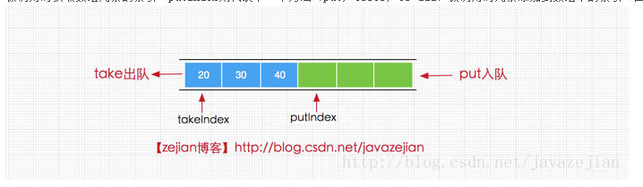
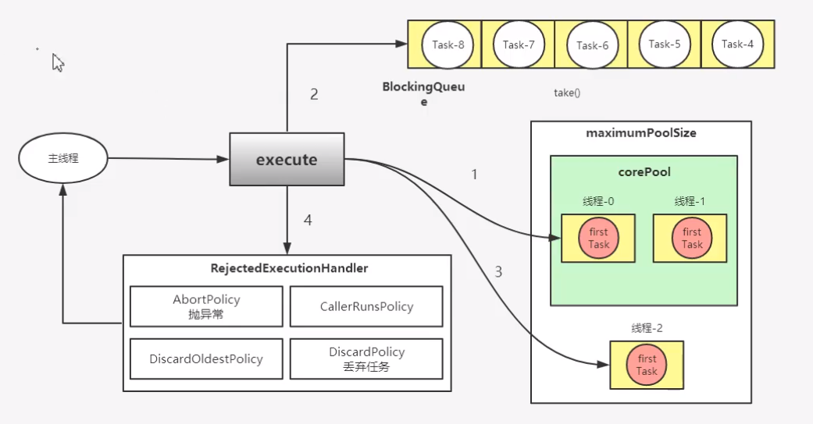

# 线程池

## Executor

```java
package java.util.concurrent;

import static java.lang.ref.Reference.reachabilityFence;
import java.security.AccessControlContext;
import java.security.AccessControlException;
import java.security.AccessController;
import java.security.PrivilegedAction;
import java.security.PrivilegedActionException;
import java.security.PrivilegedExceptionAction;
import java.util.Collection;
import java.util.List;
import java.util.concurrent.atomic.AtomicInteger;
import sun.security.util.SecurityConstants;

public class Executors {
    // 创建一个定长的线程池，可控制线程最大的并发数，超出的线程会在队列中等待
    public static ExecutorService newFixedThreadPool(int nThreads) {
        return new ThreadPoolExecutor(nThreads, nThreads,
                                      0L, TimeUnit.MILLISECONDS,
                                      new LinkedBlockingQueue<Runnable>());
    }

   // 任务窃取线程，用到了分而治之，递归计算的算法。
    public static ExecutorService newWorkStealingPool(int parallelism) {
        return new ForkJoinPool
            (parallelism,
             ForkJoinPool.defaultForkJoinWorkerThreadFactory,
             null, true);
    }

    public static ExecutorService newWorkStealingPool() {
        return new ForkJoinPool
            (Runtime.getRuntime().availableProcessors(),
             ForkJoinPool.defaultForkJoinWorkerThreadFactory,
             null, true);
    }

    // 创建一个可重用固定个数的线程池，以共享的无界队列方式来运行这些线程。 传入拒绝策略
    public static ExecutorService newFixedThreadPool(int nThreads, ThreadFactory threadFactory) {
        return new ThreadPoolExecutor(nThreads, nThreads,
                                      0L, TimeUnit.MILLISECONDS,
                                      new LinkedBlockingQueue<Runnable>(),
                                      threadFactory);
    }

    // 创建一个单线程化的线程池，它只会用唯一的工作线程来执行任务，保证所有任务按照指定顺序(FIFO.LIFO,优先级)执行。
    public static ExecutorService newSingleThreadExecutor() {
        return new FinalizableDelegatedExecutorService
            (new ThreadPoolExecutor(1, 1,
                                    0L, TimeUnit.MILLISECONDS,
                                    new LinkedBlockingQueue<Runnable>()));
    }

   // 创建单线程化的线程池，并传入拒绝策略
    public static ExecutorService newSingleThreadExecutor(ThreadFactory threadFactory) {
        return new FinalizableDelegatedExecutorService
            (new ThreadPoolExecutor(1, 1,
                                    0L, TimeUnit.MILLISECONDS,
                                    new LinkedBlockingQueue<Runnable>(),
                                    threadFactory));
    }

    // 创建缓冲性线程池，没有则创建，60秒内未被使用则会被销毁
    public static ExecutorService newCachedThreadPool() {
        return new ThreadPoolExecutor(0, Integer.MAX_VALUE,
                                      60L, TimeUnit.SECONDS,
                                      new SynchronousQueue<Runnable>());
    }

   // 同上  创建了拒绝策略
    public static ExecutorService newCachedThreadPool(ThreadFactory threadFactory) {
        return new ThreadPoolExecutor(0, Integer.MAX_VALUE,
                                      60L, TimeUnit.SECONDS,
                                      new SynchronousQueue<Runnable>(),
                                      threadFactory);
    }

   // 返回单实例的线程池，如果线程失败而终止，再次调用的时候将替换一个新的线程，保证执行任务。
    public static ScheduledExecutorService newSingleThreadScheduledExecutor() {
        return new DelegatedScheduledExecutorService
            (new ScheduledThreadPoolExecutor(1));
    }

    // 同上指定拒绝策略
    public static ScheduledExecutorService newSingleThreadScheduledExecutor(ThreadFactory threadFactory) {
        return new DelegatedScheduledExecutorService
            (new ScheduledThreadPoolExecutor(1, threadFactory));
    }

    // 创建一个可以定期执行的线程池，并指定保留在池中的线程数
    public static ScheduledExecutorService newScheduledThreadPool(int corePoolSize) {
        return new ScheduledThreadPoolExecutor(corePoolSize);
    }

   // 同上 指定拒绝策略
    public static ScheduledExecutorService newScheduledThreadPool(
            int corePoolSize, ThreadFactory threadFactory) {
        return new ScheduledThreadPoolExecutor(corePoolSize, threadFactory);
    }

    // 配置ExecutorService 使其只暴露出ExecutorService的方法 ，而不能对其进行配置(用于创建不可更改的线程池)
    public static ExecutorService unconfigurableExecutorService(ExecutorService executor) {
        if (executor == null)
            throw new NullPointerException();
        return new DelegatedExecutorService(executor);
    }

   // 同上 并传入拒绝策略
    public static ScheduledExecutorService unconfigurableScheduledExecutorService(ScheduledExecutorService executor) {
        if (executor == null)
            throw new NullPointerException();
        return new DelegatedScheduledExecutorService(executor);
    }

   // 线程构造器吧。给线程命名，或者设置为后台线程/前台进程
    public static ThreadFactory defaultThreadFactory() {
        return new DefaultThreadFactory();
    }

   // 用于返回创建新线程的线程工厂
    public static ThreadFactory privilegedThreadFactory() {
        return new PrivilegedThreadFactory();
    }

    
    public static <T> Callable<T> callable(Runnable task, T result) {
        if (task == null)
            throw new NullPointerException();
        return new RunnableAdapter<T>(task, result);
    }

    public static Callable<Object> callable(Runnable task) {
        if (task == null)
            throw new NullPointerException();
        return new RunnableAdapter<Object>(task, null);
    }

  
    public static Callable<Object> callable(final PrivilegedAction<?> action) {
        if (action == null)
            throw new NullPointerException();
        return new Callable<Object>() {
            public Object call() { return action.run(); }};
    }

   
    public static Callable<Object> callable(final PrivilegedExceptionAction<?> action) {
        if (action == null)
            throw new NullPointerException();
        return new Callable<Object>() {
            public Object call() throws Exception { return action.run(); }};
    }

    public static <T> Callable<T> privilegedCallable(Callable<T> callable) {
        if (callable == null)
            throw new NullPointerException();
        return new PrivilegedCallable<T>(callable);
    }

   
    public static <T> Callable<T> privilegedCallableUsingCurrentClassLoader(Callable<T> callable) {
        if (callable == null)
            throw new NullPointerException();
        return new PrivilegedCallableUsingCurrentClassLoader<T>(callable);
    }

  
    private static final class RunnableAdapter<T> implements Callable<T> {
        private final Runnable task;
        private final T result;
        RunnableAdapter(Runnable task, T result) {
            this.task = task;
            this.result = result;
        }
        public T call() {
            task.run();
            return result;
        }
        public String toString() {
            return super.toString() + "[Wrapped task = " + task + "]";
        }
    }

    private static final class PrivilegedCallable<T> implements Callable<T> {
        final Callable<T> task;
        final AccessControlContext acc;

        PrivilegedCallable(Callable<T> task) {
            this.task = task;
            this.acc = AccessController.getContext();
        }

        public T call() throws Exception {
            try {
                return AccessController.doPrivileged(
                    new PrivilegedExceptionAction<T>() {
                        public T run() throws Exception {
                            return task.call();
                        }
                    }, acc);
            } catch (PrivilegedActionException e) {
                throw e.getException();
            }
        }

        public String toString() {
            return super.toString() + "[Wrapped task = " + task + "]";
        }
    }

    private static final class PrivilegedCallableUsingCurrentClassLoader<T>
            implements Callable<T> {
        final Callable<T> task;
        final AccessControlContext acc;
        final ClassLoader ccl;

        PrivilegedCallableUsingCurrentClassLoader(Callable<T> task) {
            SecurityManager sm = System.getSecurityManager();
            if (sm != null) {
                sm.checkPermission(SecurityConstants.GET_CLASSLOADER_PERMISSION);
                sm.checkPermission(new RuntimePermission("setContextClassLoader"));
            }
            this.task = task;
            this.acc = AccessController.getContext();
            this.ccl = Thread.currentThread().getContextClassLoader();
        }

        public T call() throws Exception {
            try {
                return AccessController.doPrivileged(
                    new PrivilegedExceptionAction<T>() {
                        public T run() throws Exception {
                            Thread t = Thread.currentThread();
                            ClassLoader cl = t.getContextClassLoader();
                            if (ccl == cl) {
                                return task.call();
                            } else {
                                t.setContextClassLoader(ccl);
                                try {
                                    return task.call();
                                } finally {
                                    t.setContextClassLoader(cl);
                                }
                            }
                        }
                    }, acc);
            } catch (PrivilegedActionException e) {
                throw e.getException();
            }
        }

        public String toString() {
            return super.toString() + "[Wrapped task = " + task + "]";
        }
    }

    /**
     * The default thread factory.
     */
    private static class DefaultThreadFactory implements ThreadFactory {
        private static final AtomicInteger poolNumber = new AtomicInteger(1);
        private final ThreadGroup group;
        private final AtomicInteger threadNumber = new AtomicInteger(1);
        private final String namePrefix;

        DefaultThreadFactory() {
            SecurityManager s = System.getSecurityManager();
            group = (s != null) ? s.getThreadGroup() :
                                  Thread.currentThread().getThreadGroup();
            namePrefix = "pool-" +
                          poolNumber.getAndIncrement() +
                         "-thread-";
        }

        public Thread newThread(Runnable r) {
            Thread t = new Thread(group, r,
                                  namePrefix + threadNumber.getAndIncrement(),
                                  0);
            if (t.isDaemon())
                t.setDaemon(false);
            if (t.getPriority() != Thread.NORM_PRIORITY)
                t.setPriority(Thread.NORM_PRIORITY);
            return t;
        }
    }
    /** Cannot instantiate. */
    private Executors() {}
}
```

## 阻塞队列

> 最常用的队列主要有以下两种：
>
> - 先进先出(FIFO): 先插入的队列的元素也最先出队列，类似于排队的功能。从某种程度上来说，这种队列也体现了一种公平性
> - 后进先出(LIFO): 后插入队列的元素最先出队列，这种队列优先处理最近发生的事件

经典的生产者消费者问题，当生产者生产的速度大于消费者消费的速度的时候，队列满了，就会阻塞其他线程的加入。

**BlockQueue的核心方法**

1. 放入数据
   1. offer(anObject): 表示如果可能的话，将anObject加入到BlockQueue里，即如果BlockQueue可以容纳，则返回true，否则false
   2. offer(E o, long timeout, TimeUnit unit)：可以设定等待的时间，如果在指定的时间内，还不能往队列中加入BlockingQueue，则返回失败。
   3. put(anObject):把anObject加到BlockingQueue里,如果BlockQueue没有空间,则调用此方法的线程被阻断直到BlockingQueue里面有空间再继续.
2. 获取数据
   1. poll(time):取走BlockingQueue里排在首位的对象,若不能立即取出,则可以等time参数规定的时间,取不到时返回null;
   2. poll(long timeout, TimeUnit unit)：从BlockingQueue取出一个队首的对象，如果在指定时间内，队列一旦有数据可取，则立即返回队列中的数据。否则知道时间 , 超时还没有数据可取，返回失败。
   3. take():取走BlockingQueue里排在首位的对象,若BlockingQueue为空,阻断进入等待状态直到BlockingQueue有新的数据被加入; 
   4. drainTo():一次性从BlockingQueue获取所有可用的数据对象（还可以指定获取数据的个数），通过该方法，可以提升获取数据效率；不需要多次分批加锁或释放锁。

**ArrayBlockingQueue的基本使用**

> ArrayBlockingQueue 的内部是通过一个可重入锁ReentrantLock和两个Condition条件对象来实现阻塞

```java
public class ArrayBlockingQueue<E> extends AbstractQueue<E>
        implements BlockingQueue<E>, java.io.Serializable {

    /** 存储数据的数组 */
    final Object[] items;

    /**获取数据的索引，主要用于take，poll，peek，remove方法 */
    int takeIndex;

    /**添加数据的索引，主要用于 put, offer, or add 方法*/
    int putIndex;

    /** 队列元素的个数 */
    int count;


    /** 控制并非访问的锁 */
    final ReentrantLock lock;

    /**notEmpty条件对象，用于通知take方法队列已有元素，可执行获取操作 */
    private final Condition notEmpty;

    /**notFull条件对象，用于通知put方法队列未满，可执行添加操作 */
    private final Condition notFull;

    /**
       迭代器
     */
    transient Itrs itrs = null;

}
```

这样来看ArrayBlockingQueue是使用数组对象来存储数据的，



添加到阻塞队列的操作

```java
//add方法实现，间接调用了offer(e)
public boolean add(E e) {
        if (offer(e))
            return true;
        else
            throw new IllegalStateException("Queue full");
    }

//offer方法
public boolean offer(E e) {
     checkNotNull(e);//检查元素是否为null
     final ReentrantLock lock = this.lock;
     lock.lock();//加锁
     try {
         if (count == items.length)//判断队列是否满
             return false;
         else {
             enqueue(e);//添加元素到队列
             return true;
         }
     } finally {
         lock.unlock();
     }
 }

//入队操作
private void enqueue(E x) {
    //获取当前数组
    final Object[] items = this.items;
    //通过putIndex索引对数组进行赋值
    items[putIndex] = x;
    //索引自增，如果已是最后一个位置，重新设置 putIndex = 0;
    if (++putIndex == items.length)
        putIndex = 0;
    count++;//队列中元素数量加1
    //唤醒调用take()方法的线程，执行元素获取操作。
    notEmpty.signal();
}
```


**调用put方法**

> 添加线程的执行存在以下两种情况，一是，队列已满，那么新到来的put线程将添加到notFull的条件队列中，二是移除线程执行操作，移除成功同时唤醒put线程。


**LinkedBlockingQueue**

> linkedBlockingQueue是一个由链表实现的有界阻塞队列，但大小默认值为Integer.MAX_VALUE，所以我们在使用LinkedBlocking时建议手动传值，为其提供我们所需的大小，避免队列过大造成机器负载获取内存爆满的情况。

```java
//默认大小为Integer.MAX_VALUE
public LinkedBlockingQueue() {
       this(Integer.MAX_VALUE);
}

//创建指定大小为capacity的阻塞队列
public LinkedBlockingQueue(int capacity) {
     if (capacity <= 0) throw new IllegalArgumentException();
     this.capacity = capacity;
     last = head = new Node<E>(null);
 }

//创建大小默认值为Integer.MAX_VALUE的阻塞队列并添加c中的元素到阻塞队列
public LinkedBlockingQueue(Collection<? extends E> c) {
     this(Integer.MAX_VALUE);
     final ReentrantLock putLock = this.putLock;
     putLock.lock(); // Never contended, but necessary for visibility
     try {
         int n = 0;
         for (E e : c) {
             if (e == null)
                 throw new NullPointerException();
             if (n == capacity)
                 throw new IllegalStateException("Queue full");
             enqueue(new Node<E>(e));
             ++n;
         }
         count.set(n);
     } finally {
         putLock.unlock();
     }
 }
```

接下来我们来看看LinkedBlockingQueue的内部成员变量

```java
public class LinkedBlockingQueue<E> extends AbstractQueue<E>
        implements BlockingQueue<E>, java.io.Serializable {

    /**
     * 节点类，用于存储数据
     */
    static class Node<E> {
        E item;

        /**
         * One of:
         * - the real successor Node
         * - this Node, meaning the successor is head.next
         * - null, meaning there is no successor (this is the last node)
         */
        Node<E> next;

        Node(E x) { item = x; }
    }

    /** 阻塞队列的大小，默认为Integer.MAX_VALUE */
    private final int capacity;

    /** 当前阻塞队列中的元素个数 */
    private final AtomicInteger count = new AtomicInteger();

    /**
     * 阻塞队列的头结点
     */
    transient Node<E> head;

    /**
     * 阻塞队列的尾节点
     */
    private transient Node<E> last;

    /** 获取并移除元素时使用的锁，如take, poll, etc */
    private final ReentrantLock takeLock = new ReentrantLock();

    /** notEmpty条件对象，当队列没有数据时用于挂起执行删除的线程 */
    private final Condition notEmpty = takeLock.newCondition();

    /** 添加元素时使用的锁如 put, offer, etc */
    private final ReentrantLock putLock = new ReentrantLock();

    /** notFull条件对象，当队列数据已满时用于挂起执行添加的线程 */
    private final Condition notFull = putLock.newCondition();

}
```

由于LinkedBlockingQueue的默认情况下其容量大小是Integer.MAX_VALUE,如果存在添加速度大于删除速度的时候，可能会造成内存溢出(OOM)

**对比一下以上两个队列的区别:**

-  队列大小有所不同，ArrayBlockingQueue是有界的初始化必须指定大小，而LinkedBlockingQueue可以是有界的也可以是无界的，无界情况容易造成溢出
- 数据存储容器不同，ArrayBlockingQueue采用的是数组存储容器，而LinkedBlockingQueue采用的是链表
- 由于ArrayBlockingQueue采用的是数组的存储容器，因此在插入或删除元素时不会产生销毁任何额外的对象实例，而LinkedBlockingQueue则会产生一个额外的Node对象。可能对于GC存在较大影响
- 实现队列添加或移除的锁不一样，ArrayBlockingQueue实现的队列中的锁是没有分离的，即添加操作和移除操作使用同一个ReentLock锁，而LinkedBlockingQueue是没有分离的，添加采用putLock，移除采用takeLock。这样能大大提高吞吐量，提高并发性能。


参考链接： https://www.cnblogs.com/xuwc/p/8661098.html


## 线程理解

> - 用户级线程(ULT)   ----->    交给自己管理 APP 管理
>   - 用户程序实现，不依赖操作系统核心，应用提供创建，同步，调度和管理的函数来控制用户线程。==不需要用户态/内核态切换，速度快。==内核对ULT无感知，线程阻塞则进程（包括它的所有线程）阻塞。
>
>  对于内核来说就像是单线程一样。这样子的话，上述的线程表就需要维护在对应的进程之间了，而且进程间无法共享数据，所以线程表只是各自进程的线程
>
> 
>
> - 内核线程(KLT)
>   - 系统内核管理线程（KLT），内核保护线程的状态和上下文信息，线程阻塞不会引起进程阻塞。在多处理器系统上，多线程在多处理器上并行运行。线程的创建，调度和管理由内核完成，效率比ULT慢，比进程操作快。
>
>  内核需要维护一个所有线程的线程表。（线程表保存了寄存器，状态和其他信息。）

> JVM使用的是KLT模型


线程是稀缺资源，它的创建与销毁是一个相对偏重且耗资源的操作，而Java线程依赖于内核线程，创建线程需要进行==操作系统切换==，为了避免资源过度的消耗需要设法重用线程执行多个任务。线程池就是一个线程缓存，负责对线程进行统一分配，调用和监控。

> 什么时候使用线程池？

- 单个任务处理时间比较短
- 需要处理的任务数量很大

> 线程池优势

- 重用存在的线程，减少线程创建，消亡的开销，提高性能
- 提高响应速度。当任务到达时，任务可以不需要等到线程创建就能立即执行。
- 提高线程的可管理性，可统一分配，调优和监控

**线程池池化过程**



## 线程池状态

> 线程池主要有五种状态：
>
> - Running
>   - 能接受新任务以及处理已添加的任务
> - Shutdown
>   - 不接受新任务，可以处理已经添加的任务
> - Stop
>   - 不接受新任务，不处理已经添加的任务，并且中断正在处理的任务
> - Tidying
>   - 所有的任务已经终止，ctl记录的“任务数量”为0，ctl负责记录线程池的运行状态与活动线程数量
> - Terminated
>   - 线程池彻底终止，则线程池转变为terminated


- 当调用shutdown的时候。队列中存在的任务还是会执行完的、
- 当调用shutdownNow，则会把队列中抛弃了，去执行停止线程的工作

```java
 	private final AtomicInteger ctl = new AtomicInteger(ctlOf(RUNNING, 0));
    private static final int COUNT_BITS = Integer.SIZE - 3;          // = 29

	// 高3位记录线程池生命状态
	// 低29位记录当前工作线程数
	
    private static final int COUNT_MASK = (1 << COUNT_BITS) - 1;

    // runState is stored in the high-order bits
    private static final int RUNNING    = -1 << COUNT_BITS;				// 111
    private static final int SHUTDOWN   =  0 << COUNT_BITS;				// 000
    private static final int STOP       =  1 << COUNT_BITS;				// 001
    private static final int TIDYING    =  2 << COUNT_BITS;				// 010
    private static final int TERMINATED =  3 << COUNT_BITS;				// 011

    // Packing and unpacking ctl
    private static int runStateOf(int c)     { return c & ~COUNT_MASK; }
    private static int workerCountOf(int c)  { return c & COUNT_MASK; }
    private static int ctlOf(int rs, int wc) { return rs | wc; }
```

锁的标志位:


## 线程池的设置

**CPU密集型**

> CPU密集型也是指计算密集型，大部分时间用来做计算逻辑判断等CPU动作的程序称为CPU密集型任务。计算量比较消耗资源。这种计算密集型任务，虽然可以用多任务完成，但是任务越多花在任务切换的时间就越多，CPU执行效率就越低，所以，要高效的利用CPU，计算密集型任务同时进行的数量应当等于CPU的核心数。

特点：

- CPU使用效率较高(也就是经常计算一些复杂的运算，逻辑处理等情况) 非常多的情况下使用
- 针对单台机器，最大线程数一般只需要设置为CPU核心数的线程个数就可以了
- 这一类型多出现在开发中的一些业务复杂计算和逻辑处理过程中

```java
package pool;

import java.util.concurrent.Executors;
import java.util.concurrent.LinkedBlockingDeque;
import java.util.concurrent.ThreadPoolExecutor;
import java.util.concurrent.TimeUnit;

public class Demo02 {
    public static void main(String[] args) {
        //自定义线程池！ 工作中只会使用 ThreadPoolExecutor

        /**
         * 最大线程该如何定义（线程池的最大的大小如何设置！）
         * 1、CPU  密集型，几核，就是几，可以保持CPU的效率最高！
         */

        //获取电脑CPU核数
        System.out.println(Runtime.getRuntime().availableProcessors());    //8核

        ThreadPoolExecutor threadPool = new ThreadPoolExecutor(
                2,                                  　　　　　　//核心线程池大小
                Runtime.getRuntime().availableProcessors(),   //最大核心线程池大小（CPU密集型，根据CPU核数设置）
                3,                                　　　　　　　//超时了没有人调用就会释放
                TimeUnit.SECONDS,                             //超时单位
                new LinkedBlockingDeque<>(3),                 //阻塞队列
                Executors.defaultThreadFactory(),             //线程工厂，创建线程的，一般不用动
                new ThreadPoolExecutor.AbortPolicy());        //银行满了，还有人进来，不处理这个人的，抛出异常

        try {
            //最大承载数，Deque + Max    (队列线程数+最大线程数)
            //超出 抛出 RejectedExecutionException 异常
            for (int i = 1; i <= 9; i++) {
                //使用了线程池之后，使用线程池来创建线程
                threadPool.execute(()->{
                    System.out.println(Thread.currentThread().getName()+" ok");
                });
            }
        } catch (Exception e) {
            e.printStackTrace();
        } finally {
            //线程池用完，程序结束，关闭线程池
            threadPool.shutdown();      //（为确保关闭，将关闭方法放入到finally中）
        }
    }
}
```

**IO密集型**

> IO密集型任务指任务需要执行大量的IO操作，涉及到网络，磁盘IO操作，对CPU消耗较少，其消耗的主要资源为IO

我们所接触到的IO，大致可以分成两种：磁盘IO和网络IO

- ==磁盘IO==，大多都是一些针对磁盘的读写操作，最常见的就是文件的读写，加入你的数据库，Redis也是在本地的话，那么这个也是数据磁盘IO
- ==网络IO==，比如http，远程读redis等


​	IO操作的特点就是需要等待，我们请求一些数据，由对方将数据写入缓冲区，这段时间中，需要读取数据的线程根本无事可做，因此可以把CPU时间片让出         	去，直到缓冲区写满，既然这样，IO密集型任务就有很大的优化空间了

​	CPU效率低，程序中会存在大量的I/O操作占用时间，导致线程空余时间很多，==所以通常就需要开CPU核心数两倍的线程==，当线程进行I/O操作CPU空闲时，线程等待时间所占比例越高，就需要越多线程，启用其他线程继续使用CPU，以此提高CPU的使用率；线程CPU时间所占比例越高，需要越少的线程，这一类型在开发中主要出现在一些计算业务频繁的逻辑中。

```java
package pool;

import java.util.concurrent.Executors;
import java.util.concurrent.LinkedBlockingDeque;
import java.util.concurrent.ThreadPoolExecutor;
import java.util.concurrent.TimeUnit;

public class Demo02 {
    public static void main(String[] args) {
        //自定义线程池！ 工作中只会使用 ThreadPoolExecutor

        /**
         * 最大线程该如何定义（线程池的最大的大小如何设置！）
         * 2、IO   密集型  >判断你程序中十分耗IO的线程
         *      程序    15个大型任务   io十分占用资源！  （最大线程数设置为30）
         *      设置最大线程数为十分耗io资源线程个数的2倍
         */

        //获取电脑CPU核数
        System.out.println(Runtime.getRuntime().availableProcessors());   //8核

        ThreadPoolExecutor threadPool = new ThreadPoolExecutor(
                2,                               //核心线程池大小
                16,       　　　　　　　　　　　　　　//若一个IO密集型程序有15个大型任务且其io十分占用资源！（最大线程数设置为 2*CPU 数目）
                3,                                //超时了没有人调用就会释放
                TimeUnit.SECONDS,                 //超时单位
                new LinkedBlockingDeque<>(3),     //阻塞队列
                Executors.defaultThreadFactory(),               //线程工厂，创建线程的，一般不用动
                new ThreadPoolExecutor.DiscardOldestPolicy());  //队列满了，尝试和最早的竞争，也不会抛出异常

        try {
            //最大承载数，Deque + Max    (队列线程数+最大线程数)
            //超出 抛出 RejectedExecutionException 异常
            for (int i = 1; i <= 9; i++) {
                //使用了线程池之后，使用线程池来创建线程
                threadPool.execute(()->{
                    System.out.println(Thread.currentThread().getName()+" ok");
                });
            }
        } catch (Exception e) {
            e.printStackTrace();
        } finally {
            //线程池用完，程序结束，关闭线程池
            threadPool.shutdown();      //（为确保关闭，将关闭方法放入到finally中）
        }
    }
}
```

**总体分析：**

1. 高并发，任务执行时间短的业务，线程池数量可以设置为CPU核数+1，减少线程上下文的切换
2. 并发不高，任务执行时间长的业务这就需要区分开了：
   1. ==业务集中在IO操作上，也就是IO密集型的任务==，因为IO操作并不占用CPU，所以不要让所有的CPU闲下来，可以适当加大线程池中的线程数目，让CPU处理更多的业务
   2. ==业务时间长集中在计算操作上，也就是计算密集型任务==，这个就没办法了，线程数尽量设置得少一点，减少线程上下文的切换
3. 并发高，业务执行时间长，解决这种类型任务的关键不在于线程而在于整体架构的设计，看看这些业务里面某些数据能否做缓存是第一步，我们的项目使用时redis作为缓存。增加服务器是第二步（一般政府项目的首先，因为不用对项目技术做大改动，求一个稳，但前提是资金充足）。

- ==一个计算为主的程序（CPU密集型程序）==，在多线程跑的时候，可以充分利用起所有的CPU核心数，比如8个核心的CPU，开8个线程的时候，可以同时跑8个线程的运算任务，此时是最大效率。但是如果线程远远超出CPU核心数量，反而会使得任务效率下降，因为频繁的的切换线程也是要消耗时间的。因此对于CPU密集型的任务来说，线程数等于CPU数是最好的了
- ==如果是一个磁盘或网络为主的程序（IO密集型程序）==，一个线程处在IO等待的时候，另一个线程还可以在CPU里面跑，有时候CPU闲着没事干，所有的线程都在等着IO,这时候他们就是同时的了，而单线程的话此时还是在一个个等待。我们都知道IO的速度比起CPU来是很慢的。此时线程数等于CPI核心数的两倍是最佳的。


